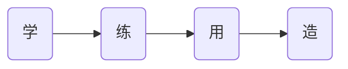
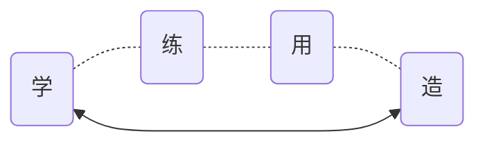
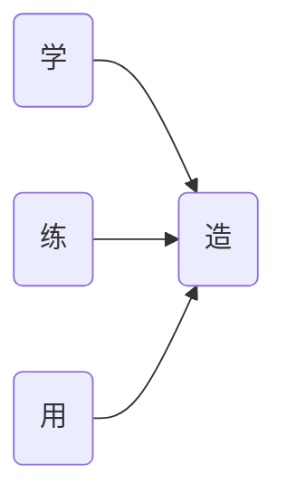
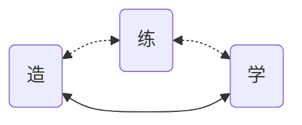

# 08. 学习路径的颠覆

2023 年 9 月，OpenAI 发布 DALL·E 的第 3 个版本，引发了轰动。DALL·E 是的名字有两个来源，一个是 2008 年 Pixar 的电影，WALL·E，另外一个是西班牙艺术家 Salvador Dalí (萨尔瓦多·达利)。DALL·E 的发音据说是 `/ˈdɑː.liː/`（美音），或者 `/ˈdɔː.liː/`（英音）。

> https://chatgpt.com/share/67066451-9d2c-8009-9a1f-55e79f5f1701

DALL·E 真的很好玩，但，请允许我先说个别的事情。

## 8.1. 曾经为之苦恼的一个问题

我一直很讨厌家里的那些设计给 0～3 岁小朋友看的 “纸壳书” —— 因为在我看来，那东西由里到外，几乎全部都是彻头彻尾的伪需求。

视觉设计上来看，鲜艳的颜色、简化的形状，以及卡通化的形象，实际上的作用并不大，虽然我们也理解，好像也只能那么设计。

以为 “鲜艳的颜色更吸引孩子的注意力” 基本上是家长的幻觉。从视觉神经科学的角度来看，虽然鲜艳的颜色确实能在短时间内引起孩子的注意，但这种注意力往往是格外短暂、特别容易转移的。

卡通化形象的设计也类似。虽然卡通形象简化了视觉信息，使孩子们可以更快地识别出图像中的物体或角色，但这种设计对他们的长期认知并没有太大帮助。研究表明，真实感更强的图片或现实生活中的物体反而更有助于孩子理解世界和建立真实的概念关联。因为大脑在处理信息时更偏向于与实际经验相符的内容，而过于简化的卡通形象有时会扭曲孩子对现实世界的认知。

这个年龄段的孩子更倾向于所谓的 “外显注意力”（overt attention），即对环境中明显的、突出的刺激作出快速反应，随时都会被周遭的 “动态” 刺激而吸引，比如声音，比如活动的人或事物。鲜艳的颜色，简化的形状，卡通的形象，与周遭的动态刺激相比，在吸引孩子注意力方面，实在是微不足道。

0～3 岁的小朋友，在相当长一段时间里，不可能理解 “书” 的意义。在他们的世界里，那只是家里的另外一个物品，可以扔，可以撕，甚至可以放到嘴里…… 反正绝对不是那些毫无根据地渴望尽早开始 “启蒙教育” 的家长们脑子里以为的那玩意。

“纸壳书”，就是用来迎合这些家长的 —— 主要卖点其实是无法被小朋友一下子破坏掉…… 当然，可以肯定的是，早晚会被他们彻底破坏掉，用各种意想不到的方式。

可是那东西真的好吗？印刷用墨和那些纸壳真的安全吗？确保免除了一切有毒物质？我的观察是，绝大多数父母都知道随时给孩子洗手，但好像从来不担心那些纸壳书其实并不见得干净……

印刷物上的那些数字、字母、颜色和形状，很完美地迎合了家长希望孩子尽早接受 “启蒙教育” 的心理。然而，0～3 岁的孩子更需要的其实是另外三样东西：

> * 互动
> * 语言交流
> * 生活经验

而这些偏偏全都是纸壳书及其内容无能为力的东西…… 内容差就算了，那些破玩意还死贵死贵 —— 这种价格定位主要是无情地利用了家长愿意为 “早期教育” 买单的心理，而非基于书籍本身的实际价值。

说实话，最气人的不是它既没用又死贵还不一定安全，最气人的是，明知道那是个破玩意，自己却无能为力…… 任凭一个破玩意在自己的生活中占据一个令人沮丧的重要位置。令人沮丧的程度，对一个父亲来说，绝不亚于在工作单位里遇到了一个明明很差但必须忍受很久的领导。

不仅如此，我还有另外的苦恼。

我是朝鲜族，在中国长大，所以从小就生活在双语环境中，中文和朝鲜语，对我来说，都是母语。长大了之后又学了英语，所以，我基本上可以算作是 “多语使用者”（Polyglot）。于是，我深谙多语技能终生带来的好处，也明确地了解多语环境的重要性。

所以，我虽然讨厌纸壳书，但并不彻底反对绘本，甚至，希望那些绘本是英文的。

然而，就算英语绘本也有问题，家里不是每个人都会说…… 于是，绘本里的文字都很傻，但，那文字傻不傻还是次要的，重要的是，家里人拿着绘本其实不会讲；就算能讲也不能用英语讲；现编来不及，就算编好了，好像也说不顺；自己不会画画，也不会编故事，更不会 “源源不断地画画，源源不断地编故事”…… 自己不会，家人也不会 —— 完蛋了。

只好接着生闷气。然后想办法忘掉，算逑。

## 8.2. 有了人工智能之后的解决方案

突然之间，DALL·E + ChatGPT + TTS，拼起来好像是个解决方案呢！于是，我就跟 ChatGPT 说：

> 帮我写个用 DALL·E，ChatGPT，TTS 生成给 2 岁左右小朋友看的绘本的方案。要详细罗列实现步骤。

ChatGPT “义无反顾” 地按照我随后的要求生成了若干个版本，以下是其中一个比较令人满意的回复的摘要：

> ……
>
> **方案步骤**
>
> 1. 确定故事主题和内容
> 2. 使用ChatGPT撰写故事文本
> 3. 使用DALL·E生成绘本插图
> 4. 合成文本与图片
> 5. 使用TTS生成语音版故事
> 6. 整合语音和图像，制作电子绘本
> 7. 测试和优化
>
>**工具清单**
>**总结**
> 
> https://chatgpt.com/share/670671e8-9b04-8009-812f-4d5149cb9dcd

仅见进行阅读理解之后，决定先搞个极简版本：

> * DALL·E：只生成 1 张图片；
> * ChatGPT：为图片配 1 个英文短故事（或英文讲解词）；
> * TTS：把故事文本转换成英文音频。

说搞就搞。

### 8.2.1. 第一遍尝试

我们不是有一个 “提示词优化模版” 吗？

> 请根据提示词设计的最佳实践原则帮我修改以下提示词，以便我能从 ChatGPT 获得最佳反馈。修改过的提示词，请返回中英两个版本。另外，本次回复中，请不要使用 Markdown 代码框：
>
> 【再次输入需要修改的提示词】

我把它保存在 Prompt Library Manager 这个插件里，随时可以拷贝粘贴出来使用。另外一个方案是使用某个剪贴板管理软件，把这个最常用的模版保存起来，以便随时调用。

我把 Edge 浏览器的分屏打开，左右各打开了一个聊天。右半屏用来优化提示词，左半屏用来直接与 ChatGP 聊天。

在右半屏，我先是不假思索地随便说（但套在模版里）：

> 帮我生成一张适合 2 岁小朋友看的图片。

在右半屏被优化的提示词，被我拷贝粘贴到左半屏，简单做了一下修改：

> 生成一张适合 2 岁小朋友看的图片。图片应色彩鲜艳、友好。使用柔和的线条和明亮的颜色，以吸引幼儿的注意力。确保图像充满正能量，氛围温暖而愉快。

不用 `@DALL·E`，现在的 ChatGPT 会看到此类提示词就直接生成图片。生成的图片，对我来说，谈不上是否满意，觉得还算可以。

在右半屏，我还是不假思索滴随便说：

> 请根据这张图片，写一个50 个词左右美式英语的小故事。

再一次，我阅读了一下优化过的提示词，从右半屏拷贝粘贴到左半屏，删掉了一小部分，发给了 ChatGPT：

> 根据这张图片，写一个大约 50 个词的美式英语小故事。请使用适合幼儿的简单语言，确保故事生动有趣，并充满正能量，以激发孩子的想象力。

很快就收到了回复：

> Once upon a time, a little bunny named Benny lived in a sunny meadow. Benny loved to hop and play with his best friend, Tilly the turtle. One day, they found a shiny red ball! They kicked, tossed, and giggled all day long. "Friends make everything fun!" said Benny, smiling at Tilly. And they both laughed.
>
> https://chatgpt.com/share/67068074-4494-8009-8c43-f1a0ccae4ea7

我读了一下，觉得有点不对劲…… Tilly the turtle 是哪儿来的？再说，图片里也没有 a shiny red ball 啊！

这次尝试得到的结论是，ChatGPT 在 “读图” 方面能力依然很差，将来肯定会越来越好；但现在，对我们来说，还真不够用。

### 8.2.2. 第二遍尝试

换个思路，先生成故事，再根据故事文本生成图片，试试看呢？—— 某种意义上，这就是 “流程优化”，不是吗？

原本的流程：

> 1. DALL·E：生成 1 张图片；
> 2. ChatGPT：为图片配 1 个英文短故事（或英文讲解词）；
> 3. TTS：把故事文本转换成英文音频。

修改成：

> 1. ChatGPT：生成 1 个英文短故事（或英文讲解词）；
> 2. DALL·E：以故事为基础生成 1 张图片；
> 3. TTS：把故事文本转换成英文音频。

于是，再来：

> 请帮我生成一个适合 2 岁小朋友听的美式英语故事，长度约为 50 个词。故事应包含简单易懂的语言，并带有温馨、友善的氛围。

返回的故事看起来还可以：

> Benny the Bunny loved his friends. One day, Benny saw Kitty crying. "What's wrong, Kitty?" asked Benny. "I lost my toy," said Kitty. Benny gave Kitty a big hug. "Don't worry," he said. "We’ll find it together!" Soon, they found the toy. Kitty smiled. "Thank you, Benny!" Benny smiled back. Friends help each other!

然后再让它根据这个故事生成图片：

> 请根据上述故事生成一张适合 2 岁小朋友看的图片。图片应采用明亮的颜色和简洁的风格，避免复杂的细节。确保整体画面温馨、友好且适合幼儿观看。

生成的结果还可以：

下一步就是把故事文本用 TTS 变成音频就好。

其实，ChatGPT 无论哪个端，都可以将某个答复转换成语音朗读，鼠标挪到消息上（移动端长按消息），就可以看到 Read Aloud 小图标。具体声音，可以在设置里选择。缺点就是，语音无法下载。

那有没有其它的文本转语音的生成工具呢？其实很多。比如：

> * Enjoy APP (https://1000h.org/)  也可以 —— 尤其它还可以帮你练习语音
> * 自己编程用 Edge-TTS 批量生成也不错 —— 声音选择比较多
> * 还有有很多生成音频的工具 —— 你可以直接去问 ChatGPT

那就问问 ChatGPT 呗：

> 随便写一版 提示词：
>
> > 请帮我推荐免费的 TTS 工具，网页版，或者桌面版 APP 都可以
>
> ChatGPT 帮忙改过的提示词：
>
> > 请帮我推荐几款免费的文字转语音（TTS）工具，可以是网页版，也可以是桌面版应用程序。我希望这些工具易于使用，支持中文和其他主要语言，并且能够生成自然、清晰的语音输出。请提供一些详细信息，如工具的主要特点、是否需要注册，以及是否支持下载生成的音频文件。
> >
> > https://chatgpt.com/share/66fe3075-abf4-8009-9585-dd3caf3ad9c7

我自己呢，当然早就知道这些工具，于是，我就用 Edge-TTS 随便生成了一个先听听效果：

<audio controls preload="none"><source src="/audios/toddler-story-01.mp3"></source></audio>

—— 感觉已经很够用了。

### 8.2.3. 细化与优化

我之前的苦恼时，自己不会画画，也不会编故事，更不会 “源源不断地画画，源源不断地编故事”…… 现在，“源源不断地画画” 貌似解决了，“源源不断地讲故事”，好像并不是很容易。

虽然，每次都跟 ChatGPT 说同样的话好像也可以：

> 根据这张图片，写一个大约 50 个词的美式英语小故事。请使用适合幼儿的简单语言，确保故事生动有趣，并充满正能量，以激发孩子的想象力。

但，有没有什么别的办法呢？当然有，我们有那个神奇的提示词关键字啊 —— “List”。

> 经过优化的提示词：
>
> 制作一个列表，为 2024 年的每一天配上一个一句话的适合讲给 2 岁孩子的故事大纲。请确保每个大纲都保持积极、有趣且温馨的基调，适合小朋友听。
>
> https://chatgpt.com/share/67068b2c-b9e0-8009-af48-c548a74fe761

试了一下，365 天，每天一句话，好像超出了 ChatGPT 目前每条聊天可以处理的 Token 数量。其实也没关系，如果能批量生成 1 个月的也不是不可以。

> 今天是 2024 年 10 月 9 日。制作一个列表，为接下来的一个月中的每一天配上一个一句话的适合讲给 2 岁孩子的故事大纲。请确保每个大纲都保持积极、有趣且温馨的基调，适合小朋友听。
>
> **10 月 10 日**: 一只小猫发现了一个会发光的球，它跟着光一路跳到了星星下面。
>
> **10 月 11 日**: 小兔子在草地上找到了一个神奇的蘑菇，蘑菇会让它跳得特别高。
>
> **10 月 12 日**: 小象学会了吹泡泡，把泡泡送到了天上，看着它们像彩虹一样闪闪发光。
>
> **10 月 13 日**: 小狗找到了一个小秘密——地上的叶子会告诉它风的故事。
>
> **10 月 14 日**: 小鸟和太阳玩捉迷藏，最后太阳在云朵后面笑了出来。
>
> **10 月 15 日**: 一只小熊学会了踮脚走路，它悄悄走到蜂蜜罐前，偷尝了一口甜甜的蜜。
>
> **10 月 16 日**: 小松鼠找到了一颗彩色的松果，它把松果种在地上，长出了五颜六色的小树。
>
> **10 月 17 日**: 小鱼跳出水面，看到了蓝天中的白云，想要去抓住它们。
>
> **10 月 18 日**: 小狐狸在月光下跳舞，月亮给它披上了一件亮闪闪的衣裳。
>
> **10 月 19 日**: 小羊羔发现了一朵像棉花糖一样的云，它想把云带回家当枕头。
>
> **10 月 20 日**: 小鸡在花园里找到了一个神奇的种子，种子开出了可以吃的小甜饼。
>
> ……
>
> https://chatgpt.com/share/67069279-d2f4-8009-a1b3-38d4a80e9520

而后制作了一个 “讲故事” 的提示词模版：

> 请根据以下句子，写一个约 【60】 词的美式英语小故事，适合讲给 【2 】岁的孩子听。故事应使用简单、易懂的语言，保持温馨、友善的基调。使用短词、短句，并尽量押韵。
>
> 【故事大意写在这里】
>
> ----
>
> Based on the following sentence, write a short story of about [60] words in American English, suitable for telling to a [2]-year-old child. The story should use simple, easy-to-understand language and have a warm, friendly tone. Use short words and short sentences, and aim for rhyming whenever possible.

> [Story idea goes here]

因为提示词里指定了 “美式英语小故事”，所以，提示词无论是中文还是英文，效果是一样的。而生成图片的提示词也一样，中文版、英文版都可以，因为最终输出是图片：

> 请根据上述故事生成一张适合 2 岁小朋友看的图片。图片应采用明亮、柔和的颜色和简洁的卡通风格，避免复杂或逼真的细节。确保整体画面温馨、友好且适合幼儿观看。
>
> ----
>
> Please create an image based on the story above, suitable for a 2-year-old child. The image should use bright, soft colors and a simple, cartoon-like style, avoiding complex or realistic details. Ensure that the overall scene is warm, inviting, and appropriate for toddlers.

随便挑了一句话试一试：

> 一只小猫发现了一个会发光的球，它跟着光一路跳到了星星下面。

先生成故事：

> Once, a little cat named Mia found a shiny ball. It glowed so bright, like a light on the wall. Mia followed the ball, hopping here and there. It led her to a place under stars in the air. She jumped with joy, so happy and free, under the twinkling stars, as bright as can be. The ball kept glowing, leading her way, and Mia danced happily, ending her day.
>
> https://chatgpt.com/share/6706973b-26b0-8009-b562-78b29c063bf0

而后生成的图片，与故事文本适配得也相当不错。

如此这般，其实就是在流程里增加了一步 —— 相当于在 “优化流程” —— 放在最开始：

> 1. ChatGPT：生成一个故事大纲列表
> 2. ChatGPT：根据故事大纲列表中的 1 项生成 1 个英文短故事（或英文讲解词）；
> 3. DALL·E：以故事为基础生成 1 张图片；
> 4. TTS：把故事文本转换成英文音频。

生成故事时，ChatGPT 在回复的时候，偶尔会前后加上它的评论。如果它的回复中有解释和评论的话，用来生成语音的文本就 “被污染了”，生成的不只是 “故事”，还有别的内容…… 这个问题，可以通过修改提示词解决，制止它说故事以外的内容 —— 这也是所谓的 “优化”：

> 请根据以下句子，写一个约 【50】 词的美式英语小故事，适合讲给 【2 】岁的孩子听。故事应使用简单、易懂的语言，保持温馨、友善的基调。使用短词、短句，并尽量押韵。**除了生成的故事之外，不要添加任何说明和评论。**
>
> 【故事大意写在这里】
>
> ----
>
> Based on the following sentence, write a short story of about [50] words in American English, suitable for telling to a [2]-year-old child. The story should use simple, easy-to-understand language and have a warm, friendly tone. Use short words and short sentences, and aim for rhyming whenever possible. *Do not add any explanations or comments other than the generated story.*
>
> [Story idea goes here]

如此这般，无论是谁，都可以每天给自家孩子做一张带故事和语音的图片……

### 8.2.4. 更进一步

更进一步的话，作为普通用户，还可以做若干 “优化”。

比如，DALL·E 的聊天里，其实可以指定图片的长宽比，有 Square，Widescreen 和 Vertical 的选项。

又比如，你在网上找找，有很多可以把 “让图片动起来” 的工具，即，图片转视频。

再比如，也有工具可以把图片和 mp3 音频合成为一个 mp4 视频文件。于是，你还可能顺便为整个视频配个背景音乐……

如果会懂一点编程语言，那么，就可以把整个 “工作流”（其实还是 “流程”，或者 “程序”）搞得更自动化一点，省掉一些枯燥且单调却又不可或缺的工作。比如，在左右半屏切换，比如拷贝粘贴，比如为了完成任务打开另外一个工具……

比如，我就给我老婆写了一个在本地电脑上可以跑的一个网页应用：

> https://github.com/xiaolai/Toddler-Picture-Story-Generator

这个页面上有完整的安装使用说明，你也可以试一试。

会编程的好处之一，就是可以对大量重复的任务进行批量处理 —— 某种意义上，就是 “批量处理那些枯燥且单调却又不可或缺的工作”。想象一下，你每天手动生成一套内容，和你可以让机器一口气为你生成 365 套内容（图片 + 文本 + 音频），当然是后者更好。

> 我顺手写了个脚本，跑了三个版本，每个版本生成大约需要四五百分钟 —— 反正它不累 —— 最终有 $365 \times 3 \times 3 = 3285$ 个文件…… 以下是网盘分享链接：
>
> > toddler-picture-book
> > 链接: https://pan.baidu.com/s/1w5nwC8MAVxmiFocXXfxR2w?pwd=6auq 提取码: 6auq 

### 8.2.5. 反思

无论如何，生活里的一个相当恼人的小问题终于被解决了…… 

为什么这个问题解决的不错呢？因为，毕竟面对的是两岁的孩子，质量没多重要，无论是图片，还是文字 —— 反正他们事实上也不懂。我们也知道，他们真正需要的，其实是陪伴。而家长在这个时候真正需要的，其实更多的是为了未来的一年两年甚至三年做准备，这一年下来，天天讲，天天练，以后就真的可以随便讲了 —— 厉害了。

这是个非常真实的 “创作” 过程，想到就开始做，做的时候，还没办法想得足够完整，但，做过一遍之后，不管好坏，都有了 “可以继续改进的起点”，然后一点一点 “优化”。

## 8.3. 学习路径的颠覆

让我们仔细想想，刚才我们都干了什么？做了这些事的意义究竟是是什么呢？

至少对于我来说，意义巨大 —— 能做个绘本倒也挺好；但，更重要的关键在于，**我竟然做了一件我之前完全无法做到的事情。**

我不会画画。我也不会讲故事。我没学画画，我也没学讲故事，我只是学会了 “如何与人工智能好好说话”，仅此而已…… 然后，因为它会画画，又因为它不仅会画画，还会用讲故事，也会用英文讲故事（其实是可以用任何语言讲故事）…… 于是，我竟然做了一个过去压根不可能做出来的东西，解决了自己生活中一个很关键的需求…… 并且还能分享给很多人……

这就是人工智能对人类的学习路径带来的颠覆。

在《自学是门手艺里》我分享过一个 “拆解”：“学习”，不止是 “学” 与 “习”（或者 “练”），还有其它两个重要的环节，“用” 和 “造”。

人们普遍的问题在于学倒是也学了，但，就是懒得去练 —— 光学不练，那有可能用得起来吗？

学校的问题首先在于 “以考代练”。学生不愿意练，于是，就用考试逼他们去练。初心是好的，效果呢？效果极差。

一方面是，小聪明绝对不可能缺的学生们很快掌握了 “六十分万岁” 的思路。更严重的另外一方面是学校本身可能也始料不及的东西 —— 考试范围主要被局限在客观题测验上。在真实的世界里，有大量的能力是无法用客观题测验衡量的，于是，学生们被逼着练的永远只是真实世界真正需要的一小部分 —— 然后还有很多人终生信奉六十分万岁…… 也就是说，这些人竟然连真实世界真实需求的那一小部分也是蒙混过关的。

学校的效果极差的原因还有更严重的另外一个。它们好像不知道自己实际上教的其实是 “真实世界真正需要的一小部分”，与此同时，与时俱进能力同样极差，一切都恨不得百年不变。于是，它们教授的内容里，还有大量等孩子们毕业了走进真实世界的时候，完全不适用，或者干脆彻底用不上的东西……

还有更严重的，其实是最严重的。学校的教育目标，从始至终都不是以 “创造” 为目标。学校教育目标不是培养真正的 “生产者”  —— 准确地讲，学校从来都不以培养 “主动生产者” 为目标，而是培养以 “被动生产者” 为目标。用我们这本书里的措辞的话，就是：

> 学校的教育目标，从来都只是培养 “程序执行者”，而非 “程序设计者” 或 “程序优化者”。

绝大多数人其实是被整个社会驱动的，而不是 “主动思考者”，也不是 “独立决策者”，更从未想过自己应该尽早成为 “主动生产者”。虽然每个家长都高度重视教育，但，他们实际上也在与学校 “同谋”，致力于把自家孩子培养成 “优秀的程序执行者” —— 在家长和老师眼里，在学校的视角中，“听话” 是 “好孩子” 的最高评价之一。

抛开无法给力的学校不谈，只谈个体。只说那些主动思考且独立决策的个体。

他们也面临其它的问题，“练” 是个很枯燥的过程。扛过去了，“用” 呢？很多人从未走到这个境界，所以不知道，“用” 起来的背后，其实是有各种成本的。学建筑的，真要盖个什么建筑，那可是要花钱的啊。学导演的，在学校里交个作业弄不好就得花好几万。学医的，没人上来就敢让你 “用” 啊，别说 “用” 了，“练” 的机会都很难得。

“造”，或者说，“创造” 或者 “创作”，从来都是 “学” 的尽头，从 “学” 走到 “造”，往往至少相距半生。对另外一些人来说，甚至超出了 “一生” 的距离。

突然之间，从 “学” 到 “造” 的距离缩短了。

在人工智能出现之后，这个趋势越来越明显，“学” 与 “造” 之间的距离被极度压缩，它们之间的关系也因距离被缩短而越来越明确：

> “学” 就是为了 “造”，为了 “造” 而学。

甚至，出现了我们刚刚经历的 “神奇体验” —— **竟然 “没学” 就开始 “造” 了！**

> 不要乱兴奋。“竟然没学也可以” 的原因，其实刚才已经说过了，是因为那是给 2 岁小朋友做的东西，质量要求实在是太低 —— 他们压根就不具备审美观念，他们甚至没办法完全听懂你说的话…… 本质上来看，这只是 “为了讲道理而专门挑出来的例子”。

## 8.4. 中间件技能

我们需要先了解一个事实：

> 能被工具替代的技能都是 “**中间件技能**”。

我喜欢看电影。根据我的习惯，我喜欢什么东西的话，我就会去研究它的方方面面，也会去翻阅一切我可能找到的相关资料。有一部电影我很喜欢，《寄生虫》（2019），反复看了很多遍。后来这部电影的导演奉俊昊出版了这部电影的配套书籍，《寄生虫：电影分镜》，那我当然要买。

分镜，就是导演在拍电影之前制作的 “视觉大纲”。在摄制过程中，导演和摄像以及众多演员沟通的最终重要工具，不一定是剧本，而是分镜。奉俊昊的分镜画得非常精致。

但，不要在意奉俊昊的 “绘画功底” —— 怎么说呢，肯定比绝大多数人强，但，说实话，真拼不过很多其它大导演。

有很多导演，手绘的功力都非常炫酷。詹姆斯·卡梅隆为《泰塔尼克》绘制的分镜：

詹姆斯·卡梅隆不仅是左撇子，他的视觉成像也相当于别人的 “镜像”，所以，在片场，他的分镜头还要用镜面转换镜头才能指导摄影师……

再看看克里斯托弗·诺兰的《蝙蝠侠》：

乔治·卢卡斯的《星球大战》：

徐克的《狄仁杰之通天帝国》：

冯小刚更夸张，看看他的《一九四二》：

周星驰的分镜手绘虽然相对有点糙，但，他的透视功夫绝对一流。看看他的《功夫》：

再看看姜文的《阳光灿烂的日子》—— 不要笑出来…… 他画的甚至连 “火柴人” 都算不上：

不要以为所有导演都手绘功力非凡，再看看就知道了，其实，马丁·斯科塞斯也没比姜文强多少…… 这是他的《出租车司机》：

对电影导演来说，“手绘” 就是 “中间件技能” —— 分镜头当然要画，画分镜头的目的肯定不是 “向所有人展示我的手绘能力有多强”…… 

很多导演花很长时间认真画分镜头，并且画得异常精彩。但，那并不是为了炫技，更多的原因是因为 “画分镜头过程的专注与思考”，对创作者来说，有什么比 “思考” 更重要的呢？又有什么比 “有效思考” 更幸福的呢？

所以，姜文的手绘能力非常差，马丁·斯科塞斯也强不了多少…… 然而，对他们来说，“手绘” 只不过是 “中间件技能”，实际上并不妨碍他们完成他们最重要且唯一的目标：电影创作。手绘这个中间件技能，强固然好，再差也不应该成为他们创作的阻碍。

手绘分镜头当然可以刺激思考，但，对姜文或者马丁·斯科塞斯这样的导演来说，刺激自己思考的方式多的去了，没必要一定在手绘分镜头的时候才能思考。

对任何生产者来说，技能都可以大致分为三个层次：

> * 基础技能
> * 中间件技能
> * 终端技能

对电影导演来说，甄别故事、理解剧本、理解镜头语言、掌握故事节奏、设置故事灵魂，等等等等，是基础技能；而手绘显然是中间件技能；进而，系统搭建，时间管理，完成作品、甚至包括最后的作品发行，等等等等，是他们的终端技能。

当我们仔细观察工具在人类发展历史中所起的作用，从来都是如此，人工智能也绝对不是第一次：

> 更好的工具在不断取代甚至消灭 “中间件技能”。

“书法” 只对书法家来说是 “终端技能”，对他们之外的所有人来说，就是个 “中间件技能”。过去，所有人都要花很长时间练习书法…… 现在呢？字处理软件基本上消灭了 “花很长时间练习书法” 的必要性。省出来的大量时间应该用来做什么？思考啊！有了思考结果，就能写作了啊 —— “写作” 可是 “创作” 的极重要形式之一呢。

## 8.5. 一切都要以造为核心

绝大多数人并不思考，也不愿思考。伯特兰·罗素观察到的是，“许多人宁愿死也不愿思考，事实上他们也确实至死都没有思考。”

其中有一个原因，很可能是因为所谓的 “教育”，即，几乎所有的学校、老师和家长，通过十数年如一日的灌输把绝大多数人塑造成了 “被动生产者”。他们的特点就是，“不用独立思考”，他们的特长就是，“按照程序完成工作”。

“创造者” 都是 “主动生产者”，都是 “程序设计者” 和 “程序优化者”，对这些人来说，“学习” 的每个环节，“学”、“练”、“用”，都是为了最后一个环节服务 —— “造”。

无论如何，都不可能是为了通过什么 “考试”。他们是主动生产者、创造者，能考他们的，从来都不是什么学校、老师或者家长，而是整个真实的世界。“被动生产者” 和 “非生产者” 终生都要参加考试，不是被学校考，就是被工作岗位考，他们必须用各种证件，毕业证书、资格证书、以及形形色色的其它证书证明自己是 “被动生产者”，即，“合格的生产参与者” —— 虽然，到最后，无论是谁都得生产，不管是主动还是被动，反正，生产从来都是财富的唯一正当来源。（请参阅《财富的真相》）

对创造者和主动生产者来说，甚至最后一个环节也是为了最后一个环节服务，他们 “造” 是为了 “接着造”，不停地 “造。

詹姆斯·卡梅隆为了拍《[阿凡达](https://www.imdb.com/title/tt0499549/)》（2009），觉得需要按自己的高要求系统掌握 3D 拍摄技术，于是，去参与拍摄了《[地心历险记](https://www.imdb.com/title/tt0373051/)》（2008）。克里斯托弗·诺兰也是如此，为了拍《[盗梦空间](https://www.imdb.com/title/tt1375666/)》（2010），觉得自己需要进一步打造驾驭宏大场面的能力，于是接活，一口气拍了两部蝙蝠侠系列，《[开战时刻](https://www.imdb.com/title/tt0372784/)》和《[黑暗骑士](https://www.imdb.com/title/tt0468569/)》…… 这样的例子无穷无尽。

不止人工智能如此，其实，历史上一切工具的进步，本质上来看都是在缩短 “学” 与 “造” 之间的距离，而其方式就是 “不断消灭中间件技能”。只不过，这一次，人工智能 “下手比较狠”，即决绝又干脆，甚至快到 “出手无形”，所以才令人震惊。

所以，不管你正在用的是哪一家出品的人工智能工具，真正的关键在于，首先你得是 “主动生产者”，甚至 “创造者”。如果你不是，你和绝大多数人一样，从根本上是 “被动生产者”，那么，再智能的工具，放在你手里，用处也不是很大。因为你所掌握的，学校里多年来向你灌输的，本质上来看全都是 “中间件技能”…… 

更为可怕的底层逻辑是，“被动生产者” 从历史上来看，从来都在，一刻不停地，被不断进步的工具不断取代、不断驱赶、甚至，不断消灭。19 世纪初，英国纺织工人发起的卢德运动（Luddite Movement）就是经典案例；近 40 多年来，农业机械化，驱使大量人口涌入城市；电子石英表技术出现之后，全球的 “修表匠” 陆续都失业了；自动柜员机（ATM ）迫使所有的银行进行了人员调动和优化；随着时间的推移，“驾驶技术” 再也不可能带来过去那么优越的收入了…… 很多职业甚至行业干脆消失了，马夫、抄写员、洗衣工、煤气灯工人、电话交换员、电报操作员、体育记分员、打字员、文字排版工、邮递员，报亭、寻呼台、录像带租赁店、钢笔厂、打字机厂、唱片厂……

这次人工智能带来的震动，之所以如此激烈且令人不安，其中原因之一是因为它的发展速度。从来没有任何工具的发展速度如此惊人。我们突然之间连十年甚至五年之后的世界都不敢想象了。看着学校两百年不变的样子，再看看人工智能两年之间的变化，我们对未来彻底失去了推测的能力 —— 哪怕仅仅是在教育这么一个相对狭小的领域里。

这一章的内容，对任何人都很重要，尤其是对那些父母。如果不能把一个人从根本上转变为 “主动生产者”，别说 “如何把人工智能用好” 了，不被人工智能消灭就不错了…… 不要再乱卷自己了，更不要再乱卷自家孩子了。要从一开始就想办法 “造”，并且，一切的动作都要以 “造” 为核心。

这是对整个 “学习路径” 的颠覆。我们不仅应该把原本的顺序彻底颠倒过来，甚至可以干脆去掉一个环节 “用”…… 因为 “造” 就是在 “用” 学到练好的技能，“造” 也是唯一的 “用处”。

## 8.6. 学与练的重点

学习路径如此颠覆之后，由于 “造” 变成了起点，“用” 被 “造” 完全替代，剩下的两个环节也和从前不一样了。

> * 学：**客观评判标准**
> * 练：**最佳实践原则**

因为是为了造而学，之所以学就是为了造，所以，一上来就要问，判断 “我造出来的东西好不好” 的评判标准是什么？过去，“评判标准” 是别人制定别人掌握的，现在，判断你的不是哪一个 “别人”，而是整个真是的世界，这也是不同，一上来就要直面整个真实的世界。“评判标准” 这个东西，更应该是客观的而不是主观的，不管是谁，造出来的东西，不管是什么，它好不好，总有个判断标准。

碰巧，这也是 ChatGPT 最擅长的工作之一。无论你想造什么，第一件事儿就是跑去问它：

> 给我一个全面且结构化的阐述：判断…… 好坏的**客观评判标准**是什么？
>
> Provide a comprehensive and structured explanation: What are *the objective criteria* for judging the quality of....?

一部小说？一篇说明文？一部电影？一个短篇故事？一首歌？一个交响乐？一张摄影作品？一款电子游戏？一篇论文？一场演讲？一则广告文案？一份商业计划书？一个建筑设计？一个室内装潢设计？一个品牌标志？，甚至，一个餐馆？或者，一道菜？

这个提示词里面的核心关键字是 “**客观评判标准**”（*the objective criteria*）—— 感谢 “自然语言编程” 时代，能好好说话，就能好好地得到结果。

研究客观评判标准之后，再问关于 “练” 的关键问题：

> 给我一个全面且结构化的阐述：做…… 的**最佳实践原则**是什么？
>
> Provide a comprehensive and structured explanation: What are *the best practice principles* for doing ...?

这个提示词里面的核心关键字是 “**最佳实践原则**”（*the best practice principles*）。无论做什么，都有 “最佳实践原则”，仔细研究这些原则，会保证你的动作绝不走形。

其实，“最佳实践原则” 这个词，在此之前你早就见过。我们的 “提示词大师”（第四章）就是这么些的啊：

> 请根据提示词设计的**最佳实践原则**帮我修改以下提示词，以便我能从 ChatGPT 获得最佳反馈。修改过的提示词，请返回中英两个版本。另外，本次回复中，请不要使用 Markdown 代码框：
>
> 【再次输入需要修改的提示词】

在第 2 章里，我们用的是 “最佳设计原则” —— “设计” 也是 “实践” 的一种：

> 使用你所掌握的**最佳设计原则**帮我书写一个详尽且又结构化的 **GPT 角色定义**。

学习路径被彻底颠覆了。要永远以 “造” 为核心，一切都围绕着它，一切从它出发；“学” 的重点变成了 “客观评判标准”；“练” 的时候遵循 “最佳实践原则”；然后就只剩下一个重点了：“重视基础” —— 这看起来 “显而易见”，但，很可能需要后面的章节做多个角度的补充才可能真正深入理解。

最后的重复只有一句话：**必须成为主动生产者**，否则…… 请自行填空。

