# 05. 方法的核心：流程

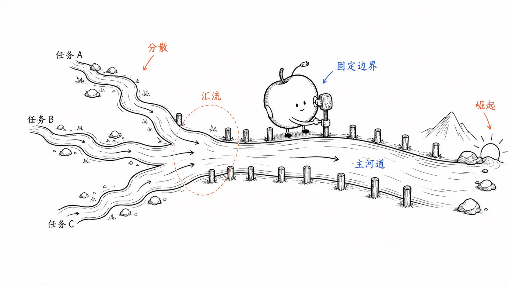

## 5.1. 智能工具的突然崛起

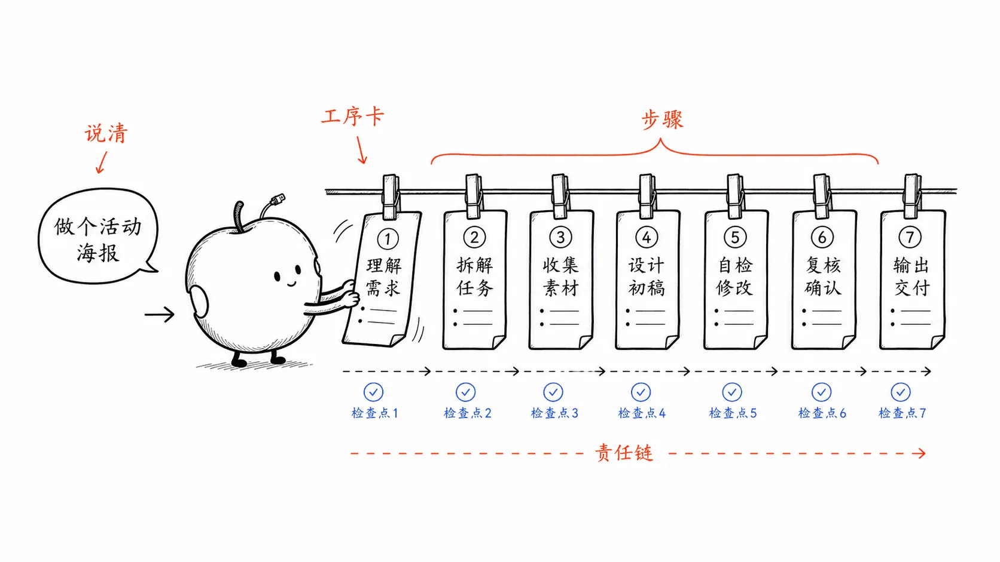

260 万年之前的古人类物种，比如南方古猿（Australopithecus）或能人（Homo habilis）就能制作工具，虽然都是很简单的东西，比如石头磨制的切割器和削刮器之类。

突然之间，人类手中有了一些 “智能工具”…… 感谢乔治·布林，感谢阿兰·图灵，感谢克劳德·香农，感谢无数的科学家和发明家…… 然而，这只不过是最近七八十年间才发生的事情。然后，这是最近两年的事情 —— 突然之间，我们所有人都有了一个能与之用自然语言对话的智能工具！

仅仅两三年时间，相对于那漫长的 260 万年，是什么样的概念呢？

如果我们将人类使用工具的历史时长（260 万年）比作一个足球场长度（100 米） —— 那么最早制作工具的古人就像是在一个球门处踢出了一颗球，而球场的另一个球门则代表现在。那么，两年前的时刻，那个从另一端踢过来的足球距离这边的球门还有多远呢？

我并没有直接动手算，而是把这段话拷贝粘贴给了 ChatGPT，它飞快地给出答案：

> 如果将人类使用工具的历史（260万年）比作一个足球场的长度（100米），那么两年前的时刻距离终点球门约为0.000077米（0.077毫米）。

据我所知，0.077 毫米大约是 1 根头发丝的直径。我又就此问了问 “事实核查机器人”，果然，我并没记错，它说是大约在 0.05 到 0.1 毫米之间。

这么类比一下，你就知道这有多 “突然” 了吧？ —— 真的很突然，真的实在太突然了！

从最近的一根头发丝开始数起，再往前倒数 24.5 根，就差不多是 1975 年，20 岁不到的比尔·盖茨和保罗·艾伦创办了微软公司，宣告个人计算机（PC）时代开启。在随后的这二十多根头发丝的时间里，有大量的人因为有能力与机器有效沟通 —— 就是通过编程语言与计算机说话 —— 而发家致富，人数众多，规模巨大。

我们绝对不能说只要会编程，只要能够与机器有效沟通，就一定发大财，但，懂编程语言的人，普遍收入相对更高，又的确是过去三十四年里大家亲眼目睹的事实。为什么呢？因为编程语言是一个杠杆，为善用者撬动了机器的效率，进而相对其他人能做更多的事情，拥有更高的生产效率 —— 就这一个理由还不够吗？

突然之间 —— 真的很突然 —— 那杠杆不再是对普通人来说是天书的编程语言，而是人人都早已会说的自然语言。虽然眼下（2024 年）的人工智能工具尚不完美，但，早晚的啊！了不起就是再等一根或者几根头发丝的时间而已。

## 5.2. 与人工智能好好说话

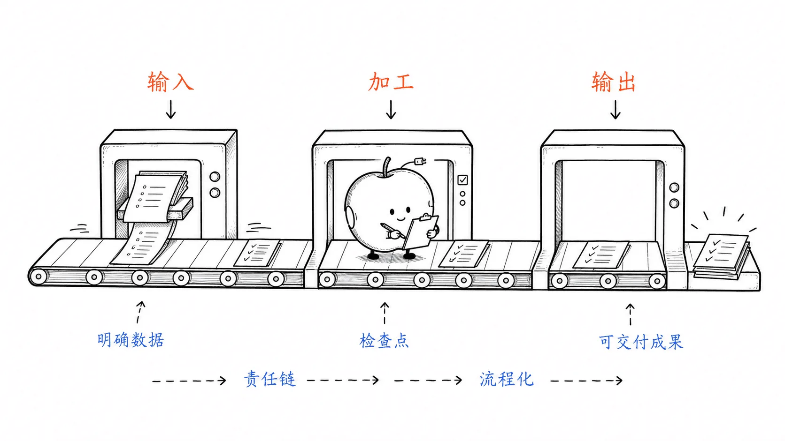

突然之间，人群之间的贫富差距来源多了一项，一个看起来有多简单就实际上有多重要的选项：

> 能不能跟人工智能 “好好说话”？

与你已经感受到的一样，“人和人之间说话的方式非常不一样”。同样的想法，就是有人比另外一些人表达的更清楚更准确，更何况想法也各不相同呢？

如何与人工智能好好说话呢？

我们已经看到了，在电脑上用浏览器跟 ChatGPT 说话远比在手机上强。我们也知道了，用英语跟 ChatGPT 说话远比用其他语言强…… 还有没有更重要的？或者说，效果更狠的方式？

当然有。用我的表述就是：

> * 调用**程序思维**思考；
> * 用**英语**表达；
> * 在**电脑上**对**浏览器**中的 ChatGPT 说话……
>
> —— 其实，无论是 ChatGPT 还是任何其他的生成式人工智能都一样。

你可能会想，“坏了，我不是程序员，我不懂编程，我没有程序思维……” 

千万别慌。其实你已经具备相当的 “程序思维” 了 —— 不知不觉之中 —— 你已经了解了 “判断”（那可是智能的核心），也顺带学了（或者了解了）一下 “布林代数” 和 “布林逻辑”，你甚至已经具备 “递归思维”（那可是进化的核心）…… 这起码已经算是掌握了恨不得 80% 的 “**程序思维**” 了。

话说，启用不同的 “思路”，或者说，启用不同的 “思维” 或 “思维体系”，威力有多么巨大大家其实在上一章已经体会过。一旦你启用了 “递归思维”，无论是你写个提示词，还是你造个能造机器人的机器人，抑或你去选择投资策略，都相对于那些 “没有递归思维” 或者 “没有启动递归思维” 的人，差距极大 —— 差距到底有多大呢？开玩笑讲的话，就差不多是 “猿与人之间一个智人” 的距离。

## 5.3. 程序思维

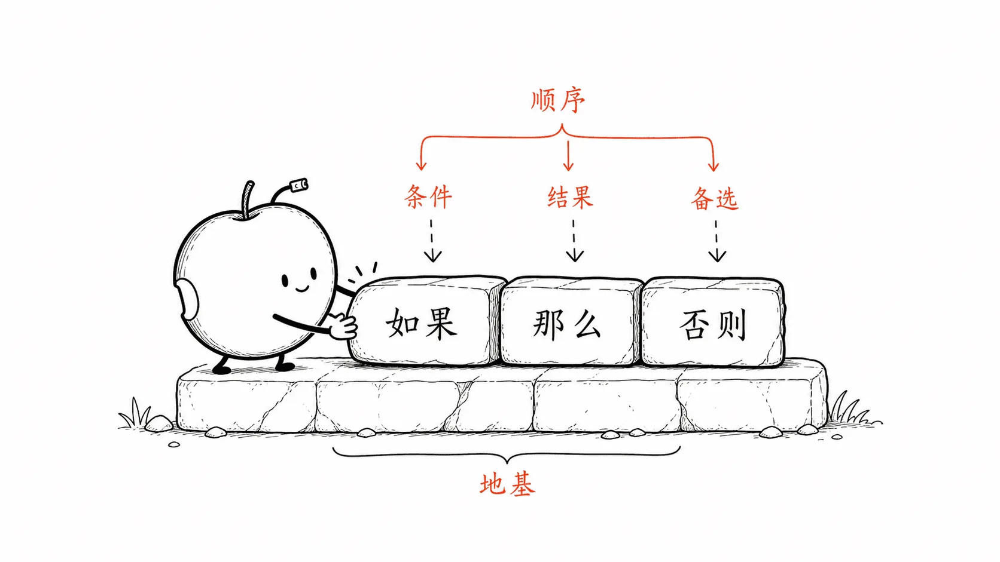

在这一章中，我们再对 “方法” 的 “执行” 过程中所需要的 “**流程控制**” 做一番补充，你就等于妥善且又完整地拥有了 “程序思维” —— 并且还是以任何小学生都能理解的方式。也就是说，你能学会，你家孩子也照样能够学会。

在此之前，你已经了解了 “**方法**” 有 “**输入**” 和 “**输出**”，你甚至了解了有些 “方法” 是 “**递归方法**”，可以把它们上一次执行的 “输出” 当作下一次执行的 “输入”。

现在我们再来看看，“方法” 的执行过程。

### 5.3.1. 流程（步骤）

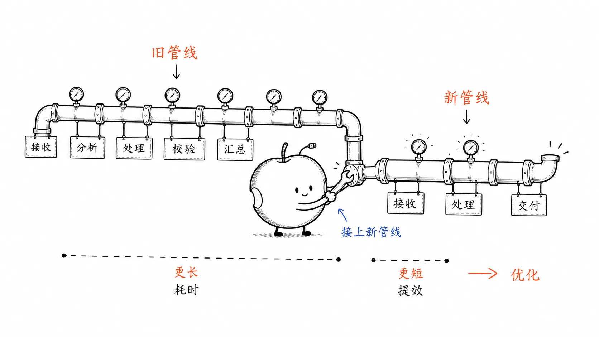

这并不难以理解，我们做事的时候，总得一步一步来，凡事都只能遵循一个步骤。“步骤” 这个东西之所以必然存在，基于时间的特殊属性：

> * 方向性
> * 排他性
> * 非逆性

除了时间有方向不可逆之外，关键在于它是一种排他性资源，你用它来做这件事情，就不能同时用它去做别的事情。同一个时间段只能做一个任务，不能做另外一个任务，只因为时间是排他性资源。于是，就只能有步骤，只能有顺序。

如果只有一个步骤，当然无需排序，直接做就完了；如果有一个以上的步骤，那就必须分出个先后，而后按顺序做完。而这个步骤事实上就是一种流程。换个词，它就是一种 “顺序”，一种 “流程”，一个 “程序”。

看看生活里的情况罢。哪怕你出门之前穿个鞋，也是有步骤的，或称为顺序，或称为流程，或称为程序。虽然每个人在细节上可能并不相同，但也都差不多，先把两只鞋都拿出来，而后先穿一只，再穿另一只，如果有鞋带的话，就分别系上。

穿鞋是这样，做菜也是一样的。理论上，每一个菜谱其实都是一个程序，因为它所描述的就是顺序、步骤或者流程。菜谱的典型描述形式就是一个列表，而列表其中的每个项目就代表一个步骤，一步一步跟着做完，食材就变成了饭菜。所以你看，一切菜谱都是程序。


做菜的师傅在干嘛？当然，我们日常生活当中把他干的活叫 “做菜”。换一个说法呢？他就是在执行一个又一个的程序，或者是在反复执行相同或者类似的程序。他所表现出来的状态就是一个 “程序执行员”。

这就是事实 —— 其实我们每天都在执行各式各样的程序，无论是穿鞋程序、做菜程序，还是泡咖啡程序或者上班程序…… 反正我们每天要执行各式各样的程序。于是，无论如何，我们每个人实际上几乎时时刻刻都是 “程序执行员”。

当我们说一个人是 “程序员” 的时候，指的不是 “程序执行员”，而是 “程序设计员”。当然了，这些 “程序设计员” 还可能有其他的角色，比如，“程序优化员”。其实，程序员的核心工作就是设计程序、优化程序。换个词就是，设计流程、优化流程，设计步骤、优化步骤，设计顺序、优化顺序，差不多就这么个事。

所谓的 “设计流程”，最朴素的定义其实是 “拆解”。拆解什么啊？把一个任务合理地拆解成若干个步骤。或者，把一个复杂的任务拆解成若干个简单小任务，然后再把每个小任务拆解成可执行的步骤。“拆解” 问题和任务，无论在哪里都一样，都是最常用思考过程和思考能力。

拆解之后，天下所有的任务都有其顺序，有其步骤，有其流程，有其程序 —— 接下来，在这些同义词中，我们选择使用 “**流程**” —— 对应编程世界里的一个术语，“流程控制”（Control flow）。

### 5.3.2. Böhm-Jacopini 定理

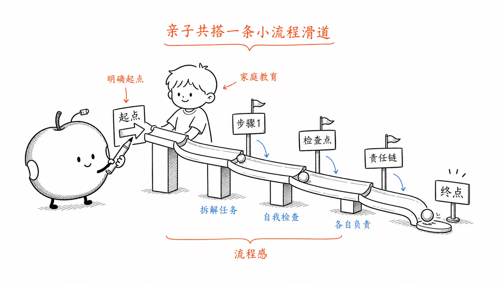

任何计算或任务流程，无论多么复杂，最终都可以通过以下三种基本控制结构来实现：

> * **顺序（Sequence）**：
>  - 按从前到后的顺序逐条执行的操作
>   - **例**：执行 A 操作后再执行B操作，然后执行 C 操作。
> 
>   - **分支（Selection）**：
>    - 根据条件的真假选择不同的执行路径，也称为条件判断。
>  - **例**：如果条件为真，执行 A 操作；否则执行 B 操作。
> 
>   - **循环（Iteration）**：
> 
>  - 重复执行某个操作，直到满足某个停止条件。
> 
>  - **例**：当条件为真时，重复执行 A 操作，直到条件变为假。

实际上，这是计算机科学家 Böhm 和 Jacopin 于 1966 年提出理论，叫做 “结构化编程理论”（[Structured program theorem](https://en.wikipedia.org/?curid=1482138)），或称为 “Böhm-Jacopini 定理”。该定理任何逻辑上有效的计算过程（即，流程）都可以用这三种基本控制结构组合而成，而无需使用其他非结构化的控制结构。

比如，现在有个很简单的任务，就是要求你把一些螺丝钉都拧进木板上。那么，用文字描述这个工作流程的话，就是：

> 根据给定的流程图，以下是它的文字列表描述：
>
> 1. 开始：
>    
> 2. 用锤子将螺丝钉钉进去一点点
>    
> 3. 判断螺丝钉的类型
>    
> 4. 根据螺丝钉头部类型选择工具：
>    - 如果螺丝钉是一字头：
>      - 使用一字螺丝刀将螺丝钉完全拧入。
>    - 如果螺丝钉是十字头：
>      - 使用十字螺丝刀将螺丝钉完全拧入。
>
> 5. 检查是否还有未处理的螺丝钉：
>    
> 6. 根据检查结果执行相应操作：
>    - 如果还有螺丝钉：
>      - 返回第二步，重复以上操作。
>    - 如果没有螺丝钉：
>      - 进入下一步。
>
> 7. 结束：
>    - 所有螺丝钉都已拧入，操作完成。

我们可以要求 ChatGPT 用以上的文字描述帮我们画个流程图：

> 请用 Mermaid 根据以下描述画个流程图：
>
> 【上面的文字描述拷贝粘贴在这里】

当然，以下的流程图，是我在 ChatGPT 给我的流程图基础上稍作了修改之后的效果：

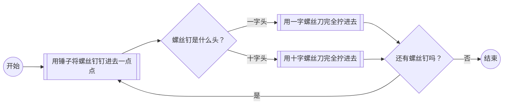

> 至于 Mermaid 是什么，好奇心充沛的你，当然可以直接去问 ChatGPT，它啥都知道……
>
> 另外，推荐一个我写的机器人（GPT）：
>
> * [Learning Anything](https://chatgpt.com/g/g-dPqJT0PXS-learning-anything): https://chatgpt.com/g/g-dPqJT0PXS-learning-anything
>
> 你想学什么就告诉它，它会给你返回一个问题列表，逐一用那些问题去问 ChatGPT 就好了……
>
> 比如：
>
> * I want to learn about drawing flowchart.
>   https://chatgpt.com/share/6704c715-af9c-8009-9c16-e425fa974b3f
> * I want to learn about drawing flowchart with mermaid.
>   https://chatgpt.com/share/6704c740-7438-8009-91a4-daec47d658ba
>
> 这个机器人的 “角色定义” 很简单：
>
> > This GPT will treat user input as a topic they want to learn about and will provide a comprehensive and structured list of prompts. The prompts will guide the user in a step-by-step manner to maximize their learning experience with ChatGPT. Each prompt will aim to deepen understanding and cover various aspects of the topic.

另外一个需要提醒并注意的事情是，“递归” 也是一种循环。你看，你用螺丝刀，“拧一圈” 就是个 “递归方法”。每一次你再 “拧一圈” 的时候，它的输入都是它上一次执行之后的输出。其实你每次都有个判断，拧紧了吗？没有，继续；拧紧了，结束。

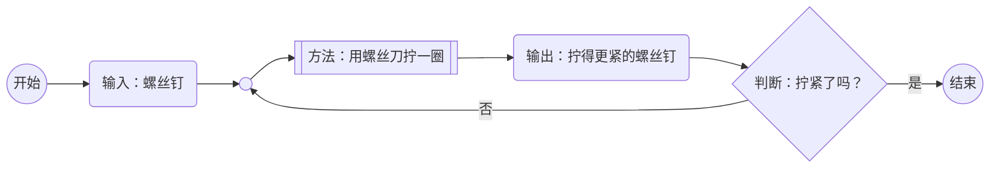

暂停一下。到此为止，你觉得这是一个需要大学文凭才能理解的事情吗？显然不是。我相信就算是还不识字的小朋友，实际上也能够理解的。

在上节课的时候，你就理解了“递归”，那可是被程序员们称为比较高级的，甚至难以学习的概念。可实际上呢？你现在压根就不是程序员，你将来也不见得是程序员，但你依然能够理解 “递归”。实际原因是，“递归” 这个概念在日常生活当中实在是太普遍，太常见了，仅此而已。“递归” 是我们整个生物界，不仅仅包括我们人类，一直在进化的核心。你怎么可能不理解它？只不过是在此之前没有人像我一样提醒你并且耐心地给你讲解而已。

### 5.3.3. 算法

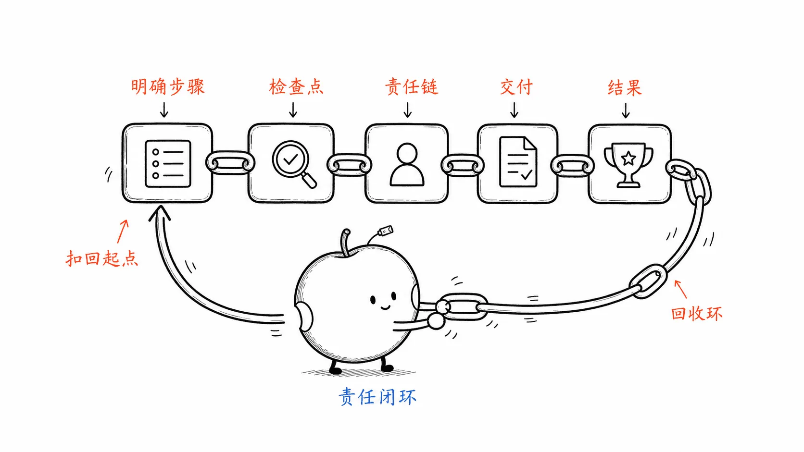

以下是判断一个数字是否为质数的算法步骤描述 —— 注意，“算法” 并不是什么高大上的词汇，它只不过是 “计算方法” 的缩写而已：

> 1. 开始
> 2. 输入一个数字
> 3. 检查数字是否小于等于 1
>    - 如果是，那么该数字不是质数（因为质数必须大于 1）。结束流程。
>    - 如果否，继续执行下一步。
> 4. 将除数设置为 2：
> 5. 检查数字能否被当前除数整除
>    - 如果是，那么该数字不是质数（因为它存在除了 1 和自身以外的其他除数）。结束流程。
>    - 如果否，继续执行下一步。
> 6. 将除数加 1：将除数加 1。
> 7. 检查除数是否大于数字的平方根
>    - 如果是，那么该数字是质数（因为到目前为止没有找到任何除数）。结束流程。
>    - 如果否，返回到步骤 5，用新的除数重新检查可整除性。
>
> 这个循环会一直持续，直到找到一个除数（表示数字不是质数）或者除数超过数字的平方根（确认它是质数）。

用 Mermaid 画出的流程图如下：

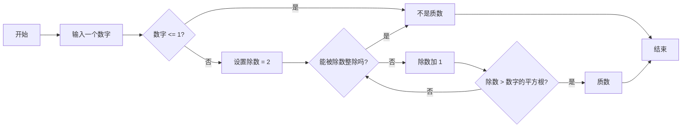

用 Python 编程语言实现这个流程的话，代码如下：

```Python
def is_prime(number):
    if number <= 1:
        return False
    divisor = 2
    while divisor * divisor <= number:
        if number % divisor == 0:
            return False  # Not prime
        divisor += 1
    return True
```

至于这段代码的细节就暂时不必研究了，以后再说 —— 目前，我们想要的是 “程序思维”，不是 “程序员工作”。

如果你有一点耐心，仔细看看这段代码也没什么，你会发现的，Python 这种高级编程语言，事实上已经非常接近 “自然语言” 了…… 只不过，我们的母语不是英语，所以才感觉 “门槛很高” 而已。

### 5.3.4. 异常处理

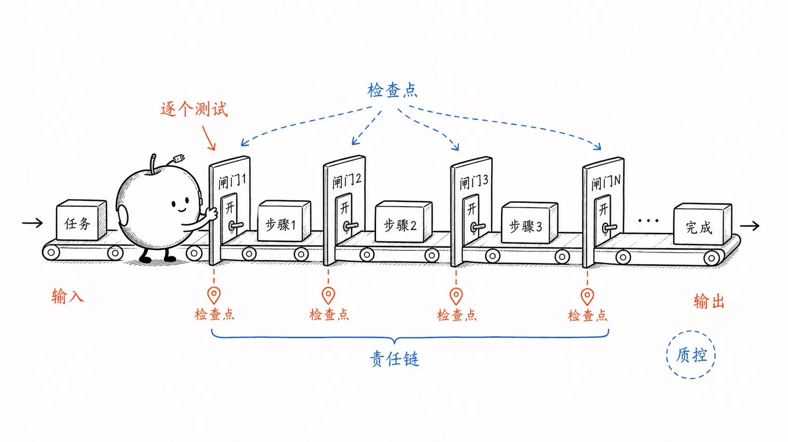

刚才说，无论多么复杂的任务，都可以用 “顺序、分支、循环” 构成 “结构化流程” 去完成。因为无论多么复杂的任务，都可以拆解成很多个小任务，然后每一个小任务，对吧，都可以设计成由分支、顺序、循环所构成的流程。

复杂的任务，我们可以称其为 “工程”。工程和系统的特点是什么？就是 “**意外频发**”。这在生活当中都是一样的，不只是程序，全世界都是这样，处处都是如此，总有意外。所以在制定流程或者是优化流程的时候，有一个很重要的单独的环节，因为它太重要，所以单独提出来的环节就叫 “**异常处理**” —— 出现意外怎么办？

举个日常生活当中所能用到的最常见的异常处理作为例子。比如，开车上班。第一个步骤当然是正常出发，而后持续使用 “开车” 这个方法…… 开车一直走，到一个路口，发现交通堵塞…… 这就是一个 “异常”。所以，如果交通堵塞了，或者说异常出现了的话，那就走备用路线。如果在这过程当中一直没有交通堵塞，那就一直走正常路线，然后到达并结束。

这就是一个 “异常处理” 的过程。当然，你也看到了，“异常处理” 的核心，无非是 “顺序、分支、循环” 中的 “分支” 而已。

一个如此简单的任务都需要 “异常处理”，那么由许许多多小任务构成的庞大且又复杂的工程呢？更是如此，随时随地都有 “异常处理” 的需求。

### 5.4.5. 优化

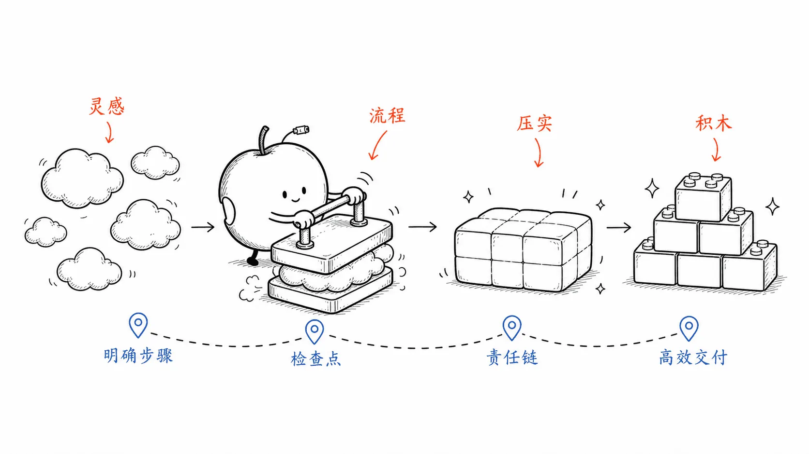

到此为止，我们所理解的概念已经不少了 —— 让我们再补充一个 “优化”：

> - 拆解
> - 方法，输入，输出，递归
> - 流程，顺序，分支，循环
>
> - 异常处理
> - **优化**

观察一下人群，你就会发现，绝大多数人终生都是 “程序执行员”，从来没做过 “程序设计员” 或者 “程序优化员”，从生至死都没有。这些占比绝大多数的人，其实有着一样的特征，那就是他们的习惯，“尽量不思考”。他们只执行，也只想执行别人设计过的、别人优化过的程序，对他们来说，这么做这么选的优势就在于无需思考，所以感觉轻松。

可是，思考真的有那么难吗？思考真的有那么累吗？并不是啊。（再一次，推荐《思考的真相》）

下面的例子能轻松让你明白思考这个东西，有多简单且多有必要。

我家小朋友，男孩上厕所的时候，都是先洗手后撒尿 —— 这就是他们在执行我告诉他们的流程。于是，我相当于是 “程序设计员”，他们相当于是 “程序执行员”。

后来他们上学了。老师教他们，应该便后洗手，大便小便都一样，小便后也要洗手。所以他们听到的是另外一个不一样的流程：先撒尿后洗手。

然后我们家老大回来就问我：“爸爸，这是咋回事？为什么你说的顺序和老师说的顺序不一样？” 

那我就得解释给他们听。

我说，你看你在外面玩，然后，你去上厕所的时候，因为刚刚你在外面玩了，你的手是不是很脏？他说是。我有说，这小鸡鸡是自己的，不是别人的，对不对？他说对。我说：你用你的脏手去碰你自己的小鸡鸡，是不是不太好？他想了想说是。我说：对啊，你要对自己好一点，也要对你的小鸡鸡好一点，是不是？洗手又不是洗给别人看的，是为了自己好，对不对？所以你要先洗手，用你干净的手去扶着自己的小鸡鸡去撒尿，这才对，是不是？然后，你再想想，撒完尿之后是不是不洗也其实无所谓？反正你还是要出去玩的，手还是会脏的，对吧？关键在于说，吃东西之前，千万不能忘了洗手，对吧？当然了，你自己想想看，你先洗手，然后去撒尿，再洗一下手又怎么样？反正也不费劲……

这就是区别。

绝大多数人都在不假思索地执行别人制定的流程，从来也不会去想是否应该去优化那个流程。但是有少数人，比如说我们执行的，就是我们自己优化过的流程。当然了，刚才这么简单的流程，你非说是我设计的，那也实在是太装了…… 它不需要设计。但那确实是需要一定的思考才能做出的优化 —— 无论那思考究竟有多么多简单。

所以，即便是最简单的流程，哪怕是仅由顺序要素构成的流程，其实也有优化空间，或者是也可能有优化空间……

其实，所谓的 “优化”，整理起来也没什么大白话不能理解的：

> * 这个步骤必要吗？
>* 顺序需要调整吗？
> * 分支的条件需要补充吗？
> * 循环次数能减少吗？
> * 还有什么异常没有考虑到？

## 5.4. 程序思维的根基

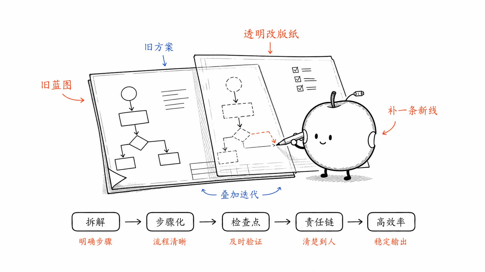

至此，虽然你依然连一行代码都不会写，可你已经具备了足够的程序思维。这就好像，你可能一句意大利语都不会说，但，作为成年人你已经具备了足够的 “生活思维”，你去听说读写意大利语，实际上只不过是在学 “用另外一种语言描述你的生活思维” —— 至于 “生活思维”，是你哪怕不懂意大利语，也早就学会并一直应用的东西……

然而，“具备程序思维” ，或者说，“像程序员一样思考”，有更深层次的根基。但，并不复杂，说穿了好像也就两件事，都跟 “写代码” 没有任何关系：

> * 主动思考
> * 长期积累。

然后我们再来仔细观察一下。人们宁死都不愿意自己设计或自己优化程序，并且大多数人最终还真的能做到至死都没设计过或者优化过任何程序，除了之前提到的 “回避思考” 之外，其实还有另外一个更为隐蔽但更为重要的原因。

他们在干什么？他们不仅在回避思考，他们还在 “回避责任”。因为做不好或者做错了的时候，他们可以说责任不在他们，因为他们已经完整地按步骤做了，因为他们按照别人说的做了，然而现在错了，那就责任不在于他；责任在谁？显然在程序设计者或程序优化者身上。他们的理由很简单：我按程序做的，别人都是这么做的，所以，无论结果怎样，反正我肯定没错。

在日常生活当中，对绝大多数人来说，“思考” 在感觉上可能还是个虚无缥缈的东西；但是 “责任” 这个东西不仅是现实存在的，并且，即便是在感觉上都是一个真实的压力。更何况，有的时候仅仅与大家不一样，都可能造成天大的压力。所以我们现在再进一步补充一下 —— 为什么绝大多数人终生都是程序执行者，而不是设计者或者优化者？从根基上来看，补充过后，一共就三件事：

> * 主动思考
> * 长期积累
> * 承担责任

所以，真正的问题并不在于你是否理解并能应用 “程序思维” 里的那些概念，诸如：

> 拆解；方法，输入，输出，递归；流程，顺序，分支，循环；异常处理；优化……

真正的问题在于你是否具备以上三个品质：“主动思考”、“长期积累”、“承担责任”。你不是这样的人，你就不可能是真正的 “程序设计者” 或者 “程序优化者” —— 即便是理解了 “程序思维” 相关的所有概念。

## 5.5. 成为程序设计者优化者

你知道吗，很多拥有编程能力的人被称作或者自称为 “码农”。为什么？因为他们自己也知道，自己做的事情只不过是用编程语言把领导交代的任务重写一遍，自己并不是设计者，自己并不是优化者，自己干的事情和种地的农民和工地的工人没什么太大的区别，只不过是生产资料生产工具不太一样而已…… 

“码农” 为什么是 “码农”？“主动思考”、“长期积累”、“承担责任”，这三个品质中哪怕缺少其中任何一个，都只能是 “码农”。尤其是最后一条，“承担责任”，会自动筛掉 99% 的人。

所以到最后，你要把自己变成这种人才行。你如果自己就不是这种人，别说 “具备程序思维” 了，哪怕你已经掌握了几十种编程语言也没有什么具体用处，你还是 “程序执行者” 而已。别说读这本书或听这种课了，读再多的书，上再多的课，也没用，也不会成为 “程序设计者” 和 “程序优化者”。因为你从根儿上就不是这样的人。

所以实际上你要干的事情，最重要的是从根基上改变自己。对你要变成一个强求自己变成一个主动思考的人，强求自己变成一个长期积累的人，并且还要勇于承担责任。自己的责任自己不承担，谁帮你承担？逃避责任永远是幻觉 —— 弱者的统一幻觉。

所以如果你是父母的话，你很容易就能理解为什么我一定要找到最后的根基 —— 要不然我就没有用。其实只不过就是上一章提到的 “深入” 而已 —— 不断思考 “问题背后的问题究竟是什么？”

我常年写书常年讲课，但，请不要误会，我实际上一直都是在给我自己、我家的孩子、我老婆讲课…… 因为我要让我的家人都变成这样的人。至于他们以后用这样的品质去干什么事情，我其实无法知道，事实上也并不太关心……

现在直接去问 ChatGPT：

> * 如何应用程序思维与 ChatGPT 更有效地沟通？
> * How to use programming mindset to communicate more effectively with ChatGPT?
> 
> https://chatgpt.com/share/67049acb-de08-8009-9074-208549a756bf

它的答复，对现在的你来说，已经变得足够 “通俗易懂”，因为你已经掌握了绝大多数 “程序思维” 里的关键概念。你可以反复问它，而后自己动手整理出一个更为完整的文档。

整理过后你就会发现，几乎所有市面上关于 “人工智能提示词工程” 的书籍和课程，本质上就是这些内容，也不可能有什么其它内容…… 

说实话，这也是没什么办法的事情。因为背后的机理的确如此。人工智能就是用程序思维搞出来的东西，当然用程序思维与它沟通效率最高。所以市面上的书籍或者课程提到的各个方面，当然也就是且只能是那些东西。这是谁都改变不了的事实。

但是我们的重点不一样。重点肯定不仅仅是让你了解程序思维是怎么回事，更重要的是把你变成程序设计者、程序优化者。不仅把你变成 “具备程序员思维的人”，也要让你变成 “主动思考、长期积累、承担责任的人”。

即，你应该能够在任何地方都可以应用程序思维，因为你就是你自己人生的程序设计者。你每天执行的所有程序，虽然最初的时候，都可能是别人设计的、别人优化的，但是其实你自己有权利有义务去进行自己的思考，去进行自己的调整、自己的优化。

然后我们再观察一下真实的世界。其实到最后，哪哪都是一样的。永远只有少数人在进行系统化的设计，他们主动思考，他们长期积累，他们承担责任。请问天下哪个地方不是如此？不只是计算机世界如此，其实哪哪都是一样的。再请问，这三个特征是不是一切形式的所谓 “领导力” 的基础要素呢？

做不到或者缺乏这三个基本要素的人在哪都不行，在哪都不可能有领导力的。你若是团队管理者，你若是团队组建者，你若是流程管理者，你若是流程设计者，你若是流程优化者。你要干嘛？第一步当然是设计并制定清楚的流程。然后谁来执行这些流程？你的团队成员。

对这些执行人的要求，其实很简单。他们不要判断，他们必须严格执行命令，确保流程完美执行。这也是为什么这世界有绝大多数人懒得思考的重要原因，因为这个世界需要相当一部分这样的人 —— 具备这样的特质，某种意义上甚至是 “加入团队” 的前提条件。或者反过来说，如果你有极强的独立思考能力，你可能都找不着工作，或者即便找到工作你也可能很难适应。

你作为组织者、管理者、设计者，设计了个流程，而后这个流程开始执行…… 然后你要干什么？你要监督流程执行的过程。一旦出现错误怎么办？这个时候你需要有监督者，就是所谓的中层。他们要有一定的判断力，但是要求并不高。为什么？因为所有的判断标准都是你给他们的，不是他们自己想出来的。

然后你还要干嘛？叫优化流程。这只能是你自己干的事情。领导有自己的任务，输赢自负，你要负责的，所以你一定要去优化流程。一共就干这么三件事，制定并优化流程，执行流程，监督执行 —— 然后有三种人来分别负责，对每一种人都有不一样的要求。这几乎是天下所有团队运营的本质。

顺带，你可以去了解一下什么叫做 “SOP”（标准操作流程，Standard Operation Procedures）—— 这是很重要很常见的一种现代企业管理技术。理论上来讲，一切的管理，核心对象，其实是 “流程” 及其各个环节，而不是执行流程的人。

有两种方法去跟 ChatGPT 聊天，获得关于 SOP 的知识。第一种，就是你凭直觉想到的，去问它 “SOP 是什么？”，另外一种，你可以尝试一下，打开一个新聊天，对 ChatGPT 说：

> “SOP”（标准操作流程，Standard Operation Procedures）很重要很常见的一种现代企业管理技术。理论上来讲，一切的管理，核心对象，其实是 “流程” 及其各个环节，而不是执行流程的人。
>
> 继续写下去，写 1000 字。
>
> https://chatgpt.com/share/670dc876-23a4-8009-a0fb-c345c7e26a5f

## 5.6. 家庭教育的重点

在平日里，大家总是吐槽各种家庭教育。其实在我看来，实话是，真的没有啥可吐槽的。因为仅从事实上来看，99% 的家长压根就不是主动思考、长期积累、承担责任的人。他们过去不是，现在不是，将来还不是。他们在家里不是，他们在外面不是，他们这辈子都不是。请问，他们怎么去做好一个家长？

所以如果你是家长，你还想做个好的家长，你就问自己这三个问题就可以了：我主动思考了吗？我长期积累了吗？我承担责任了吗？若是你想教育出一个这样的孩子，对，你就从小向他灌输这三个基础要素的重要性就可以，并让他们像你一样经常认真问自己那三个简单的问题。

这三个特质与年龄、性别完全没有关系。有的人很小就具备，能做到，绝大多数人终生做不到。请问，如果你是家长，在你的教育当中有没有这个重点？问题在于，如果你自己就不是，请问你的重点里怎么可能有这些？

并且这三个特征也与金钱全无关系，这压根就不是需要花钱才能获得的品质或者能力。好笑的是，它只不过是一个意识问题、认知问题。它就好像是一个开关一样，绝大多数人都关着，终生关着。可问题在于，打开它真的很累吗？打开这个开关的成本为零的。如果你是个家长的话，我可以毫不夸张地告诉你，在 99% 的概率下，已经瞬间改变甚至颠覆了你对所谓教育的认知。

再仔细想想看，与这三个特征相比，请问，学校里的成绩算个什么？课外辅导班一文不值。

成年后，人们经常慨叹，“小时候养成的习惯” 远比那些 “在学校里学过考过毕业之后就忘了的东西” 重要不知道多少倍…… 请问，“习惯” 是什么？本质上来看就是因为重复了不知道多少遍而固化在脑中 “流程” 啊。人们总把 “凭直觉做的第一步” 称为 “习惯”，其实，“习惯” 是以那一步为开始的流程，可能只有一步，也可能随后有很多步……

说哪个 “习惯” 不好，就是在说那个流程不对。比如，使用任何工具之前，开头都漏掉一步，“阅读说明书”；又比如，做任何事情的时候，最后都漏一步，检查；这都是 “缺失必要环节的流程”。更多的时候，所谓的 “坏习惯” 只不过是 “凭直觉采用的”、“未经设计”、“未经优化” 的习惯，所以，经常出现 “在真实生活里完全不适用” 的情况。

想想看吧，如果父母不是 “程序设计者”、“程序优化者” 的话，如果父母从来都只是 “程序执行者”，会出现什么情况？原理上来看，所有婴儿出生的时候都一样，大脑尚未发育完整，大约 15 岁的时候才能做到 “除了前额叶皮层之外发育基本完整”…… 所以，在相当长一段时间里，小朋友是需要父母充当他们的 “大脑皮层”，尤其是 “前额叶皮层” 的。所以，如果父母不是 “程序设计者”、“程序优化者” 的话，孩子的所有 “习惯”，或者说 “基础流程”，全都是仅凭直觉采用的、错的、或者起码是未经优化的 —— 即，所谓的坏习惯。而后，终其一生，一切的所谓 “挣扎”，其实都是与那些小时候养成的坏习惯作斗争……

另外，我们已经知道那个重要的事实：“判断是智能的核心”，那么请问，最重要的 “判断力” 是什么呢？或者说，“优秀判断力” 的最佳应用场景是什么呢？在我看来，生活中最重要的 “判断” 是关于 “流程” 的判断，用优秀判断力去评估一个流程的好坏，以及判断它是否能够继续优化 —— 请问，还有什么比这更好更重要的场景呢？

## 5.7. 一人做事一人当

程序也好流程也罢，不管设计者是谁，执行的后果是不是总是由我们自己承担呢？那么请问，是不是自己参与设计、自己参与优化更划算一点？或者最起码是不是更应该？因为无论怎样，都是要自己承担后果。

再说，其实压力也并不大，因为绝大多数程序其实都挺好的。如何泡咖啡，非要优化一下也行，不优化也可以。群体的力量还是很大的 —— 绝大多数现有的程序，已经挺好的了。

于是我们要做的只不过是对最重要的程序、最关键的程序，主动进行进一步的思考，判断每个环节的质量，然后看看有没有必要进行优化。然后反正都是由自己来承担后果。最终，这只是一个选择而已。

顺带，我们可以问问 ChatGPT “程序思维” 或 “结构化思维” 到底是什么？

> What is programing mindset, or structured thinking framework? 
>
> https://chatgpt.com/share/6704b4bc-3e80-8009-a6b9-754b8810a5fd

你会发现的，用英文问，然后再翻译成中文，远比直接用中文问获得的答案质量高出许多。

> 什么是 “程序思维”，或者 “结构性思考框架”？
>
> https://chatgpt.com/share/6704b8af-9fe8-8009-8deb-001bc2e11102

好了，那么重点来了，请问，我们应该如何应用 “程序思维” 与 ChatGPT 有效沟通呢？

虽然你现在还不会任何编程语言，但你知道了，程序这个东西，最好自己设计、自己优化，最起码，要自己审核之后才能放心使用。于是，无论干什么，你都可以通过与 ChatGPT 沟通，那些关于程序的关键点：

> * 把【……】拆解成多个最小化且可处理的问题。（拆解问题）
> * 做【……】的具体步骤/流程是什么？（用自然语言写程序）
> * 做【……】（例如某个步骤）的时候都需要做哪些关键判断？（判断与分支）
> * 在做【……】的时候，通常都有哪些意外可能发生？（异常处理）
> * 以下是我做【……】的步骤，看看有哪些地方可以优化？（优化工作）
> * 做【……】的时候，如何尽量减少重复工作？（循环优化）
>
> —— 也许你应该把上面的模版全都翻译成英文保存好，以便随时可以调用。

太简单了吧？这是因为我们现在可以跟一个 “智能工具” 用 “自然语言” 沟通了 —— 于是，你竟然在只不过是 “知道” 了几个重点概念之后，就可以开始使用那些重点概念从 “智能工具” 当中获得更多信息，就好像你已经彻底 “掌握” 了那些重点概念一样。在与 ChatGPT 反复沟通的过程当中，你所需要的仅仅是 “阅读理解” 能力，而后就可以一步一步地做到 “的确掌握” 那些重点概念…… 这实际上是个非常神奇的过程。

## 5.8. 继续完善工具方法论

另外，为了真正做到：

> * 调用**程序思维**思考；
> * 用**英语**表达；
> * 在**电脑上**对**浏览器**中的 ChatGPT 说话……

我还在不断定制我的 Edge 浏览器 —— 作为 ChatGPT 专用浏览器。

> 顺带说，Edge 浏览器有一个快捷键：`Shift + Command/Control + U`，用来启动 Read Aloud 功能 —— 微软的 Natrual Voice 是很强大的。
>
> 另外，拿来任何一个软件，都要先去看一下 “设置对话框”（Settings/Preferences）之后，就是 “顺带学几个重要的快捷键”。

在这个浏览器里我只安装了 5 个插件（Extensions），它们分别是：

> * [GPT Search: Chat History](https://microsoftedge.microsoft.com/addons/detail/gpt-search-chat-history/hcnfioacjbamffbgigbjpdlflnlpaole)：添加聊天搜索功能
> * [Prompt Library Manager](https://chromewebstore.google.com/detail/prompt-library-manager/ekjokgphmodglpfneiallnaefcoegdnc)：保存几个格外常用的提示词模版
> * [ChatGPT EnterControl](https://chromewebstore.google.com/detail/chatgpt-entercontrol/llifnfdbmdcpjfnlhpombbadbhfghdao) 用 `Enter` 键插入新行；用 `Ctrl + Enter` 发送消息
> * [Custom New Tab](https://microsoftedge.microsoft.com/addons/detail/custom-new-tab/onagfgjlokaciajhjmajljcfanonbmia)：指定新建 Tab 的网址
> * [Redirector](https://microsoftedge.microsoft.com/addons/detail/redirector/jdhdjbcalnfbmfdpfggcogaegfcjdcfp)：把所有 bing.com 的搜索链接指向 google.com

> [!Note]注意
>
> 2024 年 10 月 30 日，ChatGPT Web 端上线了聊天记录搜索功能。于是，GPT Search 插件可以弃用了……

迄今为止，我没有安装任何 “付费插件” —— 不是不肯花钱，是衡量过之后并无必要。至于为什么没必要，后面的章节中，会有详细的解释。

我希望浏览器一打开就直接访问 https://chatgpt.com，所以把浏览器的首页设置成了这个网址。我还希望新建 Tab 也同样是 https://chatgpt.com 而不是那个被设计得极丑的 Microsoft Bing Homepage，于是，只好安装了 [Custom New Tab](https://microsoftedge.microsoft.com/addons/detail/custom-new-tab/onagfgjlokaciajhjmajljcfanonbmia) 插件，它可以指定新建 Tab 的网址。

相比来看，我依然更喜欢 Google 搜索引擎。所以，

> * 把默认搜索引擎换成了 Google。
>
> * 安装了一个 [Redirector](https://microsoftedge.microsoft.com/addons/detail/redirector/jdhdjbcalnfbmfdpfggcogaegfcjdcfp) 插件，把所有指向 bing.com 的搜索链接指向 google.com。需要在 Redirector 插件的选项里进行设置：
>
>   ```
>   Redirect: https://www.bing.com/search?q=*
>   to: https://www.google.com/search?q=$1
>   Hint: Any word after search?q= leads to google search for that word.
>   Example: https://www.bing.com/search?q=some-word-that-matches-wildcard → https://www.google.com/search?q=some-word-that-matches-wildcard
>   Applies to: Main window (address bar)
>   ```
>
>   如此这般之后，哪怕是 `Shift + Command + E` 启动的搜索，其实用的也不是 Bing，而是 Google。
>
> * 启用 Sidebar，把原本放在那里的所有 App 都清理掉，搜索并添加了 Google —— 这一步很重要，因为能在 Sidebar 里用 Google 搜索实在太方便了。
>

我在 Sidebar 里用的最多的，除了 Google 之外就是 Amazon 了，因为经常要求 ChatGPT 推荐书籍，然后直接购买…… 很开心。


最终在众多的浏览器中选择 Microsoft Edge 浏览器的原因，最重要的只有一条：它有个 “浏览器内分屏” 的功能，这个功能在使用 ChatGPT 的时候超级好用 —— Google Chrome 和 Apple Safari 都没有这个功能。

用 `Command + ,` 呼出浏览器设置页面（或者直接在地址栏里输入：`edge://settings`），搜索 `Split`，而后滑动页面，总计能看到几处可以设置与之相关的地方（因为是通过搜索找到的，所以有重复）：

> * Split screen button，打开这个开关，如此这般，在浏览器的工具条上就会显示一个按钮；
> * Configure Split Screen 点进去，有两个开关：
>   * Enable Split Screen，当然要打开这个开关；
>   * Link tabs，这个按钮一定要打开。然后就能在分屏之后，在左半屏点击的链接，会在右半屏打开…… 这太方便了！

如此这般设置之后，你会跟我有同样的感受，电脑屏幕一定要足够大…… 否则实在是太耽误事儿了。很多年以前开始，我就使用两块屏幕，都是 27 吋的显示器 —— 两个 32 吋的也试过，但换回来了，因为超出了能够掌控的视角范围 —— 这些年享受了太多 “只用一块儿屏幕的人” 几乎永远不可想象的便利和好处。

反正，我在用 ChatGPT 的时候，可以同时打开很多窗口。第一块屏左半边是我写作的区域，一个 Typora；右半边是一个 Edge 浏览器窗口，被 “浏览器内分屏”，一半是我的主要 ChatGPT 聊天窗口，另外一半是 Google；在第二块屏幕上，左中右平铺了 3 个窗口，分别是写作时我常用的机器人（GPTs）…… 对我来说，完全无法想象在一个单独的小屏幕上工作的可能性。


在这里，不得不感叹一下，电脑才是真正的“效率工具”，而手机其实是“分心神器”。手机这种设备，能少用就尽量少用 —— 尽管在某些情况下，它的确不可或缺。

如今，有相当一部分人几乎完全依赖手机，而不用电脑，这样的人数比例还相当高。但是，如果你仔细观察就会发现，这些几乎不用电脑的人，通常并不是那些特别注重效率或工具使用的人。他们的生活习惯和长期的思维方式促使他们做出了这样的选择。

我的态度始终如一：要么工作，要么不工作；要么学习，要么不学习；要么生产，要么不生产。无论是工作、学习，还是生产，能在电脑上完成的尽量在电脑上完成，因为电脑是提高效率的工具；能不在手机上操作的，就尽量避免，因为手机是容易分心的利器。这一点需要不断提醒自己和家人。
