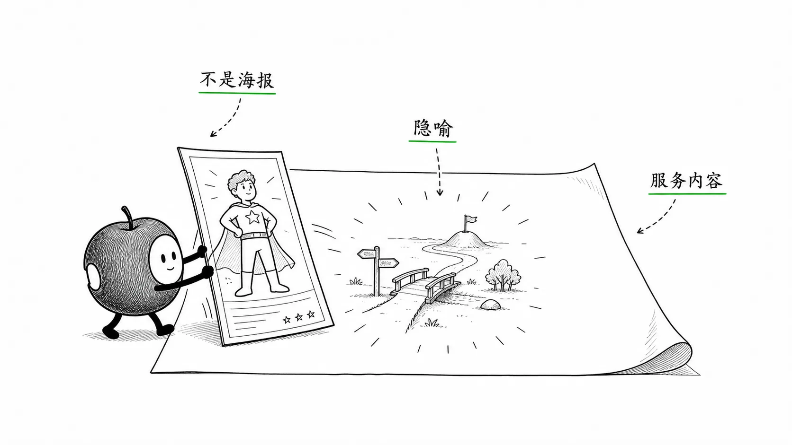
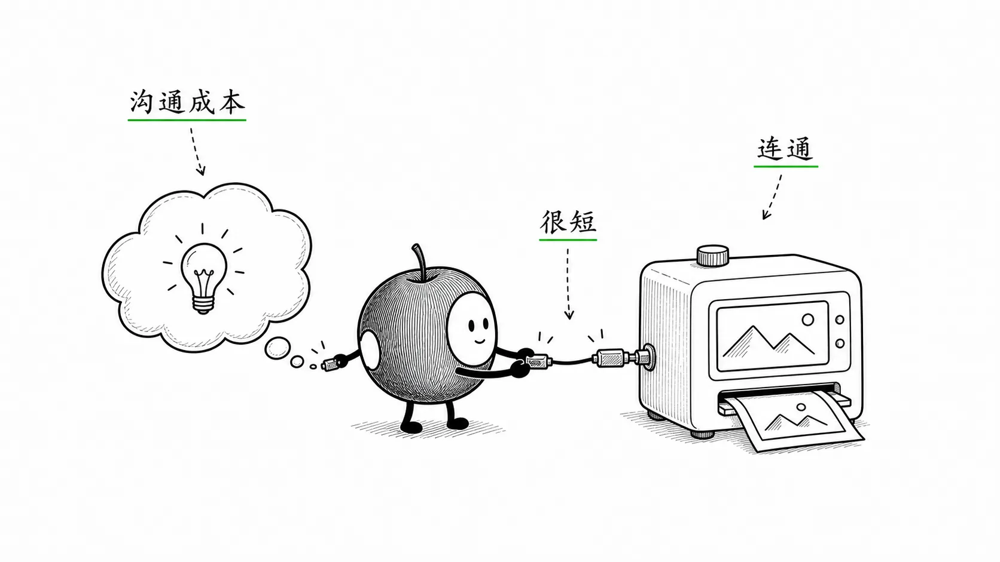
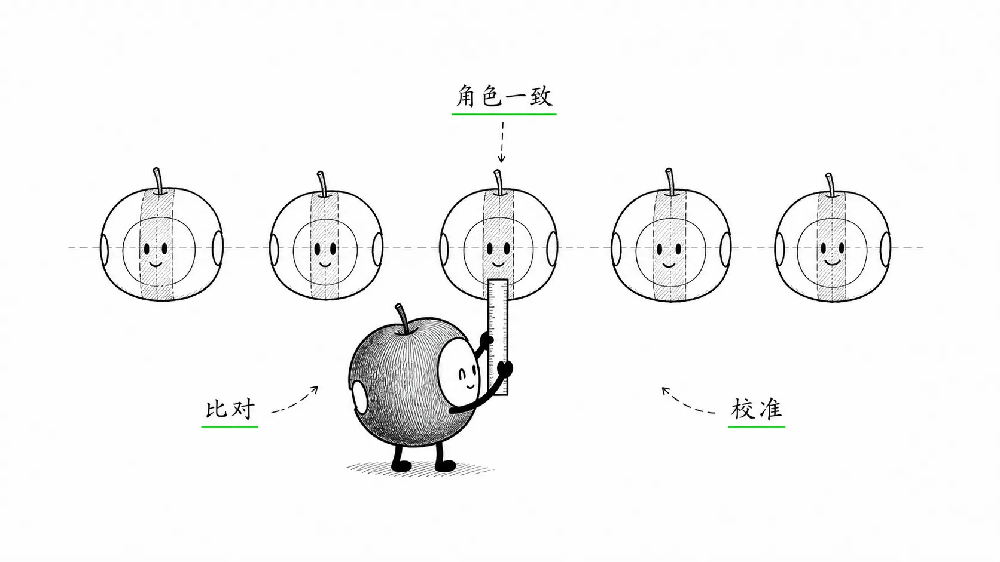
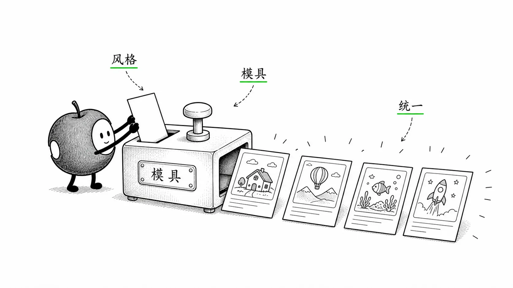
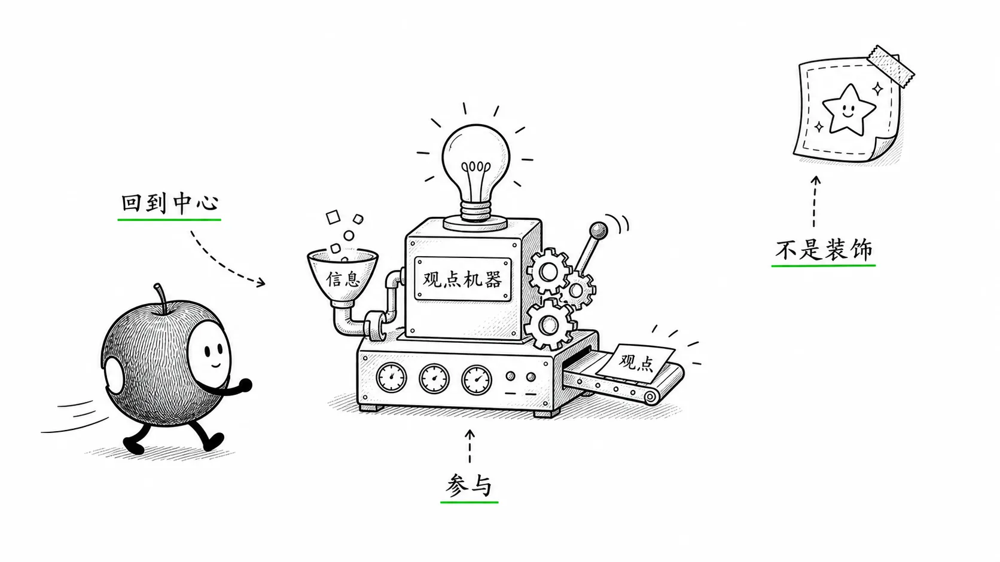
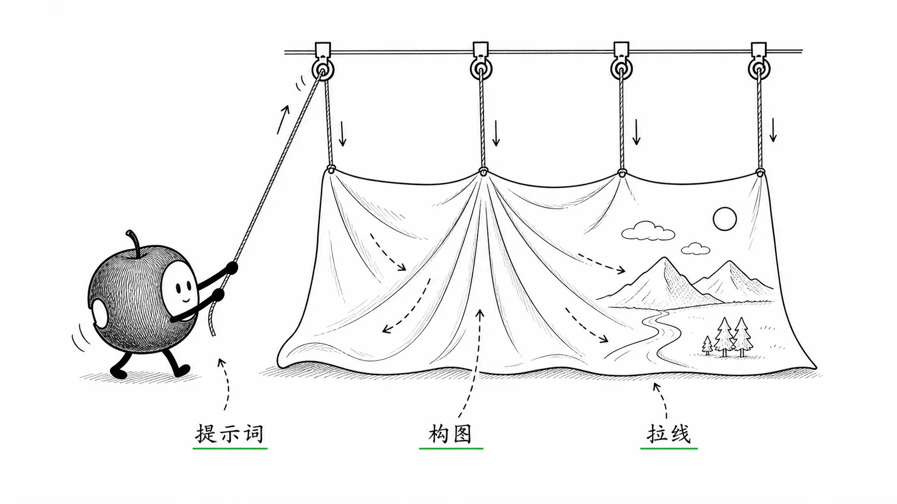
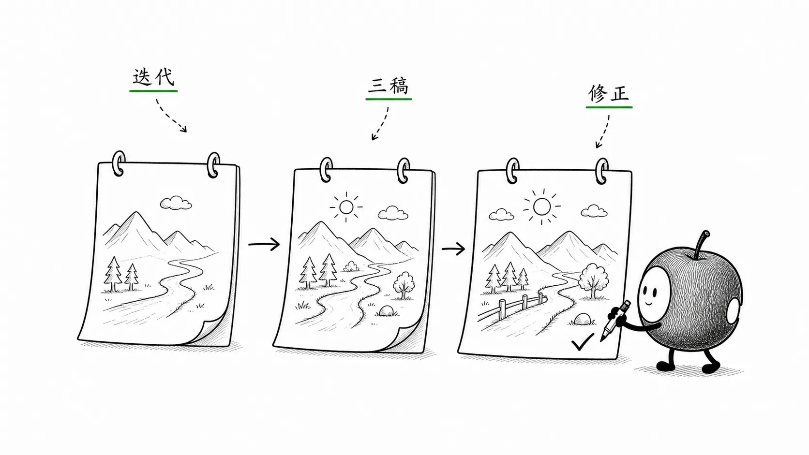
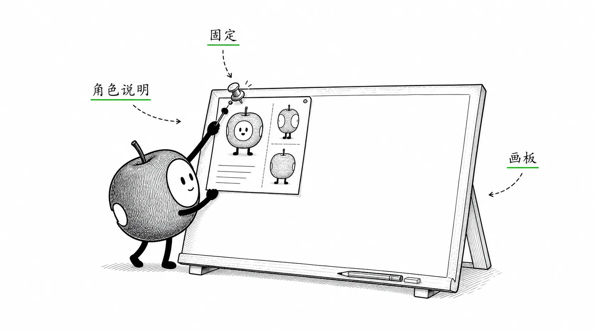
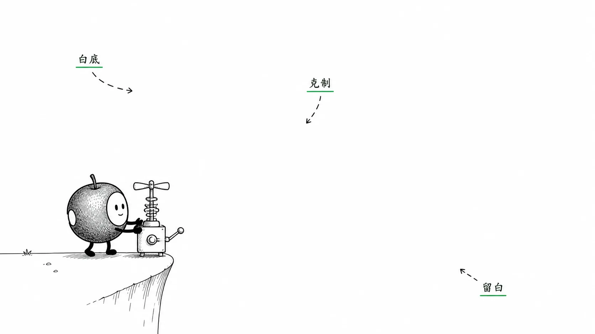
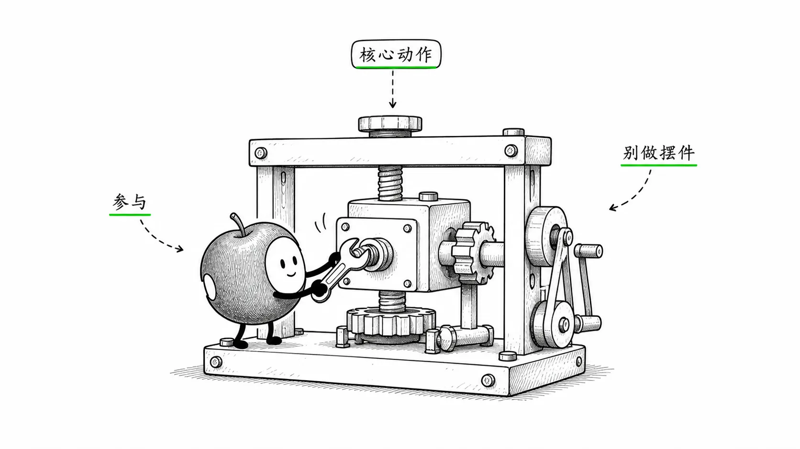

# 关于插图

每章首页的插图，都是用 DALL·E 画的。虽然它的制图仍然不完美，可总比我去找一个插画师来得方便，并且 “沟通成本几近于零”。

DALL·E 画图的时候，目前还很难保持统一的角色。只能用很 “笨” 的方法将就着做。我的做法是，首先，选择一个不太容易不一样的角色 “火柴人”（a stick figure），而后每次都用同样的方式描述这个火柴人：

> Create a cartoon image of a stick figure having a conversation with a huge brain. The stick figure stands on one side, while the brain is on the other side, much larger than the figure. Both the stick figure and the brain should have speech bubbles, as if they are engaged in a dialogue. 
>
> > *The stick figure is a simple, minimalistic one drawn with thin black lines. The figure has a perfectly round head with only dot eyes, and a thin body. The arms and legs are basic, straight lines extending from the body. Light, subtle shading is added on the lower side of the head and the body to suggest minimal depth, but the shading is soft and faint to maintain the overall minimalist and flat design.*
> >
> > *Ensure the image stays in a minimalistic black-and-white cartoon style, with a light gray background. All elements should be kept simple, with minimal detail and clean, precise lines.* 
> >
> > *Wide aspect ratio.*

即，每次描述图片之后，都要附加上上文中 “斜体” 的部分 —— 然后还要多试几次，才有可能遇到自己相对满意的图片。

当然，这些图片虽然在细节上都有令人无法满意之处，但作为这本书的插图，却竟然让我感觉“再合适不过”了。神奇。

