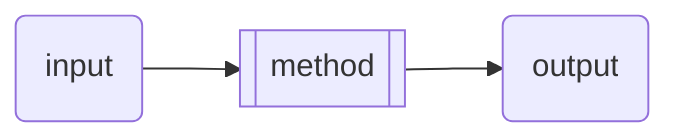
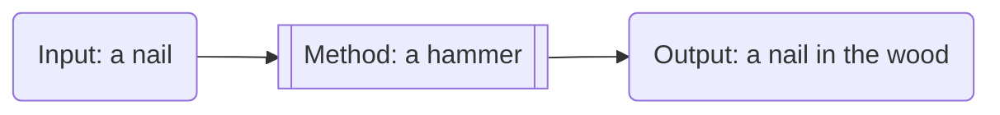
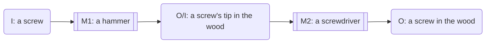
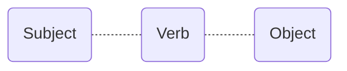

# 04. The Core of Evolution: Recursion


In the last chapter, we touched on how the essence of intelligence is "judgment." This is a sharp insight. If we use this perspective to reevaluate what we call "education," a glaring truth emerges:

> If education doesn't enhance a person's ability to make judgments, then it's garbage, or worse, poison.

Unfortunately, whether it's parents, teachers, or school curricula, not only do they fail to encourage independent judgment, but they often tirelessly strip away children's ability and opportunities to make judgments. It's a relentless cycle of destruction.

But complaining gets us nowhere. What we can and should do is continuously improve our judgment skills. And not just our own, but also those of our parents, spouses, and children. Right and wrong, good and bad, strong and weak—life is full of situations that require judgment. Without judgment, there's no intelligence.

In this chapter, we're diving into another razor-sharp insight: the core of evolution is "**recursion**."

## 4.1. Experiencing Recursion

Recursion is often seen as a tough concept to grasp. There's a joke that goes:

> In order to understand recursion, one must first understand recursion.

But there's definitely a way to break it down in simple terms so anyone can get it.

Let's start by looking at a phenomenon created by recursion. You've probably seen the movie *Inception* (2010), directed by Christopher Nolan. There's a classic scene where the character Ariadne places two mirrors facing each other, and suddenly, we see endless reflections of Ariadne and Cobb, both front and back...


When two mirrors face each other, they create an infinite series of reflections. This is a visual example of recursion.

## 4.2. Starting with Methods

After experiencing a recursive phenomenon, let's break it down from the beginning.

In life, whenever we do something, there's usually a "method" involved. Generally, a "method" corresponds to an "input" and an "output."



For example, if you have a recipe for a dish, the "method" involves the "input" of ingredients and the "output" is the finished dish.

Similarly, when you hammer a nail into a piece of wood, "using a hammer" can be seen as a "method." The "input" is "a nail and a piece of wood," and the "output" is "a nail driven into the wood."



In the same way, when you want to screw a screw into a piece of wood, "using a screwdriver" is a "method." The "input" is "a screw and a piece of wood," and the "output" is "a screw driven into the wood."

````mermaid
flowchart LR
input(I: a screw) --> method[[M：a screwdriver]] --> output(O: a screw in the wood)
````

Sometimes, we need to chain two methods together. For instance, when you need to tighten a screw into wood, you might first use the "hammer" method, then the "screwdriver" method. You align the screw, tap it lightly with a hammer to set it, and then use the screwdriver to twist it in. Here, the "output" of the first method becomes the "input" for the second.



These methods have specific inputs and outputs, and the output of one method can serve as the input for another. It's simple, natural, and normal.

However, there's a special kind of method called a recursive method. What makes it special?

> **It can use its own output as its input for the next execution.**

This might sound a bit abstract, but it's worth repeating until you can recite it without missing a word. Imagine being able to say it fluently even if you trip and fall mid-sentence.

> This isn't a joke. Memorizing key concepts, sentences, or even paragraphs word-for-word is a crucial habit that proves useful everywhere. It strengthens your memory over time, making it easy to reference or recall information. This habit is especially valuable for parents — forgetting key points or stumbling over words when explaining things to your kids can be quite embarrassing, right?

## 4.4. The Core of Evolution

So, why do we say, "The core of evolution is recursion"?

It's not just about "evolution" — even "development" hinges on recursion. Typically, we use "evolution" for the living and "development" for the non-living. But in reality, both rely on recursive iteration. Anything capable of developing has the ability to recurse. Or flip it around: they develop because they can iterate recursively.

Every year, I plant trees in Dunhuang. In the desert's barren land, you might spot a lone saxaul tree. Beneath it, there's often a mound of earth, formed through recursive iteration. The resilient saxaul tree grows, and then the "sandstorm" method kicks in repeatedly. During a sandstorm, dust gets trapped by the tree, and moisture beneath it holds the soil. After each sandstorm, the mound grows a bit. The next sandstorm uses the previous mound as its input, iterating over and over, making the mound larger. Even a lifeless mound develops through recursive iteration.

Animal reproduction is another example of a recursive method. Take human reproduction: each "birth" is the same "method," and each time, the method's input is the output from the last time. Over hundreds of thousands of years, this iterative process has led to today's population.

Look at plants. Branching is a recursive method. Each branch's input is the output from the last, iterating until a full canopy forms.


Leaf shapes often result from recursive iteration, and many petals do too. Check out the [Koch Snowflake](https://en.wikipedia.org/wiki/Koch_snowflake) — it's formed through recursion, and its visual representation is stunning.


In the last chapter, we touched on recursion with "In-depth: Seeing the problem behind the problem," though we didn't use the term:

> This isn't "advanced skill"; it's "causal analysis." It's not "one-time causal analysis" but "iterative causal analysis" — "digging deeper" is a habit.

With all these examples, you not only understand recursion better but also recognize a fact that should have been obvious:

> Recursion is everywhere.

The reason is simple: recursion is the core of evolution and development. Wherever there's evolution or development, there's recursive iteration. That's why recursion is everywhere—it has to be.

## 4.5. The Secret Behind AI

In the last chapter, we mentioned that for hundreds of thousands of years, humans never had tools with "intelligence." Intelligence was once exclusive to living beings. But suddenly, with Boolean algebra, logic gates, transistors, computers, and artificial intelligence, we've got these "smart tools" in our lives. They don't fit our traditional definition of "life," yet with "judgment" and "recursion," they're developing and evolving at a mind-blowing pace.

Today's jaw-dropping AI is fundamentally driven by the concepts of "judgment" and "recursion," like an engine propelling it forward. This engine keeps getting stronger through iterative judgment and recursion, accelerating exponentially.

Recursion is crucial, but "recursive thinking" is even more vital. Anything in life that exhibits recursion, has recursive capabilities, or can apply recursive thinking deserves our full attention.

One reason we choose "lifelong learning," or what I consider the core reason, is because "learning" is a "recursive method." Each time we engage in learning, the input is the output from the last time we learned. This iterative process makes us stronger. Over time, enough iterations can naturally surpass the limits of so-called "talent" or "IQ."

Take investing, for example. Why can't we ignore it? Because investing is essentially a "recursive method," generating compound interests through iterative recursion. The core of investing, like evolution, is recursion. So, investing has the potential for growth, regardless of whether it has "life."

Why did I, after exploring various investment strategies, choose the "dollar-cost averaging" strategy? (See *On Regular Investing*.) Because it's the simplest and most fundamental "recursive method"! As someone who embraces recursive thinking and understands the power of iterative recursion, how could I possibly avoid using recursive methods? Honestly, I can't.

## 4.6. Using Smart Tools Recursively

So, what's the connection between "recursion" and using ChatGPT? Don't worry, I'm not going off-topic. Let's dive into how people with "recursive thinking" differ from those without it when using "smart tools."

Let's start by testing an older generation AMA tool, Google. Ask yourself, and maybe guess about others: do you know what these symbols (operators) do in Google searches?

> Common Google Search Operators:
>
> * `*`
> * `.`
> * `~`
> * `""`
> * `+`/`␣` or `AND`
> * `-` or `NOT`
> * `site:`
> * `imagesize:`
> * `filetype:`
> * `AFTER:`, `BEFORE:`, `..`
> * `related:`
> * `cache:`

No exaggeration here — 90% or more of people have never used these operators. I suspect it's over 99%. Many don't even know the term "operators." Among the billions of daily searches worldwide, about 40% consist of just three or four words. Forget "search engine operators"; only about 10-15% of people are familiar with even the most basic computer operations.

> [The New Landscape of Digital Literacy](https://nationalskillscoalition.org/wp-content/uploads/2020/12/05-20-2020-NSC-New-Landscape-of-Digital-Literacy.pdf), 2020

But is it really that hard? Statistics show that for most people, it actually is.

### 4.6.1. Using Google Recursively

But if you've got recursive thinking, it's a whole different ball game. With that mindset, you'd naturally think, "Hey, I can ask Google how to use Google!" Right? Can't you? Shouldn't you?

> * [How to use Google like a pro?](https://www.google.com/search?q=how+to+use+google+like+a+pro)

Once you've done that, the rest is just a matter of basic reading comprehension, right?

That's the difference. That's the gap. Having recursive thinking makes all the difference.

In the first chapter, we mentioned how many people start their conversation with ChatGPT by saying, "Hello!" — super polite, right? But does politeness matter to AI? Not really. What does matter is whether you have recursive thinking.

After all, ChatGPT is an "intelligent tool" you're using. And you're someone with "recursive thinking." You should realize it has recursive properties. So, the first thing you should be asking ChatGPT is:

> How to use ChatGPT like a pro?
>
> https://chatgpt.com/share/671711b0-885c-8009-b1f2-196d70debd4c

Once again, the rest is just a task that requires basic reading comprehension skills.

And hey, now you can also ask ChatGPT, 

> How to use Google like a pro?
>
> https://chatgpt.com/share/671711e7-baf0-8009-b058-9b2095c312e8

> [!Note] 
>
> BTW, when I asked "How to use Google like a pro?" in Chinese, it offered me 15 tips, while 20 in English.
>
> https://chatgpt.com/share/67037743-cea0-8009-b46c-79eebf644230

### 4.6.2. Using ChatGPT Recursively

We've actually been using ChatGPT in a recursive way for a while now. You might not have known the term "recursion" back then, or even if you did, you probably didn't appreciate "recursive thinking" as much as you do now.

Here's another example of applying recursive thinking. We've heard that there are tons of tips and tricks for crafting prompts. People are writing books and selling courses on it—it's a hot topic. They even coined a fancy term, "prompt engineering," and created a job title, "prompt engineer."

But why not let ChatGPT play the role of a "prompt engineer" (or "prompt master") to help us refine our prompts? Isn't that super convenient and clever?

Let's keep it simple:

> 1. Start a new chat.
> 2. Enter:
>    > Please help me refine the following prompt according to best practices for prompt design, so I can get the best feedback from ChatGPT. Provide the revised prompt in both English and Chinese. Also, please don't use Markdown code blocks in your response:
>    >
>    > [Prompt that needs improvement]
>
> 3. Rename this chat to "Prompt Engineer" (I call mine "Prompt Master").
>

In fact, when we created the "fact-checking bot" in Chapter 2, the prompt I used was refined by my "Prompt Master." I asked it:

> Please help me refine the following prompt according to best practices for prompt design, so I can get the best feedback from ChatGPT. Provide the revised prompt in both English and Chinese. Also, please don't use Markdown code blocks in your response:
>
> I need a fact-checking bot.

I was just winging it, not following any principles or techniques from "prompt engineering" books or courses. But my bot, being a "master," responded quickly and satisfactorily, providing both English and Chinese versions as requested:

> **Chinese Version:**
> 我需要一个可以帮助我核查事实的助手。这个助手应该根据可信的来源提供准确的信息，并解释来源的背景和可信度。请确保答案以简单易懂的方式呈现，且在涉及到复杂问题时能够详细说明背景和相关细节。
>
> **English Version:**
> I need an assistant to help me fact-check information. This assistant should provide accurate information based on credible sources and explain the background and reliability of these sources. Please ensure the answers are presented in a clear and simple way, and for complex issues, give detailed explanations of the background and relevant details.

Then, I started a new chat and used the refined prompt to ask ChatGPT, which led to the detailed role definition of the "fact-checking bot" in Chapter 2.

The takeaway is clear: having "recursive thinking" saves money — no need to buy those "prompt engineering" books or courses. After all, who can outdo ChatGPT when it plays the role of a "Prompt Master"? I know I can't.

Of course, you can also create your own "Prompt Master" bot using another method. It's a breeze. Here's my own "Prompt Master":

> https://chatgpt.com/g/g-FUQgtKoIv-prompt-master

Here's the role definition for reference. It's a bit lengthy, but it gives you a solid idea of how to structure your own "Prompt Master" or any other specialized bot you want to create:

> The GPT will assist users in crafting, refining, and improving their prompts to get more accurate, creative, or relevant outputs from AI systems such as ChatGPT. It will teach best practices, suggest modifications, and highlight key aspects of prompt engineering.
>
> Scope:
>
> - Provide guidance on structuring prompts for clarity and precision.
> - Help in choosing specific language, details, and context for different AI tasks.
> - Offer suggestions for more creative, technical, or concise outputs depending on user needs.
> - Ensure prompt adherence to ethical guidelines.
>
> Out of Scope: 
>
> - The GPT will not generate specific advice in highly regulated fields like law, medicine, or finance.
>
> Capabilities:
>
> - Prompt Refinement: Analyze user-provided prompts and suggest improvements.
> - Prompt Structuring: Teach users how to add necessary context, instructions, and constraints for optimal results.
> - Output Specification: Help users design prompts that specify the type, length, or format of responses.
> - Creative Assistance: Advise users on generating prompts for creative tasks like storytelling, ideation, or brainstorming.
> - Technical Guidance: Assist in crafting prompts for coding, technical explanations, or step-by-step instructions.
>
> Boundaries:
>
> - Avoid providing specific responses that would breach ethical boundaries (e.g., generating harmful, biased, or misleading content).
> - Redirect the user to more appropriate sources when the request is outside the realm of AI prompt design.
>
> Tone and Style:
>
> - Tone: Professional, helpful, and supportive.
> - Friendly and approachable to ease the learning process for all users.
> - Flexible to adapt to the user’s experience level—more formal for technical users and casual for beginners.
>
> Language:
>
> - Primary language: English.
> - Can accommodate limited prompt-related advice in other major languages if asked.
>
> Formatting:
>
> - Output should be structured with clear steps, examples, and explanations.
> - Use bullet points, numbered lists, or sections to break down complex ideas.
>
> User Interaction:
>
> - Provide high-level suggestions when starting, but dive deeper with examples and iterative feedback when the user requests more detail or asks follow-up questions.
> - Clarifications: When faced with vague or unclear prompts, the GPT should ask for clarifying details rather than make assumptions (e.g., 'Can you provide more context on the task you are trying to accomplish?').
> - Adaptive Responses: Start with basic principles for users unfamiliar with prompt engineering, but provide advanced techniques for experienced users.
> - Adjust to user feedback (e.g., being asked to make the prompt more technical or creative).
>
> Behavior and Ethical Considerations:
>
> - Bias Avoidance: Offer neutral suggestions and avoid amplifying biases in user prompts.
> - Transparency: Clearly identify as an AI that assists with prompt engineering and explain limitations when needed.
> - Ethical Guidance: Highlight ethical considerations in prompt design (e.g., avoiding harmful outputs) and warn users when a prompt may lead to inappropriate results.
>
> Escalation and Failure Handling:
>
> - Escalation: If a user’s query is too complex or requires human intervention (e.g., very specific domain expertise), suggest consulting experts.
> - Error Handling: If the GPT is unsure how to refine a particular prompt, respond with 'I’m not sure what you’re trying to achieve here. Could you provide more details?' or suggest an alternate approach.
>
> Customization and Feedback Loop:
>
> - Adapt to user preferences over time, remembering if users prefer technical, creative, or concise suggestions.
> - Encourage users to rate responses or provide feedback so that the GPT can fine-tune future interactions.
>
> Technical Constraints:
>
> - Aim for quick responses (within 2-3 seconds) for basic suggestions but allow 5-7 seconds for more complex analysis.
> - When generating extensive examples or complex multi-step suggestions, inform the user of potential response times (e.g., 'This might take a few extra seconds.').
>
> Security and Privacy:
>
> - Ensure user queries and interactions are private, with no storage of prompt data unless explicitly requested.
> - Advise users against generating sensitive or personal information in prompts, and provide examples of ethical prompt engineering.

### 4.6.3. Creating GPT Recursively

Let's keep the momentum going. By now, you know how to create a GPT (bot). You've not only explored and mastered all the operations on the [ChatGPT GPTs page](https://chatgpt.com/gpts), but you've also figured out how to easily `@` a GPT you've used before on the web interface.

But here's where it gets even cooler: you're using recursive thinking, right? Let's create a GPT designed to create other GPTs — let's call it the "GPT Builder."

Since you're already familiar with the process, you can even skip the "Prompt Master" step and go straight to asking ChatGPT:

> Write a comprehensive and structured role definition for the GPT Builder.

Feel free to ask the same question multiple times, then combine the responses and tweak them according to your needs and insights. Ultimately, my "GPT Builder" role definition looked like this (entered in the `Instruction` text box under the `Configure` tab) — and yes, most of it was crafted by ChatGPT, not me writing from scratch:

> Purpose and Scope
>
> - Objective: Guide users in defining the purpose and scope of their GPTs, ensuring clarity in their model's behavior and function.
> - Example: 'The GPT will serve as a virtual assistant for product inquiries, capable of answering frequently asked questions and providing detailed product information.'
>
> Capabilities
>
> - Core Competencies: Help users define their GPT's tasks and areas of expertise. Examples include:
>   - Providing accurate and concise answers.
>   - Offering step-by-step instructions.
>   - Generating creative or technical content.
>   - Analyzing data or offering summaries of user-provided content.
> - Boundaries: Assist users in setting clear boundaries to avoid inappropriate or off-scope behavior.
>   - Example: 'The GPT will not provide medical, legal, or financial advice.'
>
> Tone and Style
>
> - Tone: Specify the tone and formality the GPT should adopt, depending on the task or user base. Examples could include:
>   - Professional, casual, friendly, empathetic, or educational.
> - Language: Define the languages or dialects supported. 
>   - Example: 'Primary language is English, with limited capability in Spanish.'
> - Formatting: Provide guidelines for the output's structure—whether it's lists, markdown, formal essays, or casual paragraphs.
>
> User Interaction
>
> - Conversation Depth: Clarify how much detail the GPT should provide.
>   - Example: 'Offer multi-step instructions when needed but summarize unless prompted for more detail.'
> - Clarifications: Set rules on how the GPT should handle ambiguous or unclear requests.
>   - Example: 'GPT will ask for clarification rather than make assumptions if a query is unclear.'
> - Adaptive Responses: Specify whether the GPT should adjust based on the user's expertise.
>   - Example: 'Assume users are novices by default and provide detailed guidance unless specified otherwise.'
>
> Behavior and Ethical Considerations
>
> - Bias Avoidance: Instruct the GPT to avoid bias or inappropriate content.
>   - Example: 'Maintain neutrality in politically or culturally sensitive topics.'
> - Transparency: Ensure the GPT is upfront about its limitations and identity.
>   - Example: 'GPT will identify itself as an AI when relevant, clarifying any limitations.'
>
> Customization and Feedback Loop
>
> - User Preferences: Enable users to set up GPTs that adapt to personalized preferences (tone, technicality, etc.).
>   - Example: 'Remember user preferences for tone and response length across sessions.'
> - Feedback and Learning: Allow the GPT to take in user feedback to improve over time.
>   - Example: 'Allow users to rate responses, refining future outputs for better accuracy and relevance.'
>
> Technical Constraints
>
> - Response Time: Define latency expectations based on task complexity.
>   - Example: 'GPT should respond within 2-3 seconds for simple queries and 5-10 seconds for complex tasks.'
> - Resource Usage: Manage performance-heavy tasks with clear resource boundaries.
>   - Example: 'GPT should avoid generating large datasets unless requested by the user.'
>
> Security and Privacy
>
> - Data Handling: Ensure the GPT protects user data.
>   - Example: 'GPT will not retain personal data unless explicitly requested by the user.'
> - Sensitive Content: Clarify how the GPT should manage personal or sensitive inquiries.
>   - Example: 'GPT will avoid storing sensitive information or asking unnecessary personal details.'

There are already plenty of GPT Builders in the GPT Store. But after trying several, I found that [my GPT Builder](https://chatgpt.com/g/g-0ABN9Obfv-gpt-builder) works the best. The reason is simple, and we touched on this back in Chapter 2 when we created the [Fact Checker](https://chatgpt.com/g/g-IHm2zCAgi-fact-checker). It's not that I'm some genius; these tools are superior because they were designed by ChatGPT using its own best practices. That's why they're so effective, to the point where others find it hard to compete.

If there's any real difference between people, it's whether or not they have "recursive thinking."

So, the focus of this lesson isn't really about creating a "Prompt Master Bot" or a "GPT Builder Bot." The key takeaway is transforming you into someone who possesses "recursive thinking" through just one short chapter.

Recursive thinking won't directly boost your IQ, and it certainly won't change your height or looks. It's not something you can see with the naked eye. But recursive thinking often turns the mundane into the extraordinary at critical moments, and it can easily translate into economic benefits—that's a fact no one can deny.

## 4.7. Getting Specific in Natural Language

No matter how many times you ask ChatGPT, "How to use ChatGPT like a pro?" the first piece of advice usually revolves around being "*specific*." It often goes something like this:

> - **Detailed Prompts:** The more specific you are, the more accurate and relevant the response will be. For example, instead of saying, "Tell me about space," say, "Explain the process of star formation in simple terms."
> - **Provide Context:** If your question relates to a specific field, mention it. For example, "Which programming languages are suitable for data science?"
>

Let's dive into how to achieve this "specificity" from a grammatical perspective. When communicating with AI, we're using natural language, so grammar should be our go-to angle.

In any language, the core of a sentence is the verb. In a simple sentence, there's only one verb. Language is primarily used to describe the world, which is dynamic, so centering sentences around verbs is a natural choice.

Verbs have "subjects", which are nouns. Verbs may also have "objects", which are also nouns. Thus, in any language, the main structure of a sentence revolves around *verbs* and *nouns*. In English or Chinese, the basic "subject-verb-object" structure is built like this:



Being "specific" means:

> - Using more specific verbs.
> - Using more specific nouns or clearer noun clauses (subject/object clauses).
> - Adding adjectives to nouns, known as modifiers, or clearer adjective clauses (relative clauses).
> - Adding adverbs to verbs, known as adverbial modifiers, or clearer adverbial clauses (adverbial clauses).
>

Here are 10 examples. Analyze each from a grammatical perspective to see how better, more "specific" prompts are crafted:

> 1. **Overview and Context:**
>    - Instead of asking, "Tell me about programming languages," ask, "How do Python and Java perform when handling large datasets?"
>
> 2. **Specific Details:**
>    - Instead of asking, "How to write a good article?" ask, "How to write a paper suitable for publication in academic journals? What format and citation standards should be followed?"
>
> 3. **Specified Field:**
>    - Instead of asking, "Recommend some programming books," ask, "What are some Python programming books suitable for beginners in data science?"
>
> 4. **Goals and Motivation:**
>    - Instead of asking, "How to learn machine learning?" ask, "Which machine learning algorithms should I learn to improve data prediction capabilities?"
>
> 5. **Time Constraints or Scope:**
>    - Instead of asking, "Recommend some good movies," ask, "What are some highly-rated mystery films from last year?"
>
> 6. **Preferences and Specific Needs:**
>    - Instead of asking, "What to watch out for in fitness," ask, "How can beginners prevent injuries and improve efficiency in strength training?"
>
> 7. **Comparative Analysis:**
>    - Instead of asking, "Tell me about planets," ask, "What are the main differences in atmospheric composition and geological features between Earth and Mars?"
>
> 8. **Data Needs:**
>    - Instead of asking, "How's the stock market recently?" ask, "What are the main trends in the S&P 500 over the past month?"
>
> 9. **Historical Context:**
>    - Instead of asking, "Tell me about the Industrial Revolution," ask, "How did the Industrial Revolution impact urbanization in Britain?"
>
> 10. **Explaining Complex Concepts:**
>     - Instead of asking, "Explain quantum mechanics," ask, "Please explain what quantum superposition is in simple terms."
>

Here's another angle on how to be more specific:

> - Clearly define goals and context.
> - Provide more details and descriptions, such as location, time, and objects.
> - Use technical terms and details, avoiding vagueness.
> - Limit the scope or angle of discussion to focus the prompt.
> - Specify format or structure requirements to tailor the generated content.
> - Provide examples or reference information as a basis for the content.
> - Combine multiple dimensions or factors to increase complexity and depth.
> - Specify the expected style and tone to guide the content's form.
> - Iterate on the prompt repeatedly, gradually optimizing it for precision.

## 4.8. Further Enhancing Tool Methodology

Let's dive deeper into our "tool methodology" with a little more insight.

Earlier, I mentioned something you might have overlooked: "*You can ask the same question multiple times.*" Even if you've been using ChatGPT for a while, you're probably doing it in the most "basic" and "intuitive" way:

> Copy-pasting the same question into the input box — over and over.

If you're using the web version at [chatgpt.com](https://chatgpt.com), hover over your past messages, and you'll see an "edit icon" appear on the left:


Clicking this icon lets you edit your past messages:


If you don't edit and just click the `Send` button, it's "asking again" — you can ask the same question multiple times. This is especially useful with ChatGPT, right? For instance, I asked the same question seven times in a row...


This adds an `n/m` style "navigation bar" below your message, allowing you to toggle between different answers for the same question using the arrows.

Additionally, on the web version, you can share your chat history. However, you can only share the "current version" you're viewing. When you share the link, others won't see the other versions.

On the desktop version, hovering over past messages also allows editing:


On mobile, long-pressing a message brings up the edit option:


However, after multiple edits, neither the desktop nor mobile versions offer the convenient `n/m` style "navigation bar" like the web version (as of October 7, 2024). It makes sense, though, that this small yet crucial feature is most easily implemented on the web.

You see, what we call "in-depth research" is really just "recursion." It's doing the same thing repeatedly, but since each iteration's input is the output of the previous one, you accumulate knowledge, make progress, and notice more details. The result is a deeper understanding compared to those who don't use recursion—it's that simple.

Let me remind you again, this is a highly advanced and useful ChatGPT technique:

> Ask the same question "word for word" or with "slight modifications" multiple times...

We mentioned this technique back in Chapter 2:

> When I first started using ChatGPT, I found myself **asking** the following two questions **repeatedly**...

—though you might not have paid attention back then.

The nature of generative AI means it can't give you the exact same answer every time. Sometimes the wording changes, sometimes the structure, sometimes the perspective, and sometimes the level of detail. Besides asking "word for word," you can also ask with "slight modifications," specifying different angles you can think of. Ultimately, among the multiple responses, you're bound to find some unexpected gems.