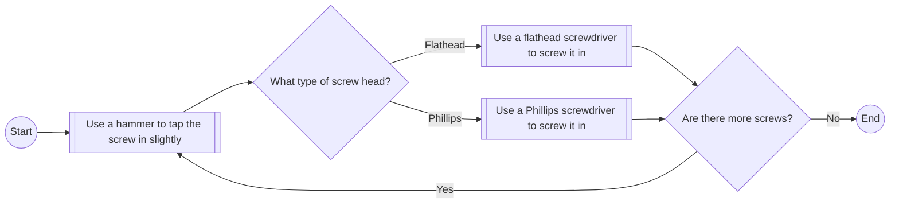
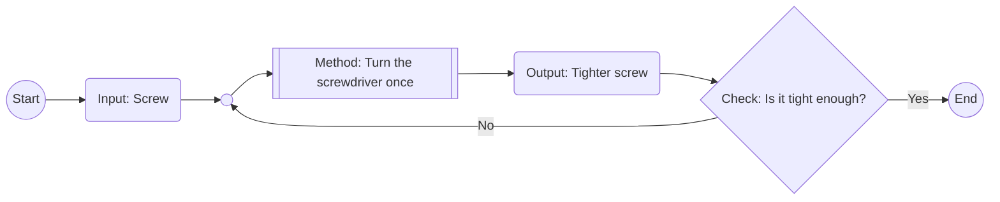
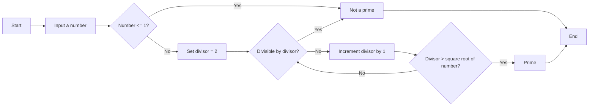

# 05. The Core of Method: Procedure


## 5.1. The Sudden Rise of Intelligent Tools

About 2.6 million years ago, early human species like Australopithecus or Homo habilis were already making tools. These were simple things, like stone cutters and scrapers.

Fast forward to today, and suddenly, we have "intelligent tools" in our hands. Thanks to pioneers like George Boole, Alan Turing, Claude Shannon, and countless other scientists and inventors, this transformation has unfolded over the last seventy to eighty years. And in just the past couple of years, we've all gained access to intelligent tools that can converse with us in natural language!

What does this rapid change mean in the grand scheme of 2.6 million years?

Imagine the entire history of human tool use (2.6 million years) as the length of a football field (100 meters). The earliest toolmakers kicked off the ball from one goal, and the other goal represents today. How far was the ball from the goal two years ago?

I didn't calculate this myself. I pasted this scenario into ChatGPT, and it quickly responded:

> If the history of human tool use (2.6 million years) is like a football field's length (100 meters), then two years ago, the ball was about 0.000077 meters (0.077 millimeters) from the goal.

To put that in perspective, 0.077 millimeters is roughly the diameter of a human hair. I double-checked with the "Fact Checker Bot," and it confirmed my memory: about 0.05 to 0.1 millimeters.

This analogy shows just how "sudden" this change is. It's incredibly sudden!

Starting from the thickness of a single hair, counting back 24.5 hairs takes us to around 1975, when a young Bill Gates and Paul Allen founded Microsoft, heralding the personal computer (PC) era. In the span of these twenty-something hairs, many people became wealthy by effectively communicating with machines — speaking to computers through programming languages. The scale was massive.

We can't say that just knowing how to code guarantees wealth, but people who understand programming languages generally earn more. This has been evident over the past 3 or 4 decades. Why? Because programming languages are a lever, allowing those who master them to harness machine efficiency, enabling them to accomplish more and achieve higher productivity. Isn't that reason enough?

Suddenly — and it really is sudden — that lever is no longer the cryptic programming languages but the natural language everyone already speaks. While today's (2024) AI tools aren't perfect, it's only a matter of time. At most, it's just a few more hairs' worth of waiting.

## 5.2. Talking to AI Like a Pro

Suddenly, there's a new factor contributing to the wealth gap among people — a factor that's as simple as it is crucial:

> Can you "talk to AI effectively"?

Just like you've noticed, "the way people communicate varies greatly." Some folks express the same idea more clearly and accurately than others, not to mention that ideas themselves differ.

So, how do you talk to AI effectively?

We've already seen that chatting with ChatGPT on a computer using a browser is way better than using a phone. We also know that speaking to ChatGPT in English is more effective than in other languages. But is there something even more impactful?

Absolutely. Here's how I put it:

> - **Think with a programatic mindset.**
> - **Communicate in English.**
> - **Engage with ChatGPT on a computer using a browser.**
>

This applies not just to ChatGPT but to any generative AI.

You might be thinking, "Oh no, I'm not a programmer. I don't know how to code. I don't have a *programatic mindset*..."

Don't panic. You already have a good chunk of "programatic mindset" — perhaps without realizing it. You've learned about "judgment" (the core of intelligence), dabbled in "Boolean algebra" and "Boolean logic," and even grasped "recursive thinking" (the core of evolution). That's practically 80% of the "programmer's mindset."

Switching to a different "way of thinking," or activating a different "mindset" or "thought system," can be incredibly powerful, as we explored in the last chapter. Once you activate "recursive thinking," whether you're crafting a prompt, building a bot that builds bots, or choosing an investment strategy, you'll have a significant edge over those who lack or haven't activated recursive thinking. How big is the gap? It's like the distance between an ape and a Homo sapiens.

## 5.3. Programmatic Thinking

In this chapter, we're going to dive deeper into the concept of "**flow control**" during the execution of a "method." Once you grasp this, you'll have a solid and complete understanding of "*programmatic mindset*" — and we're breaking it down in a way that even a grade-schooler can get. So, if you can learn it, your kid can too.

Previously, you learned that a "**method**" has "**inputs**" and "**outputs**." You even got a handle on some methods being "**recursive**," where the output from one execution becomes the input for the next.

Now, let's take a closer look at the execution procedures of a "method."

### 5.3.1. Procedure (Steps)

It's pretty straightforward — when we tackle tasks, we have to take it step by step. Everything follows a sequence of steps. The reason "steps" are inevitable is because of the unique properties of time:

> - **Directionality**
> - **Exclusivity**
> - **Irreversibility**
>

Besides time having a direction and being irreversible, the key is that it's an exclusive resource. If you're using time to do one thing, you can't simultaneously use it to do something else. You can only tackle one task at a time because your time is an exclusive resource. Thus, steps and sequences are necessary.

If there's only one step, there's no need to order it — just do it. But if there are multiple steps, you must determine the order and follow it through. This sequence is essentially a procedure. In other words, it's an "order," a "workflow," or a "program."

Take a look at everyday situations. Even putting on shoes before heading out involves steps, or you might call it a sequence, a procedure, or a program. While the details might vary from person to person, it's generally the same: you take out both shoes, put on one, then the other, and if there are laces, you tie them, respectively.

Putting on shoes is like this, and cooking is no different. In theory, every recipe is a program because it describes a sequence, steps, or a procedure. A typical recipe is laid out as a list, with each item representing a step. Follow the steps, and raw ingredients turn into a meal. So, you see, every recipe is a program.


What does a chef do? In our everyday language, we call it "cooking." But in another sense, they're executing one program after another, or repeatedly running the same or similar programs. Essentially, they're acting as a "program executor."

That's the reality — we're all running various programs every day, whether it's the shoe-wearing program, the cooking program, the coffee-making program, or the commuting program. We're constantly executing different programs, making each of us a "program executor" almost all the time.

When we call someone a "programmer," we're not talking about a "program executor" but a "program designer." These "program designers" might also take on other roles, like "program optimizer." The core job of a programmer is to design and optimize programs. In other words, they design and refine procedurees, steps, and sequences. That's pretty much the gist of it.

The simplest definition of "designing a procedure" is "decomposition." What are we decomposing? Breaking down a task into several steps. Or, breaking a complex task into several simple tasks, then breaking each simple task into executable steps. Decomposing problems and tasks is a universal thinking procedure and skill.

Once decomposed, every task has its sequence, steps, procedure, and program. Moving forward, among these synonyms, we'll use "**procedures**" to align with a term from the programming world, "control flow."

### 5.3.2. Böhm-Jacopini Theorem

Any computation or task, no matter how complex, can ultimately be broken down into three basic control structures:

> - **Sequence**:
>   - Actions executed one after another in a specific order.
>   - **Example**: Perform action A, then action B, followed by action C.
>
> - **Selection**:
>   - Choosing different execution paths based on conditions, also known as conditional logic.
>   - **Example**: If a condition is true, perform action A; otherwise, perform action B.
>
> - **Iteration**:
>   - Repeating an action until a certain condition is met.
>   - **Example**: While a condition is true, keep performing action A until the condition becomes false.
>

This concept was introduced by computer scientists Böhm and Jacopini in 1966, known as the "[Structured Program Theorem](https://en.wikipedia.org/wiki/Structured_program_theorem)" or "Böhm-Jacopini Theorem." It states that any logically valid computational procedure can be constructed using these three basic control structures without needing other non-structured control structures.

For instance, let's say you have a simple task: screwing screws into a wooden board. Describing this workflow in words would look like this:

> 1. **Start**:
> 2. Use a hammer to tap the screw in slightly.
> 3. Determine the type of screw head.
> 4. Choose the tool based on the screw head type:
>    - If it's a flathead:
>      - Use a flathead screwdriver to fully screw it in.
>    - If it's a Phillips head:
>      - Use a Phillips screwdriver to fully screw it in.
> 5. Check if there are more screws to procedure:
> 6. Based on the check, perform the corresponding action:
>    - If there are more screws:
>      - Return to step two and repeat.
>    - If there are no more screws:
>      - Proceed to the next step.
> 7. **End**:
>    - All screws are in, task complete.
>

We can ask ChatGPT to create a flowchart based on this description:

> Please use Mermaid to draw a flowchart based on the following description:
>
> [Copy and paste the above text here]

Here's a flowchart I tweaked a bit from what ChatGPT provided:



> Curious about what Mermaid is? Feel free to ask ChatGPT—it knows everything!
>
> Also, check out a bot I created (GPT):
>
> - [Learning Anything](https://chatgpt.com/g/g-dPqJT0PXS-learning-anything): https://chatgpt.com/g/g-dPqJT0PXS-learning-anything
>
> Just tell it what you want to learn, and it'll give you a list of questions to ask ChatGPT.
>
> For example:
>
> - I want to learn about drawing flowcharts.
>   https://chatgpt.com/share/6704c715-af9c-8009-9c16-e425fa974b3f
> - I want to learn about drawing flowcharts with Mermaid.
>   https://chatgpt.com/share/6704c740-7438-8009-91a4-daec47d658ba
>
> The bot's "role definition" is simple:
>
> > This GPT will treat user input as a topic they want to learn about and will provide a comprehensive and structured list of prompts. The prompts will guide the user in a step-by-step manner to maximize their learning experience with ChatGPT. Each prompt will aim to deepen understanding and cover various aspects of the topic.

Another thing to note is that "recursion" is a type of iteration. When you use a screwdriver, "turning it once" is a recursive method. Each time you "turn it once again," the input is the output from the previous turn. You actually make a decision each time: Is it tight enough? If not, continue; if yes, stop.



Pause for a moment. Up to this point, do you think this requires a college degree to understand? Clearly not. I believe even young kids who can't read yet can grasp this.

In the last section, you understood "recursion," a concept often considered advanced and challenging by programmers. But in reality, you're not a programmer now, and you might never be one, yet you can still understand "recursion." The reason is that the concept of "recursion" is incredibly common in everyday life. It's at the core of evolution across the biological world, not just for humans. How could you not understand it? It's just that no one has pointed it out and explained it to you as patiently as I have.

### 5.3.3. Algorithm

Here's a step-by-step breakdown of an algorithm to determine if a number is prime. Remember, "algorithm" isn't some fancy term—it's just shorthand for "calculation method":

> 1. **Start**
> 2. Input a number.
> 3. Check if the number is less than or equal to 1:
>    - If yes, the number is not a prime (since primes must be greater than 1). End the procedure.
>    - If no, proceed to the next step.
> 4. Set the divisor to 2.
> 5. Check if the number can be evenly divided by the current divisor:
>    - If yes, the number is not a prime (since it has divisors other than 1 and itself). End the procedure.
>    - If no, continue to the next step.
> 6. Increment the divisor by 1.
> 7. Check if the divisor is greater than the square root of the number:
>    - If yes, the number is a prime (since no divisors were found). End the procedure.
>    - If no, return to step 5 and check divisibility with the new divisor.
>

This iteration continues until a divisor is found (indicating the number is not prime) or the divisor exceeds the square root of the number (confirming it is prime).

Here's the flowchart using Mermaid:



And here's how you would implement this procedure in Python:

```python
def is_prime(number):
    if number <= 1:
        return False
    divisor = 2
    while divisor * divisor <= number:
        if number % divisor == 0:
            return False  # Not prime
        divisor += 1
    return True
```

Don't worry about the nitty-gritty details of this code for now — we'll get to that later. Right now, we're focusing on "programatic mindset," not "programmer's tasks."

If you take a moment to look at this code, you'll notice that Python, as a high-level programming language, is quite close to "natural language." The only reason it might seem like a high barrier is because our native language isn't English.

### 5.3.4. Exception Handling

We just talked about how any complex task can be tackled using a "structured procedure" made up of sequences, selections, and iterations. Because no matter how complex a task is, it can be broken down into smaller tasks, and each of those can be designed using these basic control structures.

Complex tasks, which we might call "projects," have a defining characteristic: **unexpected events happen frequently**. This is true in life, not just in programming — unexpected things pop up everywhere. So, when designing or optimizing a procedure, there's a crucial step called **exception handling** — what do you do when things go sideways?

Let's look at a common example of exception handling in everyday life: driving to work. The first step is to start your journey normally and keep driving. As you approach an intersection and find a traffic jam, that's an "exception." So, if there's a traffic jam, or an exception occurs, you take an alternate route. If there's no traffic jam, you stick to the normal route and reach your destination.

That's an exception handling procedure. As you can see, the core of "exception handling" is really just a "branch" in the sequence, selection, and iteration framework.

Even a simple task like this requires exception handling. So, imagine a large, complex project made up of many small tasks. The need for exception handling is even greater, as unexpected events can occur at any time.

### 5.4.5. Optimization

We've covered a lot of ground so far — let's add one more concept: "optimization."

> - Breakdown
> - Method, input, output, recursion
> - Flow, sequence, selection, iteration
> - Exception handling
> - **Optimization**
>

Take a look around, and you'll notice that most people go through life as "program executors," never stepping into the roles of "program designers" or "program optimizers." These folks share a common trait: they prefer not to think too much. They just execute procedures designed and optimized by others, finding comfort in not having to think.

But is thinking really that hard? Is it really that exhausting? Not at all.

Here's a simple example to show how easy and necessary thinking can be.

My kids, when they go to the bathroom, wash their hands before peeing — that's the procedure I taught them. So, in this scenario, I'm the "program designer," and they're the "program executors."

Then they went to school. Their teacher taught them to wash their hands after using the bathroom, whether it's number one or number two. So, they heard a different procedure: pee first, then wash hands.

My eldest came home and asked, "Dad, what's up with this? Why is your order different from the teacher's?"

I had to explain it to them.

I said, "When you're playing outside and then go to the bathroom, aren't your hands dirty from playing?" He said yes. I continued, "Your private parts are yours, not someone else's, right?" He agreed. "So, using your dirty hands to touch your private parts isn't great, is it?" He thought about it and said yes. I said, "Exactly, you should treat yourself and your private parts well, right? Washing your hands isn't for others to see; it's for your own good, right? So, you should wash your hands first, then use your clean hands to handle your business. Makes sense, right? And then, think about it, after peeing, it's not a big deal if you don't wash again, because you're going back to play and your hands will get dirty again, right? The key is to remember to wash your hands before eating, right? Of course, if you want to wash your hands before and after, that's fine too. It's not a big deal..."

That's the difference.

Most people mindlessly follow procedures set by others, never considering if they could be optimized. But a few people, like us, follow procedures we've optimized ourselves. Of course, calling such a simple procedure my "design" would be a stretch... It doesn't need design. But it does require a bit of thinking to optimize—even if that thinking is super simple.

So, even the simplest procedures, even those made up of just sequential steps, can have room for optimization, or at least the potential for it...

In plain terms, "optimization" boils down to a few straightforward questions:

> - Is this step necessary?
> - Does the order need adjusting?
> - Do the conditions for branching need more detail?
> - Can the number of iterations be reduced?
> - Are there any exceptions we haven't considered?

## 5.4. The Foundation of Programmatic Thinking

At this point, even if you can't write a single line of code, you've got enough programmatic mindset under your belt. It's like not speaking a word of Italian as a Chinese, yet as an adult, you already have enough "life thinking." Learning to speak, read, or write Italian is just about expressing your life thinking in another language. The "life thinking" itself is something you've already mastered and use daily, regardless of your Italian skills.

However, having "programmatic mindset," or "thinking like a programmer," has deeper roots. But it's not complicated — it boils down to two things, neither of which involves directly writing code:

> - Proactive thinking
> - Long-term accumulation
>

Let's take a closer look. People often avoid designing or optimizing programs themselves, and most manage to go through life without ever doing so. Besides the "avoidance of thinking" we mentioned earlier, there's another, more subtle but crucial reason.

What are they doing? They're not just avoiding thinking; they're avoiding responsibility. If things go wrong, they can claim it's not their fault because they followed the steps, did what they were told, and if it didn't work out, the blame lies elsewhere. Who's responsible? Clearly, the program designer or optimizer. Their reasoning is simple: "I followed the program; everyone else does it this way, so no matter the outcome, I'm not at fault."

In everyday life, for most people, "thinking" might seem abstract, but "responsibility" is a tangible reality and a real pressure. Moreover, sometimes just being different from everyone else can create immense pressure. So let's add to our understanding—why do most people spend their lives as program executors rather than designers or optimizers? At the core, it comes down to three things:

> - Proactive thinking
> - Long-term accumulation
> - Taking responsibility
>

So, the real issue isn't whether you understand and can apply the concepts of "programmatic mindset," like:

> Breakdown; method, input, output, recursion; flow, sequence, selection, iteration; exception handling; optimization...

The real question is whether you possess these three qualities: "proactive thinking," "long-term accumulation," and "taking responsibility." If you're not that kind of person, you can't truly be a "program designer" or "program optimizer"—even if you understand all the concepts related to "programmatic mindset."

## 5.5. Becoming a Program Designer and Optimizer

Did you know that many people with coding skills are called or call themselves "code monkeys"? Why? Because they know they're just rewriting tasks given by their bosses in a programming language. They're actually not designers or optimizers.

Why are "code monkeys" just that? If you're missing any of these three qualities — proactive thinking, long-term accumulation, and taking responsibility — you'll remain a "code monkey." Especially the last one, "taking responsibility," filters out 99% of people.

So, in the end, you need to transform yourself into this kind of person. If you're not, then understanding "programmatic mindset" won't matter. Even if you master dozens of programming languages, you'll still be just a "program executor." Reading more books or taking more courses won't make you a "program designer" or "program optimizer" because, fundamentally, you're not that kind of person.

The real task is to change yourself at the core. You need to push yourself to become someone who thinks proactively, accumulates knowledge over the long term, and takes responsibility. If you don't take responsibility for yourself, who will? Dodging responsibility is an illusion — a shared illusion of the weak.

If you're a parent, you'll easily understand why finding this foundational root is crucial — otherwise, it's all for nothing. It's about digging deeper, constantly asking, "What's the real issue behind the issue?"

I've been writing books and giving lectures for years, but don't get me wrong — I'm really teaching myself, my kids, and my wife. I want my family to become these kinds of people. What they do with these qualities later on, I can't predict, and honestly, I don't worry too much about it.

Now, go ahead and ask ChatGPT:

> How to use a programmatic mindset to communicate more effectively with ChatGPT?
>
> https://chatgpt.com/share/67171ff2-0ce0-8009-ae77-3b0a7abb3702

Its response should now be "crystal clear" to you because you've grasped most of the key concepts of "programmatic mindset." You can keep asking it questions and then compile a more comprehensive document yourself.

Once you do, you'll realize that almost all books and courses on "AI prompt engineering" boil down to these concepts. There's really nothing else to it.

Frankly, there's no way around it. The underlying mechanism is just that way. AI is built using programmatic mindset, so naturally, communicating with it using the same mindset is most efficient. That's why the books and courses out there cover these aspects — they can't cover anything else. It's an unchangeable fact.

But our focus is different. It's not just about understanding programmatic mindset; it's about transforming you into a program designer and optimizer. Not only making you someone with a programmatic mindset but also someone who thinks proactively, accumulates knowledge over time, and takes responsibility.

In other words, you should be able to apply programmatic mindset anywhere because you're the designer of your own life's program. All the programs you execute daily might have been initially designed and optimized by others, but you have the right and duty to think for yourself, make your own adjustments, and optimize them.

Let's take a look at the real world. In the end, it's the same everywhere. Only a few people engage in systematic design — they think proactively, accumulate knowledge over time, and take responsibility. Is there any place in the world where this isn't true? It's not just the computer world; it's the same everywhere. And aren't these three traits the foundational elements of any form of "leadership"?

People who lack these three basic elements won't succeed anywhere and won't have leadership. If you're a team manager, a team builder, a project manager, a program designer, or a program optimizer, what should you do? The first step is to design and establish clear procedures. Then who executes these procedures? Your team members.

The requirements for these executors are simple. They shouldn't make judgments; they must strictly follow orders to ensure perfect program execution. This is why many people in the world are lazy to think — because the world needs a significant number of such people. Having these traits is, in some sense, a prerequisite for "joining a team." Conversely, if you have a strong independent thinking ability, you might struggle to find a job, or even if you do, you might find it hard to fit in.

As an organizer, manager, or designer, you design a program, and then it starts executing. What do you do next? You supervise the execution procedures. What if errors occur? That's when you need supervisors, the so-called middle management. They need some judgment skills, but not much. Why? Because all the judgment criteria are provided by you as the leader, not something they come up with themselves.

And what else do you do? You optimize the program. That's something only you can do. Leaders have their own tasks, and they bear the consequences, so you must optimize the program. You do three things: design and optimize the program, execute the program, and supervise execution — then have three types of people responsible for each, with different requirements for each type. This is essentially the nature of all team operations worldwide.

By the way, you might want to learn about "SOP" (Standard Operating Procedures) — a crucial and common modern business management technique. Theoretically, all management focuses on "procedures" and their various stages, not the people executing them.

There are two ways to chat with ChatGPT to gain knowledge about SOP. The first is intuitive: ask, "What is SOP?" The second is to try this: open a new chat and tell ChatGPT:

> "SOP" (Standard Operating Procedures) is a crucial and common modern business management technique. Theoretically, all management focuses on "processes" and their various stages, not the people executing them.
>
> Continue writing, 1200 words.
>
> https://chatgpt.com/share/6717214f-b5dc-8009-bf38-bd9934508639

## 5.6. The Focus of Family Education

People often complain about various aspects of family education. But honestly, there's not much to gripe about. The truth is, 99% of parents aren't proactive thinkers, don't accumulate knowledge over time, and don't take responsibility. They weren't in the past, aren't now, and likely won't be in the future. They're not like that at home, not like that outside, and won't be like that their entire lives. So, how can they be good parents?

If you're a parent and want to be a good one, just ask yourself these three questions: 

> * Am I thinking proactively? 
> * Am I accumulating knowledge over time? 
> * Am I taking responsibility? 
>

If you want to raise a child with these qualities, instill the importance of these three foundational elements from an early age. Encourage them to regularly ask themselves these simple questions, just like you do.

These three traits have nothing to do with age or gender. Some people possess them from a young age, while most never do. If you're a parent, is this a focus in your education? The issue is, if you don't embody these traits yourself, how can they be a focus in your parenting?

Moreover, these traits have nothing to do with money. They're not qualities or abilities you need to pay for. The funny thing is, it's just a matter of awareness and understanding. It's like a switch that most people keep off their entire lives. But is flipping that switch really that hard? The cost of turning it on is zero. If you're a parent, I can confidently say there's a 99% chance this realization will instantly change or even revolutionize your understanding of education.

Think about it — compared to these three traits, what do school grades matter? Extracurricular classes are worthless.

As adults, people often lament that "habits formed in childhood" are far more important than the "things learned, tested, and forgotten after graduation." So, what are "habits"? Essentially, they're "programs" ingrained in the brain through countless repetitions. People often refer to the "first step taken by instinct" as a "habit," but in reality, a "habit" is a program that starts with that step, which might be just one step or followed by many more.

When someone says a "habit" is bad, they're saying the program is flawed. For example, skipping the step of "reading the manual" before using any tool, or forgetting to "check" at the end of any task — these are "programs missing essential steps." Often, "bad habits" are simply "instinctive, unplanned, and unoptimized" habits, leading to situations where they're "completely unsuitable for real life."

Consider this: if parents aren't "program designers" or "program optimizers," and have always been just "program executors," what happens? Theoretically, all babies are born the same, with brains not fully developed until around age 15, when they're "mostly developed except for the prefrontal cortex." So, for a significant period, children need their parents to act as their "cerebral cortex," especially the "prefrontal cortex." If parents aren't "program designers" or "program optimizers," then all of a child's "habits," or "basic programs," are instinctive, flawed, or at least unoptimized — essentially, bad habits. And throughout life, all so-called "struggles" are really battles against those bad habits formed in childhood.

Additionally, we know the important fact: "Judgment is the core of intelligence." So, what's the most important "judgment"? Or, what's the best application of "excellent judgment"? In my view, the most crucial "judgment" in life is about "programs." Using excellent judgment to evaluate the quality of a program and determine if it can be further optimized—what could be a better or more important scenario than this?

## 5.7. Owning Your Actions

Whether it's a program or a procedure, no matter who designed it, aren't we always the ones who bear the consequences of its execution? So, wouldn't it make more sense to be involved in the design and optimization ourselves? At the very least, isn't it more prudent? Because, in the end, we're the ones dealing with the fallout.

And honestly, the pressure isn't that intense because most programs are pretty solid. Take making coffee, for example — you can optimize the procedure if you want, but it's not necessary. The power of the collective is strong — most existing programs are already quite good.

What we need to do is focus on the most important and critical programs, actively think them through, evaluate the quality of each step, and decide if optimization is necessary. After all, we're the ones who will face the consequences. Ultimately, it's just a choice.

By the way, we can ask ChatGPT, "What is a programming mindset, or structured thinking framework?"

> What is programming mindset, or structured thinking framework?
>
> https://chatgpt.com/share/6704b4bc-3e80-8009-a6b9-754b8810a5fd

You'll find that asking in English and then translating to Chinese often yields higher-quality answers than asking directly in Chinese.

> 什么是 “程序思维”，或者 “结构性思考框架”？
>
> https://chatgpt.com/share/6704b8af-9fe8-8009-8deb-001bc2e11102

Now, here's the key question: How should we use "programmatic thinking" to communicate effectively with ChatGPT?

Even if you don't know any programming languages yet, you understand that it's best to design and optimize programs yourself, or at least review them before using. So, whatever you're doing, you can communicate with ChatGPT about those key program points:

> - Break down [task] into the smallest manageable problems. (Problem decomposition)
> - What are the specific steps/processes for doing [task]? (Writing programs in natural language)
> - What key judgments need to be made when doing [task] (e.g., a specific step)? (Decision-making and branching)
> - What unexpected events might occur when doing [task]? (Exception handling)
> - Here are my steps for doing [task]; what areas can be optimized? (Optimization work)
> - How can I minimize repetitive work when doing [task]? (Iteration optimization)
>

Simple, right? That's because we can now communicate with an "intelligent tool" using "natural language." So, just by knowing a few key concepts, you can start using those concepts to extract more information from the "intelligent tool," as if you've already mastered them. In your repeated interactions with ChatGPT, all you need is "reading comprehension," and you can gradually achieve a true mastery of those key concepts. It's a pretty magical process.

## 5.8. Enhancing the Toolset Methodology

To truly achieve:

> - Think with a **programatic mindset**.
> - Communicate in **English**.
> - Engage with ChatGPT on a **computer** using a **browser**.
>

I've been customizing my Edge browser as my dedicated ChatGPT browser.

I've installed just five extensions:

> - [GPT Search: Chat History](https://microsoftedge.microsoft.com/addons/detail/gpt-search-chat-history/hcnfioacjbamffbgigbjpdlflnlpaole): Adds chat search functionality.
> - [Prompt Library Manager](https://chromewebstore.google.com/detail/prompt-library-manager/ekjokgphmodglpfneiallnaefcoegdnc): Saves frequently used prompt templates.
> - [ChatGPT EnterControl](https://chromewebstore.google.com/detail/chatgpt-entercontrol/llifnfdbmdcpjfnlhpombbadbhfghdao): Use `Enter` to insert a new line; `Ctrl + Enter` to send messages.
> - [Custom New Tab](https://microsoftedge.microsoft.com/addons/detail/custom-new-tab/onagfgjlokaciajhjmajljcfanonbmia): Sets a custom URL for new tabs.
> - [Redirector](https://microsoftedge.microsoft.com/addons/detail/redirector/jdhdjbcalnfbmfdpfggcogaegfcjdcfp): Redirects all bing.com searches to google.com.
>

> [!Note]
>
> On October 30, 2024, ChatGPT's web version rolled out a chat history search feature. So, it's time to say goodbye to the GPT Search plugin — it's officially out of a job.

So far, I haven't installed any "paid extensions" — not because I'm unwilling to spend money, but because I haven't found it necessary. I'll explain why in later chapters.

I set my browser's homepage to https://chatgpt.com so it opens directly there. I also wanted new tabs to open to the same site instead of the unattractive Microsoft Bing Homepage, so I installed the [Custom New Tab](https://microsoftedge.microsoft.com/addons/detail/custom-new-tab/onagfgjlokaciajhjmajljcfanonbmia) extension.

I still prefer Google as my search engine. So:

> - I changed the default search engine to Google.
> - I installed the [Redirector](https://microsoftedge.microsoft.com/addons/detail/redirector/jdhdjbcalnfbmfdpfggcogaegfcjdcfp) extension to redirect all bing.com search links to google.com. Here's how to set it up in the Redirector options:
>
>   ```
>   Redirect: https://www.bing.com/search?q=*
>   to: https://www.google.com/search?q=$1
>   Hint: Any word after search?q= leads to Google search for that word.
>   Example: https://www.bing.com/search?q=some-word-that-matches-wildcard → https://www.google.com/search?q=some-word-that-matches-wildcard
>   Applies to: Main window (address bar)
>   ```
>
>   This way, even searches initiated with `Shift + Command + E` use Google instead of Bing.
>
> - I enabled the Sidebar, removed all the default apps, and added Google—this is crucial because having Google search in the Sidebar is incredibly convenient.
>


In the Sidebar, besides Google, I use Amazon a lot because I often ask ChatGPT for book recommendations and then buy them directly. It's quite satisfying.


The main reason I chose Microsoft Edge over other browsers is its "split-screen" feature, which is super handy when using ChatGPT—something neither Google Chrome nor Apple Safari offers.

To access the browser settings, use `Command + ,` (or type `edge://settings` in the address bar), search for `Split`, and you'll find several related settings (some may repeat due to the search):

> - Split screen button: Turn this on to display a button on the browser toolbar.
> - Configure Split Screen: Click to find two toggles:
>   - Enable Split Screen: Definitely turn this on.
>   - Link tabs: This must be on. It allows links clicked in the left pane to open in the right pane—super convenient!
>

After setting this up, you'll feel like I do: your computer screen needs to be big enough, or it's just too limiting. I've been using two 27-inch monitors for years — tried 32-inch ones but switched back because they exceeded my comfortable viewing range. Over the years, I've enjoyed benefits unimaginable to those using just one screen.

When using ChatGPT, I can have multiple windows open. On the first screen, the left half is my writing area in Typora; the right half is an Edge browser window split between my main ChatGPT chat and Google. On the second screen, I have three windows tiled left, center, and right, each with my frequently used bots (GPTs) for writing. For me, working on a single small screen is unimaginable.


I have to say, computers are the real "productivity tools," while smartphones are "distraction devices." Use your phone sparingly — though indispensable in some situations, it's best to minimize its use.

Nowadays, many people rely almost entirely on their phones, rarely using computers. But if you observe closely, these individuals aren't typically those who prioritize efficiency or tool usage. Their lifestyle and long-term thinking habits lead them to make such choices.

My stance is consistent: either work or don't work; either study or don't study; either produce or don't produce. Whether it's work, study, or production, do it on a computer whenever possible because computers boost efficiency. Avoid using your phone for tasks that can be done on a computer, as phones are prone to distractions. This is a reminder I constantly give myself and my family.