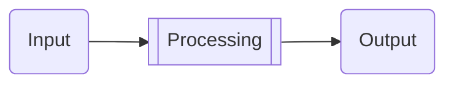

# 07. AI Doesn't Tolerate Laziness

## 7.1. Lazy People Drive the World?

Let's kick things off by discussing a popular notion floating around. Some folks claim that the world is driven by lazy people. There's even a catchy saying:

> *If necessity is the mother of invention, then laziness is sometimes its father.* Yes, if we look back, we'll find that laziness is behind many inventions. Laziness drives innovations that boost productivity because people often think, "There must be a better way."

Clearly, this is just a flashy statement, yet it has quite a following, both at home and abroad. They often cite a quote from [John Atanasoff](https://en.wikipedia.org/wiki/John_Vincent_Atanasoff), the inventor of the electronic calculator, as evidence:

> "I was too lazy to calculate and so I invented the computer."

People who can't see the forest for the trees think they've stumbled upon a profound truth. They get all excited and start listing a bunch of what they believe are solid examples:

> - Too lazy to climb stairs, so they invented elevators.
> - Too lazy to walk, so they invented cars, trains, and airplanes.
> - Too lazy to cook, so they invented microwaves.
> - Too lazy to attend concerts, so they invented records, tapes, CDs, and MP3s.
> - And the most outrageous one: too lazy to kill one by one, so they invented the atomic bomb...
>

Surprisingly, even some famous people support this flashy claim and agree with this nonsensical reasoning. 

Where's the flaw in this argument?

The truth is clear: the root of all inventions is definitely not because inventors are "lazy in every aspect." Take John Atanasoff, for example. He wasn't lazy in every way. He was just tired of doing tedious calculations. In other, more important areas, he was anything but lazy. For him, saving time on boring calculations meant he could do more meaningful work, like inventing new calculators.

As for the so-called "evidences" these overly excited people present, it's not worth refuting. It's unnecessary and exhausting because it's all over the place. The people too lazy to climb stairs aren't the ones inventing elevators. The inventors of cars, trains, and airplanes weren't those too lazy to walk. The inventors of microwaves weren't necessarily too lazy to cook. Who says the inventors of records, tapes, CDs, and MP3s were too lazy to attend concerts? It's baffling how they can establish such random cause-and-effect relationships and then take them for granted.

Even those described as "too lazy to kill one by one" don't stop killing just because they have atomic bombs. If they're serial killers, mass murderers, or those who start wars without reason, they're actually quite diligent and hardworking in the act of killing, aren't they? Where's the laziness?

Lazy people can't drive the world. If someone is truly lazy to the core, they wouldn't bother changing the world, right?

Plato once said in "The Republic," "Necessity is the mother of invention." But do we really need to find a partner for this "mother"? Claiming "laziness is the father of invention" and feeling smug about it seems like a puzzling performance art to me. However, if we tweak Plato's saying to "Efficiency is the mother of invention," no one would "seek attention" because "efficiency" has never been a lazy person's preference.

## 7.2. The Meaning of Tools

Why start by wrestling with this question? Because it touches on our fundamental perspective on using tools, a crucial concept in the methodology of tool usage. What are tools really for?

> Every tool (or invention) is born to **boost efficiency**, but using tools isn't just about making things easier.

At first glance, this might seem a bit tricky because sometimes "making things easier" and "boosting efficiency" appear synonymous. However, let me break it down from another angle. The primary purpose of using tools isn't just to make things easier; it's to boost efficiency.

Every task, every job, and every meaningful endeavor in the world often consists of 99% **tedious and monotonous yet essential** components. The parts people consider advanced might only make up 1%.

The renowned writer Bi Shumin mentioned a brilliant analogy in her novel "The Female Psychologist":

> A cup of coffee is 99% water, with the actual coffee making up just 1%.

If you visualize that 1%, it's just one square in a 10x10 grid, as shown below:

> In the past, drawing a diagram like this was quite a hassle. Now, it's simple. I just tell ChatGPT:
>
> Draw a svg, 10x10 grid, with top-left corner filled with coffee.
>
> https://chatgpt.com/share/6706000a-4b1c-8009-9995-6dbbaefb306a
>
> And I get the result almost instantly. As for what `svg` is, you can learn about it by asking the [Learning Anything](https://chatgpt.com/g/g-dPqJT0PXS-learning-anything) bot...

"Having ChatGPT draw this diagram for me" is a great example. I did make things easier by using it, and this ease did boost my efficiency. But the key point is that "drawing this diagram" is part of the 99% **tedious and monotonous yet essential** tasks in my current project — writing a book. It's not part of the truly important 1%. This diagram is nice to have, but not having it wouldn't be a dealbreaker.

So, here's the crux:

> All tools, whether "smart" or not, often can't do much for the most important 1%. Their real value lies in efficiently tackling the 99% **tedious and monotonous yet essential** tasks.

If tools can help us efficiently handle the high-percentage **tedious and monotonous yet essential** tasks, then we have more time and energy to focus on the important 1%. We might even increase its proportion to 2% or 3%, right?

Ultimately, the role of all tools is similar. The best tools are often most effective in the 99% tedious and monotonous yet essential parts, while the truly important 1% inevitably relies on soulful, wise humans. This is an unavoidable reality and a long-standing fact.

So, contrary to what many people think, or even the opposite:

> Having better tools doesn't mean "less work to do," but rather "*more* work to do."

"Making things easier" is synonymous with "boosting efficiency." The result of boosting efficiency is, of course, "completing tasks faster." But what happens after "completing tasks faster"? Clearly, it's to "complete more tasks," not fewer. This is the full purpose of all inventions. Seeing only "making things easier" without seeing "more tasks" is a one-sided view.

Why do most people's thoughts contradict "facts"? Strange, right? Not really. People perceive "facts" differently. This cognitive difference in "tool methodology" comes from the tool users themselves.

As described in Chapter 5, most people are lifelong "program executors" rather than "program designers" or "program optimizers." Thus, whether it's work or tasks, what falls into their hands is often not the "important 1%," but more likely the "tedious and monotonous yet essential 99%." So, in their world, "facts" are just that, "tools are for making things easier," and another "fact" is obvious and real to them: "the better the tool, the less work there is."

> Think about it: the widespread discussion of "AI causing massive unemployment" and the resulting anxiety are likely based on the same "fact."

In another world, tools aren't just for "making things easier." The result of having better tools is that the work you can do and need to do only increases, not decreases. Not surprising, right? Because good tools help us tackle more tedious and monotonous yet essential tasks. Thus, the following phenomena become common:

> - What was originally important becomes even more important.
> - Important parts that were previously neglected can now be addressed.
> - We always discover more important parts...
>

The end result is that once you have better tools, you'll find more meaningful things to do. With better tools, people don't become more idle; they often become busier.

Non-learners, non-producers, and non-creators can't grasp the essence of truly doing things. They not only don't understand that 1%, but they aren't even aware of its existence. They uniformly and consistently believe that 99% is everything, and they spend their entire lives on that 99%. They share a common trait: when they're at a disadvantage, they never realize it, and they can't imagine why they're at a disadvantage. As a result, they spend their lives continuously at a disadvantage, suffering greater losses... Ultimately, the only "compound interest" they enjoy is the scenario of "being at a disadvantage."

If you're not a learner, producer, or creator, the same tool in your hands can have completely opposite uses and effects. Isn't that fascinating?

The internet celebrity mentioned in Chapter 2, who made three mistakes in one sentence, or his copywriting team, also suffered from this — they didn't do the most important thing. Let me ask, isn't fact-checking supposed to be part of that "important 1%"? With a good tool in hand, they only focused on "making things easier," mistakenly thinking that 99% was everything...

## 7.3. The Best Way to Be Lazy

I learned early on that "laziness" is something you absolutely can't cheat. It's like it has a mind of its own, holding grudges. If you try to cheat it, it won't say anything right away, but it'll sneak back and take more from you. No one has ever beaten it. So, I have a deep respect for laziness and never dare to offend it. The best way to be lazy is simply not to be lazy — never be lazy.

If you're a parent, you should show your kids the "composition of work or tasks" early on — the "key parts" and the "tedious and monotonous yet essential parts." The balance is heavily skewed, with the former being a small portion and the latter a large one. Observe and demonstrate this repeatedly in life. All work, all products, and all significant achievements are composed this way.

At the same time, instill the correct "tool methodology" in them: when you have a better tool, it can help you quickly and efficiently handle those tedious and monotonous yet essential tasks, and that's worth celebrating. However, the most important part, though smaller in proportion, requires your own time and brainpower, and you absolutely can't be lazy about it.

This world is full of lazy people. They make up a larger portion and will significantly increase in the future. So, in the foreseeable future, many funny things might happen or have already happened. For example, many people now rely on AI to write work emails. They do this to save effort, as AI can quickly expand any short phrase or keyword into any length — 150 words, 500 words, 2000 words, 3000 words — it doesn't really matter.

Meanwhile, on the other end, the person receiving the email no longer reads the full text themselves but relies entirely on AI to generate a summary. They then only read that summary, compressing the other person's lengthy text back into a sentence or even a keyword.

The final scene is quite amusing: it seems like there's a lot of communication between humans, but in reality, it's just two bots burning through tokens, computing power, and electricity, achieving nothing. Human communication, already sparse and inefficient, is now almost nonexistent, both in content and efficiency.

Lazy methods should never be emulated. For instance, the phenomenon we mentioned in last chapter about lazy people using tools: lazy people never spend time and effort opening the settings dialog to carefully study each option. Almost 99.99% of people won't do this. Therefore, the way lazy people use tools should never be emulated, or you'll gradually evolve from lazy to clumsy. This isn't a joke or harsh; it's a simple and clear fact.

## 7.4. Reading and Thinking

Since ChatGPT came along, the browser plugin market has been flooded with all sorts of "Summarizers," like mushrooms after a rainstorm. They're all paid, and surprisingly, they sell well.

I haven't installed a single one.

It's not because I'm stingy. It's just that "that's not how I use tools."

When it comes to "reading," people have a lot of misconceptions. The root is pretty straightforward. The fact is, most people don't read books; among those who do, many don't read anything substantial; and among those who read substantial books, a significant portion doesn't finish them, let alone truly understand them. Ultimately, for the vast majority, "reading" and "understanding" are two separate things.

So, it's quite amusing and even absurd: if you seriously read substantial books, finish them, and understand them, you've already outpaced the majority—saying it's 99% isn't an exaggeration. Throughout this book, I'll repeatedly emphasize this fact: outpacing 99% isn't hard.

### 7.4.1. The Professional Way to Read

Over the years, the process of "reading" has undergone significant changes, each driven by technological advancements that have turned things upside down.

Not too long ago, serious readers used "catalog cards" to take notes — not notebooks (that's amateur), but cards (that's professional). These cards would pile up and eventually require dedicated drawers for organized storage. Today's kids might not have seen these cards at all, or maybe only in some old libraries, because "technological progress" wiped them out years ago.

The "Catalog Card System" is actually a modern invention. Before [1780](https://web.archive.org/web/20220302063835/https://www.onb.ac.at/en/about-us/650th-anniversary/timeline/1780-the-oldest-card-catalogue), the world didn't have this system. After that, libraries everywhere relied on it.

I was lucky as a kid because my mom worked in a library. So, I learned to take reading notes the "professional" way early on — after all, those cards were everywhere at home, ready to be used. Notes on cards could be categorized and searched, making it easy to find what you needed later and avoiding the "I've seen this before, but where?" dilemma.

I used cards for note-taking until the late '90s. But then I stopped. Why? Because taking notes on a computer became more convenient, especially for searching. No matter how many cards you had, you could get search results instantly. Plus, typing is three to five times more efficient than handwriting!

Around 2005, things got even better as the number of e-books started skyrocketing. By 2010, a significant portion of the books I bought on Amazon were e-books. By 2015, almost 100% were digital. From then on, I didn't even bother with note-taking — no need to type out notes. As long as I had a general impression in my mind, I could search the full text later and find what I needed instantly among my saved books.

To this day, having a full-text search software on your computer is indispensable for serious readers. On macOS, I use [Devonthink](https://www.devontechnologies.com/apps/devonthink), the professional version at $199. For someone who takes tools seriously, that's not expensive. After all, I was the kind of person who spent five or six hundred bucks on a screwdriver in the '90s. There are free alternatives, like [DocFetcher](https://docfetcher.sourceforge.io/en/index.html) (which also has a "professional" or commercial version). While it might lack some features, it's cross-platform, available on macOS, Windows, and Linux.

This is a classic example of how "better tools" gradually eliminate the time-consuming and tedious yet essential parts — like using catalog cards for reading notes. It certainly makes things easier, but what's the result? The result is definitely "more time and energy to read more books," not "no need to read anymore" or "spending all the extra time on leisure," right?

### 7.4.2. Reading Summaries is a Waste of Time

With ChatGPT now in the mix, it can whip up a "summary" of just about anything in no time. But here's the kicker: is that really useful? It's like back in the day when I read books and took notes on cards, and you, trying to save time, just skimmed through someone else's cards — does that really work?

"Reading" and "reading summaries" are worlds apart. Often, reading summaries isn't just unhelpful; it's a total time-waster. This is especially true for important knowledge and skill-based books. If you're trying to learn programming, what's the use of a programming book's summary? No matter the language, the summaries and tables of contents are pretty much the same. If you're learning English, what's the point of a grammar book's summary? Regardless of the publisher, the summaries and contents are basically identical.

As an author, I often think, "If you can understand what I've written just by glancing at the outline or summary, why did I even bother writing the book?" Conversely, if you can truly grasp everything just by skimming the outline or summary, it means I've been "padding" the entire book beyond the outline!

Even for entertainment, like novels or movies, you can't just read the summary! Take Jiang Wen's "The Sun Also Rises" — if you boil it down to a summary, it's just one sentence: "A 'most lovable person' messes around and ends up accidentally shooting his own son." What's the point? "Breaking Bad" is a masterpiece, but summarizing five seasons into one sentence—"How bad can a good guy get?" — doesn't do it justice. Is that interesting?

Many people might be misunderstanding. "Reading" isn't just an "input" process; it can actually involve two or even three stages:

If "reading" were only about "input," then having ChatGPT summarize for you would indeed "boost efficiency." But if the second stage is more crucial, where you need to process, i.e., think... then what's the use of a summary? Thinking is clearly your job, not AI's. The so-called "reading without understanding" often isn't due to a lack of brainpower but because there's only the first stage, with no second stage, leaving your brain with nothing to do... And that's not all; there might even be a third stage! Without the second stage, and with ChatGPT handling the first, what do you have to output? How can you output anything?

Among the stages of reading, the most important is "processing," i.e., the thinking we do while reading. Saying this stage is "important" is an understatement; it's downright "indispensable." Without this stage, can you even call it "reading"?

### 7.4.3. Thinking While Reading

When you're diving into a book, there's a lot of brainwork involved.

If you're into fiction — novels, movies, TV shows — beyond just getting hooked on the plot, you might notice how the author shapes characters, the actors' performances, storytelling techniques, and even the deeper meanings behind the story.

For nonfiction, you're evaluating the author's arguments, checking their logic, methods, and the authenticity of their evidence or data. Plus, you need to dig into the assumptions hidden between the lines or behind the text. And then, the content might spark countless associations in your mind...

When it comes to skill-based books, you're constantly figuring out things you didn't understand before, memorizing essentials, organizing your thoughts, and practicing until you've truly mastered the material.

All this thinking happening in your brain is something no tool can do for you. Frankly, it shouldn't. Tools exist to tackle the tedious and monotonous yet essential tasks, not to replace your brain or rob you of your thinking.

Growing up, teachers often said, "Read with questions in mind." But they rarely told us what questions to ask. That's where ChatGPT can step in—if you read its responses carefully, you'll find it incredibly useful:

> For each question below, you can "follow up" with: "Translate the above response into Simplified Chinese."
>
> * **Reading Nonfiction Books**
>
> > Provide a comprehensive and structured list of ChatGPT prompts that can guide a reader through the process of reading a nonfiction book.
> >
> > https://chatgpt.com/share/67062737-5528-8009-9936-1fdc6d431269
>
> - **Reading Skill-Based Books**
>
> > Provide a comprehensive and structured list of ChatGPT prompts that can guide a reader through the process of reading a book for skills or techniques.
> >
> > https://chatgpt.com/share/670627ab-6dd0-8009-aac2-53687440ea2f
>
> - **Reading Fiction**
>
> > Provide a comprehensive and structured list of ChatGPT prompts that can guide a reader through the process of reading a fiction.
> >
> > https://chatgpt.com/share/67062822-5adc-8009-9e55-f72981061d76
>
> - **Reading Poetry**
>
> > Provide a comprehensive and structured list of ChatGPT prompts that can guide a reader through the process of reading a poem.
> >
> > https://chatgpt.com/share/6706289b-1bb0-8009-958a-7b0f84abc5eb
>
> - **Watching Movies and TV Shows**
>
> > Provide a comprehensive and structured list of ChatGPT prompts that can guide a reader through the process of watching a movie or TV series.
> >
>
> https://chatgpt.com/share/670628f5-77b8-8009-9364-85f3a29e6ae3

The benefits of reading can be measured. In "The Truth About Thinking," I laid out a simple and clear standard:

> At any time, all effective input will inevitably cause changes or optimizations in the three tables in your mind (i.e., your operating system):
>
> > * Concept Table
> > * Relationship Table
> > * Program Table
>
> —— If these tables don't change after input and processing, it means the input was ineffective.

The thinking process during reading is one of life's rare and immensely enjoyable experiences. I don't rely on "summary tools" or "abstract tools" for a simple reason: I won't let them take away my reading joy, or more precisely, the *joy of thinking while reading*. Even for video summaries, I don't use them because my stance is: if I'm going to watch, I'll watch seriously; if not, I won't watch at all. For example, I revisit amazing shows like "Breaking Bad," movies like "The Yellow Sea," or classic novels like "Fortress Besieged" every year. I not only take them seriously but also enjoy them repeatedly, and each time is a delight.

The thinking process during reading is like a long-distance run; it's truly the brain's "best aerobic exercise." You'll eventually realize that another important aspect of reading is not just gaining knowledge but also strengthening your brain. Although this process isn't always obvious, it's similar to physical fitness. A healthy body enables you to do more and boosts your confidence and charm. Similarly, enhanced intellect can have the same effect, possibly to an even greater degree.

### 7.4.4. The Book Genie

In the first chapter, we used an analogy:

> If Google is like a "giant library," then ChatGPT is like a "genie" that suddenly appeared in an even bigger and higher-quality library. It's constantly expanding and organizing the library while having a clearer understanding of everything inside. And since it's also an AMA bot, it's always ready to have a normal conversation with anyone at any time.

You can literally use ChatGPT as a library. It's truly a book genie.

The reason those "summary generators" out there are useless is this: as long as a book is "legit," a good book, and has been reviewed by many, ChatGPT essentially has that book "built-in." You don't need to "upload files"; just start a serious conversation about the book with it.

Think about it. How often do we actually get the chance to read a book that was published just yesterday? A huge chunk of books, especially serious and classic ones, were published years ago. So, there's no worry about ChatGPT being "outdated" in this regard.

During the 2024 National Day holiday, a friend recommended [The Creative Act: A Way of Being, by Rick Rubin](https://www.amazon.com/Creative-Act-Way-Being/dp/0593652886), published on January 17, 2023, and a New York Times bestseller. Of course, I didn't bother with any summaries. I spent an entire afternoon slowly reading it. However, when I messaged ChatGPT in the same way:

> Provide a comprehensive and structured list of ChatGPT prompts that can guide a reader through the book "The Creative Act: A Way of Being."
>
> https://chatgpt.com/share/67062fc9-bae4-8009-a025-c0e525e1029f

Clearly, ChatGPT knows the book well. Since I had already read it, thought about it, and made connections, I could answer most of the questions myself. The surprise was that the structured list included several questions I hadn't considered — pretty cool!

I had completely abandoned the habit of taking reading notes. For me, writing books is my "study notes" or "reading notes" — except they're things I can sell, so I invest more time and effort.

However, I've started taking notes again—because there are so many questions worth asking AI, and often parts worth saving. Besides using ChatGPT, I frequently use Google's [NotebookLM](https://notebooklm.google.com/), launched in January 2023. It offers a lot of functionality. By September 2024, it could generate a 15-minute podcast in conversation form about any book you throw at it.

Of course, in NotebookLM, I ask the same questions in the same way:

> Create a structured list of prompts that can guide me through this book.
>

Both NotebookLM and ChatGPT accept user-uploaded text. Currently, neither directly accepts `epub` format e-books. So, for any book, I usually upload them in `txt` format. To convert `epub` or other formats to `txt`, you can simply ask ChatGPT...

> How to convert epub into txt?
>
> https://chatgpt.com/share/67063a4f-afec-8009-a732-e1a2ccb8f308

For basic computer-related knowledge like this, ChatGPT is unlikely to have any "hallucinations" and can be used right away.

For over twenty years, most of the books I've read have been "non-fiction." I rarely read novels, opting instead for lots of movies and TV shows. When I encounter a great piece, I become quite meticulous. I don't want to miss any detail, and I always use search engines to find more interesting stuff. With AI, I'm even happier because now I can directly ask questions like:

> List as many as possible *less known interesting things* in Breaking Bad.
>
> https://chatgpt.com/share/6706383c-4b48-8009-ba35-6358d9d3a775
>
> (And don't forget to run it by @Fact Checker...)

With AI, not only has my viewing experience become more diverse, but I've also picked up novel reading again — because being able to directly interact with a novel is a magical experience. If you want to know how to play with novels using AI, you don't need me to tell you. Just ask ChatGPT — and remember to ask several times:

> List as many as possible creative ways talking to a novel or fiction using AI.
>
> https://chatgpt.com/share/67063919-2c94-8009-a282-25ca7664d3b7

These are all great examples, each proving that "with better tools, the things you can and want to do only increase..."

## 7.5. Never Give Up Thinking

This chapter is a bit of a curveball. In a book about using AI, here's a whole chapter urging you not to use AI in one specific situation: when you need to think for yourself.

We've been saying it all along—"don't give up thinking," or "stick to independent thinking." We flagged this back in Chapter 2:

> You can ask ChatGPT, but at the same time, **maintain independent thinking**. Filter through ChatGPT's responses and add your own insights...

— But chances are, you might not have noticed or taken it seriously back then.

Earlier, we talked about how the world is full of lazy people, and their numbers are only going to grow. But a scarier trend has already emerged: people who are unwilling or simply refuse to use their brains. With AI's rise, their numbers and proportions are skyrocketing, and they're doing it with pride.

The human brain, from birth to death, is highly plastic. Technology has a massive impact on it. Word processors with auto-correct have made many people unable to write correctly with pen and paper. Navigation apps have left a huge chunk of people unable to easily identify directions, relying instead on left and right. Smartphones have shortened everyone's attention span to an alarming degree. Many people can't even sit through a movie anymore and can only handle short videos. Some can't even watch short series and go straight to ChatGPT for summaries.

That's how the brain works. The moment you stop thinking, it loses its ability to think, with no regrets or second chances.

Research shows that identical twins, though genetically identical at birth, can develop vastly different personalities and paths. Often, one is "decisive," while the other is "indecisive"; one is "extroverted," while the other is "introverted." A key reason behind this is "brain plasticity."

This applies not just between people but also between humans and robots. The human brain can "reshape" itself rapidly, unlike "robot brains."

The greatest value of AI is probably freeing people from "boring and monotonous yet essential" tasks, allowing them to focus their limited attention on more meaningful activities like learning, producing, and creating. Whatever you do, it requires "focused thinking."

At a pivotal moment in AI, an important paper titled *[Attention is All You Need](https://arxiv.org/abs/1706.03762)* was published. Here, "you" refers to AI algorithms. If we borrow this phrasing for humans, it should be *Attention is All You Have.* Here, "you" refers to us. Since attention is our only asset, our most tangible one, it makes sense to invest it in thinking.

But what's happening? More and more people don't care about their only asset, scattering it carelessly, with no regrets. As for the most valuable activity — thinking — they're handing it over to AI, cheering all the while... It's both sad and unfortunate.

In the end, it's a choice. And when it comes down to it, you have to own the choices you make.