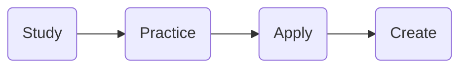
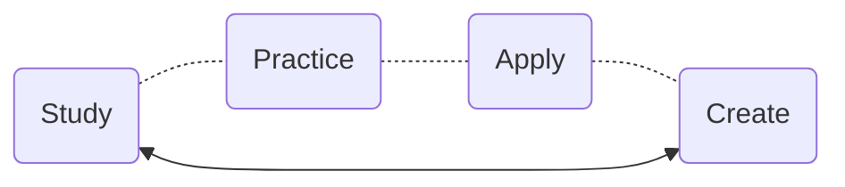
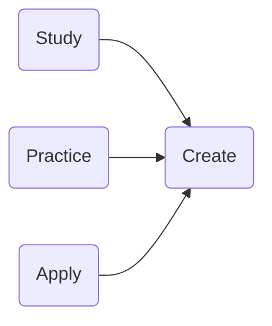
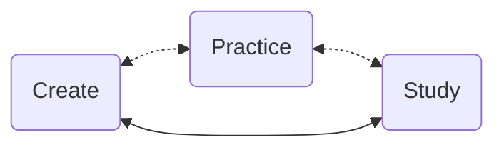

# 08. Disrupting the Learning Path

In September 2023, OpenAI released the third version of DALL·E, and it caused quite a stir. The name DALL·E is a mashup of two sources: the 2008 Pixar movie, *WALL·E,* and the Spanish artist *Salvador Dalí*. It's pronounced `/ˈdɑː.liː/` in American English or `/ˈdɔː.liː/` in British English.

> https://chatgpt.com/share/67066451-9d2c-8009-9a1f-55e79f5f1701

DALL·E is pretty fun to play with, but let me digress for a moment and talk about something else first.

## 8.1. A Problem That Used to Bother Me

I've always had a beef with those "board books" designed for kids aged 0-3. To me, they're pretty much a complete waste, a classic case of a fake need.

From a design perspective, the bright colors, simplified shapes, and cartoonish images don't really do much, even though we get why they're designed that way.

The idea that "bright colors attract kids' attention" is mostly a parental illusion. From a visual neuroscience standpoint, while bright colors can grab a kid's attention momentarily, that attention is fleeting and easily distracted.

Cartoonish designs are similar. They simplify visual information, helping kids quickly recognize objects or characters, but they don't do much for long-term cognitive development. Research shows that more realistic images or real-world objects actually help kids understand the world and build real conceptual connections. The brain prefers content that aligns with real experiences, and overly simplified cartoon images can sometimes distort a child's understanding of the real world.

Kids in this age group are more inclined towards "overt attention," meaning they react quickly to obvious, standout stimuli in their environment. They're drawn to dynamic stimuli like sounds or moving people and things. Compared to these, bright colors, simplified shapes, and cartoon images are pretty insignificant in capturing a child's attention.

Kids aged 0-3 can't grasp the concept of a "book" for quite a while. In their world, it's just another household item to throw, tear, or even chew on. It's definitely not what those parents, eager for early "educational enlightenment," imagine it to be.

Board books are really just there to cater to these parents — the main selling point being that they can't be easily destroyed by little hands. Of course, eventually, they'll get destroyed in all sorts of unexpected ways.

But are they really any good? Is the ink and cardboard used in printing safe? Are they free from all toxic substances? From what I've seen, most parents are diligent about washing their kids' hands but seem unconcerned about the cleanliness of those board books.

The numbers, letters, colors, and shapes printed on them perfectly cater to parents' desires for early "educational enlightenment." However, kids aged 0-3 actually need three other things:

> * Interaction
> * Language exchange
> * Life experiences

And these are precisely what board books and their content can't provide. Besides having poor content, these things are ridiculously expensive — priced to exploit parents' willingness to pay for "early education," not based on the actual value of the books.

Honestly, the most frustrating part isn't just that they're useless, overpriced, and possibly unsafe. It's knowing they're junk but feeling powerless to do anything about it. Letting a piece of junk take up a frustratingly important place in your life is as maddening as dealing with a lousy boss you have to endure at work.

On top of that, I have another gripe.

I'm ethnically Korean, grew up in China, and have lived in a bilingual environment with both Chinese and Korean as my native languages. I later learned English, so I'm basically a polyglot. I know the lifelong benefits of multilingual skills and the importance of a multilingual environment.

So, while I dislike board books, I'm not entirely against picture books. In fact, I wish those picture books were in English.

However, even English picture books have their issues — not everyone at home speaks English. The text in the picture books is often silly, but that's secondary. The main problem is that family members can't narrate them; even if they could, they can't do it in English. Making up stories on the fly is tough, and even if you prepare, it doesn't flow well. I can't draw or make up stories, let alone do it continuously. Neither can my family — it's a mess.

So, I just stay frustrated. Then I try to forget about it and move on.

## 8.2. Solutions with AI

Suddenly, combining DALL·E, ChatGPT, and TTS seemed like a solid solution! So, I asked ChatGPT:

> Help me draft a plan to create a picture book for toddlers around 2 years old using DALL·E, ChatGPT, and TTS. List the steps in detail.

ChatGPT eagerly generated *several* versions based on my requests. Here's a summary of one of the more satisfying responses:

> **Plan Steps**
>
> 1. Define the story theme and content
> 2. Use ChatGPT to write the story text
> 3. Generate illustrations with DALL·E
> 4. Combine text and images
> 5. Use TTS to create an audio version of the story
> 6. Integrate audio and images to make an e-picture book
> 7. Test and optimize
>
> https://chatgpt.com/share/670671e8-9b04-8009-812f-4d5149cb9dcd

After a quick read and understanding, I decided to start with a minimalist version:

> * DALL·E: Generate just one image;
> * ChatGPT: Create a short English story or description for the image;
> * TTS: Convert the story text into English audio.

And just like that, I got to work.

### 8.2.1. First Attempt

Remember our "prompt optimization template"?

> Please help me refine the following prompt according to best practices for prompt design, so I can get the best feedback from ChatGPT. Return the modified prompt in both English and Chinese. Also, please do not use Markdown code blocks in this response:
>
> [Enter the prompt you need to modify again]

I've saved it in the Prompt Library Manager plugin, ready to copy and paste whenever needed. Another option is to use a clipboard manager to keep this frequently used template handy.

I opened the Edge browser in split-screen mode, with two chats side by side. The right side was for optimizing prompts, and the left side was for chatting directly with ChatGPT.

On the right side, I casually typed (but within the template):

> Help me generate an image suitable for a 2-year-old.

The optimized prompt on the right was copied and pasted to the left, with a few tweaks:

> Generate an image suitable for a 2-year-old. The image should be colorful and friendly. Use soft lines and bright colors to capture a toddler's attention. Ensure the image is full of positive energy, with a warm and cheerful atmosphere.

No need for `@DALL·E`; ChatGPT now generates images directly with such prompts. The resulting image was okay—not exactly what I wanted, but it worked.

On the right side, I casually typed again:

> Please write a short story in American English, around 50 words, based on this image.

Once more, I read the optimized prompt, copied it from the right side to the left, trimmed a bit, and sent it to ChatGPT:

> Write a short story in American English, about 50 words, based on this image. Use simple language suitable for toddlers, ensuring the story is lively, engaging, and full of positive energy to spark a child's imagination.

I quickly got a response:

> Once upon a time, a little bunny named Benny lived in a sunny meadow. Benny loved to hop and play with his best friend, Tilly the turtle. One day, they found a shiny red ball! They kicked, tossed, and giggled all day long. "Friends make everything fun!" said Benny, smiling at Tilly. And they both laughed.
>
> https://chatgpt.com/share/67068074-4494-8009-8c43-f1a0ccae4ea7

I read it and felt something was off... Where did Tilly the turtle come from? Plus, there was no shiny red ball in the image!

The takeaway from this attempt is that ChatGPT's "image reading" skills are still lacking. They'll definitely improve over time, but for now, it's not quite up to the task.

### 8.2.2. Second Attempt

Let's switch gears and try generating the story first, then create an image based on the story. This is a kind of "workflow optimization," right?

Original workflow:

> 1. DALL·E: Generate one image;
> 2. ChatGPT: Create a short English story or description for the image;
> 3. TTS: Convert the story text into English audio.

Revised workflow:

> 1. ChatGPT: Generate a short English story or description;
> 2. DALL·E: Create an image based on the story;
> 3. TTS: Convert the story text into English audio.

So, let's give it a go:

> Please help me generate a short American English story suitable for a 2-year-old, about 50 words long. The story should use simple, easy-to-understand language and have a warm, friendly vibe.

The story that came back looked pretty good:

> Benny the Bunny loved his friends. One day, Benny saw Kitty crying. "What's wrong, Kitty?" asked Benny. "I lost my toy," said Kitty. Benny gave Kitty a big hug. "Don't worry," he said. "We’ll find it together!" Soon, they found the toy. Kitty smiled. "Thank you, Benny!" Benny smiled back. Friends help each other!

Next, I asked it to generate an image based on this story:

> Please create an image suitable for a 2-year-old based on the story above. The image should use bright colors and a simple style, avoiding complex details. Ensure the overall picture is warm, friendly, and appropriate for young children.

The result was decent:

The next step is to convert the story text into audio using TTS.

Actually, ChatGPT, on any platform, can convert a response into spoken word. Just hover over the message (or long-press on mobile) to see the Read Aloud icon. You can choose the voice in settings. The downside is you can't download the audio.

Are there other text-to-speech tools out there? Plenty. For example:

> * Enjoy APP (https://1000h.org/) is an option — it even helps with pronunciation practice.
> * Programming with Edge-TTS for batch generation is also great — lots of voice options.
> * There are many audio generation tools — just ask ChatGPT.

So, I asked ChatGPT:

> Write a quick prompt:
>
> > Please recommend free TTS tools, either web-based or desktop apps.
>
> ChatGPT's refined prompt:
>
> > Please recommend a few free text-to-speech (TTS) tools, either web-based or desktop applications. I hope these tools are easy to use, support Chinese and other major languages, and can generate natural, clear voice output. Please provide some details, such as the main features, whether registration is required, and if they support downloading the generated audio files.
> >
> > https://chatgpt.com/share/671750a4-d9bc-8009-9ef1-33ece0d2827a

I already knew about these tools, so I used [Edge-TTS](https://github.com/rany2/edge-tts) to quickly generate an audio file to check the effect:

<audio controls preload="none"><source src="/audios/toddler-story-01.mp3"></source></audio>

— It feels just right for what I need.

### 8.2.3. Refinement and Optimization

Previously, I was stuck because I couldn't draw or make up stories, let alone do it continuously. Now, while the "endless drawing" part seems solved, the "endless storytelling" isn't as easy.

Sure, I could keep telling ChatGPT the same thing:

> Please help me generate a short American English story suitable for a 2-year-old, about 50 words long. The story should use simple, easy-to-understand language and have a warm, friendly vibe.

But is there another way? Of course! We have that magical keyword for prompts — "List."

> Optimized prompt:
>
> Create a list with a one-sentence story outline suitable for a 2-year-old for each day of 2024. Ensure each outline maintains a positive, fun, and warm tone, suitable for young children.
>
> https://chatgpt.com/share/6717580c-b66c-8009-ba7d-a8d5b46d4633

I tried it, but 365 days of one-liners exceeded ChatGPT's current token limit for a single chat. No worries, generating a month's worth at a time works too.

Then, I created a "storytelling" prompt template:

> Based on the following sentence, write a short story of about [60] words in American English, suitable for telling to a [2]-year-old child. The story should use simple, easy-to-understand language and have a warm, friendly tone. Use short words and short sentences, and aim for rhyming whenever possible.
>
> [Story idea goes here]

Since the prompt specifies output as an "American English short story," it works the same whether the prompt is written in Chinese or English. The image generation prompt is similar; both versions work since the final output is an image:

> Please create an image based on the story above, suitable for a 2-year-old child. The image should use bright, soft colors and a simple, cartoon-like style, avoiding complex or realistic details. Ensure that the overall scene is warm, inviting, and appropriate for toddlers.

I picked a sentence to try:

> A kitten finds a glowing ball and follows it to the stars.

First, generate the story:

> Once, a little cat named Mia found a shiny ball. It glowed so bright, like a light on the wall. Mia followed the ball, hopping here and there. It led her to a place under stars in the air. She jumped with joy, so happy and free, under the twinkling stars, as bright as can be. The ball kept glowing, leading her way, and Mia danced happily, ending her day.
>
> https://chatgpt.com/share/6706973b-26b0-8009-b562-78b29c063bf0

The generated image matched the story text quite well.

This process adds a step to the workflow — essentially "optimizing the workflow" — at the very beginning:

> 1. ChatGPT: Generate a list of story outlines
> 2. ChatGPT: Create a short English story or description based on one item from the story outline list
> 3. DALL·E: Generate an image based on the story
> 4. TTS: Convert the story text into English audio

When generating stories, ChatGPT sometimes includes comments or explanations in its responses. If the text for generating audio includes these, it "pollutes" the output, adding more than just the story. This can be fixed by tweaking the prompt to prevent extra content — another form of "optimization":

> Based on the following sentence, write a short story of about [50] words in American English, suitable for telling to a [2]-year-old child. The story should use simple, easy-to-understand language and have a warm, friendly tone. Use short words and short sentences, and aim for rhyming whenever possible. **Do not add any explanations or comments other than the generated story.**
>
> [Story idea goes here]

With this setup, anyone can create a daily picture with a story and audio for their child.

### 8.2.4. Taking It Further

If you want to take things up a notch, there are several "optimizations" you can make as a regular user.

For instance, in DALL·E's chat, you can specify the aspect ratio of the image. Options include Square, Widescreen, and Vertical.

Additionally, there are plenty of online tools that can "animate" your images, essentially turning them into videos.

Moreover, you can find tools to merge images and mp3 audio into an mp4 video file. You might even add some background music to the whole video.

If you know a bit of programming, you can automate the entire "workflow" (or "procedure" or "program"), eliminating some of the tedious yet essential tasks. For example, switching between screens, copying and pasting, or opening another tool to complete a task.

I wrote a local web app for my wife to run on her computer:

> https://github.com/xiaolai/Toddler-Picture-Story-Generator

The page includes complete installation and usage instructions, so feel free to give it a try.

One of the perks of programming is the ability to batch process repetitive tasks—in a sense, "batch processing those tedious yet essential tasks." Imagine manually generating a set of content each day versus having a machine generate 365 sets (image + text + audio) for you all at once. The latter is obviously better.

> I wrote a script and ran three versions, each taking about four to five hundred minutes to generate — no sweat for the machine — resulting in $365 \times 3 \times 3 = 3285$ files. Here's the link to the shared drive:
>
> > toddler-picture-book
> > Link: https://pan.baidu.com/s/1w5nwC8MAVxmiFocXXfxR2w?pwd=6auq Access Code: 6auq

### 8.2.5. Reflection

Finally, a pesky little problem in life has been sorted out. Why did this solution work so well? Because, let's face it, we're dealing with two-year-olds here. The quality of the images or stories isn't a big deal — they don't really understand them anyway. What they truly need is companionship. And what parents need at this stage is to prepare for the next year or two, maybe even three. By telling stories and practicing every day, you'll eventually be able to spin tales effortlessly — how cool is that?

This is a genuine "creative" process. You start with an idea and just dive in. At first, you might not have everything figured out, but once you go through it, regardless of the outcome, you have a "starting point for further improvement." Then, you can gradually "optimize" from there.

## 8.3. Disrupting the Learning Path

Let's take a moment to reflect on what we've just done. What's the real significance of these actions?

For me, it's huge. Sure, creating a picture book is nice, but the real game-changer is that I've accomplished something I couldn't do before.

I can't draw. I can't tell stories. I never learned how to draw or tell stories. I just learned how to "talk to AI effectively," and that's it. Because it can draw, and not only draw but also tell stories in English (or any language, really), I managed to create something that was previously impossible for me. I solved a crucial need in my life and can share it with others.

This is the disruption AI brings to the learning path.

In my book *[The Craft of Selfteaching](https://github.com/selfteaching/the-craft-of-selfteaching)*, I shared a breakdown: "learning" isn't just about "study" and "practice." There are two other crucial steps: "apply" and "create."

The common issue is that people learn but are too lazy to practice. Without practice, can you really apply what you've learned?

Schools have a problem with "replacing practice with exams." Students don't want to practice, so schools use exams to force them. The intention is good, but the outcome? Not so much.

On one hand, students quickly learn to aim for "just passing." More seriously, schools focus on objective tests, which can't measure many real-world skills. Students end up practicing only a small part of what's truly needed in the real world. Many people go through life believing in "just passing," meaning they barely grasp even that small part.

Another major issue with schools is their outdated content. They teach a small portion of what's needed in the real world and struggle to keep up with the times. Much of what they teach becomes irrelevant or useless by the time students graduate.

The most severe issue is that schools never aim for "creation (production)." Their goal isn't to produce true "creators (producers)." Instead, they focus on producing "passive producers." In the language of this book:

> Schools aim to cultivate "program executors," not "program designers" or "program optimizers."

Most people are driven by society, not "active thinkers" or "independent decision-makers." They've never considered becoming "active producers." Despite parents valuing education, they conspire with schools to raise "excellent program executors." In their eyes, "obedience" is one of the highest praises for a "good child."

Leaving ineffective schools aside, let's focus on individuals — those who think actively and make independent decisions.

They face other challenges. "Practice" is tedious. If they get through it, "apply" comes next. Many never reach this stage, unaware of the costs involved. Architecture students need money to build something. Film students might spend thousands on a school project. Medical students rarely get "practice" opportunities, let alone "apply."

"Create" has always been the ultimate goal of "study." The journey from "study" to "create" often spans half a lifetime. For some, it exceeds a lifetime.

Suddenly, the gap between "study" and "create" has shrunk.

With AI, this trend is becoming more evident. The distance between "study" and "create" is shrinking, clarifying their relationship:

> "Study" is for "create." We study to create.

We've just experienced a "magical moment" — we started "creating" without "studying"!

> Don't get too excited. The reason we could "create without studying" is because it was for a 2-year-old. The quality requirements were low—they don't have aesthetic judgment or fully understand what you say. Essentially, it's just an example to illustrate a point.

## 8.4. Middleware Skills

Let's get one thing straight:

> Skills that can be replaced by tools are "middleware skills."

I love watching movies. When I like something, I dive deep into every aspect of it, digging up all the info I can find. One movie I really dig is "Parasite" (2019). I've watched it countless times. So, when the director Bong Joon-ho released a companion book, "Parasite: A Graphic Novel in Storyboards," I had to grab it.

Storyboards are like a director's visual blueprint before shooting a film. During production, the storyboard often becomes the key tool for communicating with the crew, even more so than the script. Bong Joon-ho's storyboards are incredibly detailed.

But don't get too hung up on Bong Joon-ho's drawing skills — they're definitely better than most, but honestly, he's not outdrawing some other big directors.

Many directors have killer hand-drawing skills. Check out James Cameron's storyboards for "Titanic":

James Cameron is not only a lefty, but his visual imaging is like a mirror image for others. On set, his storyboards need a mirror to guide the cinematographer.

Then there's Christopher Nolan's "Batman":

George Lucas's "Star Wars":

Tsui Hark's "Detective Dee":

Feng Xiaogang goes all out with "Back to 1942":

Stephen Chow's storyboards might look rough, but his perspective skills are top-notch. Check out "Kung Fu Hustle":

And then there's Jiang Wen's "In the Heat of the Sun" — try not to laugh... his drawings barely qualify as stick figures:

Not all directors have amazing drawing skills. Take a look at Martin Scorsese's "Taxi Driver" — he's not much better than Jiang Wen:

For film directors, "hand-drawing" is a "middleware skill." Storyboards need to be drawn, but the goal isn't to show off drawing skills.

Many directors spend a lot of time crafting detailed storyboards, but it's not about showing off. It's about the "focused thinking" that comes with the process. For creators, what's more important than "thinking"? And what's more fulfilling than "effective thinking"?

So, Jiang Wen's drawing skills might be lacking, and Martin Scorsese isn't much better. But for them, "hand-drawing" is just a "middleware skill." It doesn't stop them from achieving their main goal: making movies. While strong drawing skills are nice, they shouldn't be a barrier to creation.

Drawing storyboards can stimulate thinking, but directors like Jiang Wen or Martin Scorsese have plenty of ways to spark their creativity. They don't need to rely solely on drawing storyboards.

For any creator, skills can be roughly divided into three levels:

> * Basic Skills
> * Middleware Skills
> * Terminal Skills

For film directors, identifying stories, understanding scripts, grasping camera language, mastering story pacing, and setting the story's soul are basic skills. Hand-drawing is a middleware skill. Building systems, managing time, completing the film, and even distribution are terminal skills.

When we look at the role of tools in human history, it's always been the same, and AI is no exception:

> Better tools constantly replace or eliminate "middleware skills."

"Calligraphy" is a "terminal skill" only for calligraphers. For everyone else, it's a "middleware skill." In the past, everyone spent a lot of time practicing calligraphy. Now? Word processors have pretty much eliminated the need for extensive calligraphy practice. What should we do with all that saved time? Think! With thoughtful results, you can write — and "writing" is one of the most important forms of "creation."

## 8.5. Make Creation the Core

Most people don't think, and they don't want to. Bertrand Russell once noted, "Many people would rather die than think; in fact, they do."

One reason might be the so-called "education" system. Schools, teachers, and parents have spent years molding most people into "passive producers." Their hallmark? "No need for independent thinking." Their specialty? "Following procedures to get the job done."

"Creators" are "active producers," "program designers," and "program optimizers." For them, every step of "learning" — study, practice, apply — is in service of the final step: "create."

It's never about passing some "exam." They are active producers, creators, and the only test they face is the real world. "Passive producers" and "non-producers" spend their lives taking exams, whether in school or at work. They need various certificates — diplomas, qualifications, and more — to prove they are "passive producers," or "qualified participants." Ultimately, everyone must produce, whether actively or passively, because production is the only legitimate source of wealth. (See "The Truth About Wealth.")

For creators and active producers, even the final step serves the final step — they "create" to keep creating.

James Cameron, for example, felt he needed to master 3D filming techniques for "Avatar" (2009), so he got involved in "Journey to the Center of the Earth" (2008). Christopher Nolan did something similar. To prepare for "Inception" (2010), he took on two Batman films, "Batman Begins" and "The Dark Knight," to hone his skills in handling grand scenes. These examples are endless.

It's not just AI; throughout history, every tool advancement has essentially shortened the distance between "study" and "create" by "eliminating middleware skills." This time, AI is cutting deep and fast, almost invisibly, which is why it's so shocking.

So, regardless of which AI tool you're using, the key is to be an "active producer," even a "creator." If you're not, and you're fundamentally a "passive producer" like most people, then even the smartest tools won't be much help. What you've learned, what schools have drilled into you, are essentially "middleware skills."

The scary underlying logic is that "passive producers" have historically been continuously replaced, driven out, or even eliminated by advancing tools. The Luddite Movement in early 19th-century England is a classic example. Over the past 40 years, agricultural mechanization has driven large populations into cities. The advent of quartz watch technology led to the unemployment of watch repairers. ATMs forced banks to reorganize and optimize staff. Over time, "driving skills" no longer guarantee the same income. Many professions and industries have vanished: coachmen, scribes, laundry workers, gas lamp lighters, telephone operators, telegraph operators, sports scorers, typists, typesetters, postal workers, newsstands, paging services, video rental stores, pen factories, typewriter factories, record factories...

The shock from AI is intense and unsettling, partly because of its rapid development. No tool has ever advanced so quickly. Suddenly, we can't even imagine the world ten or five years from now. Looking at schools that haven't changed in 200 years and AI's evolution in just two, we've lost the ability to predict the future — even in the relatively narrow field of education.

This chapter is crucial for everyone, especially parents. If you can't fundamentally transform someone into an "active producer," forget about "using AI well." Just not being wiped out by AI would be an achievement. Stop overburdening yourself and your kids. Start with "create," and make it the core of everything you do.

This is a disruption of the entire "learning path." We should not only reverse the original order but even remove a step — "apply" — because "create" is the application of learned and practiced skills. "Create" is the only "application."

## 8.6. Focus of Study and Practice

With this disruption, "create" becomes the starting point, and "apply" is entirely replaced by "create." The remaining steps are different too.

> * Study: **Objective Evaluation Criteria**
> * Practice: **Best Practice Principles**

Since the goal is to create, the first question is, what are the criteria for judging "what I create"? In the past, "evaluation criteria" were set and controlled by others. Now, the real world judges you, not any "other." This is different; you face the real world from the start. "Evaluation criteria" should be objective, not subjective. Whatever you create, there's always a standard to judge its quality.

Coincidentally, this is one of ChatGPT's strengths. Whatever you want to create, the first thing to do is ask:

> Provide a comprehensive and structured explanation: What are *the objective criteria* for judging the quality of...?

A novel? An essay? A film? A short story? A song? A symphony? A photograph? A video game? A paper? A speech? An ad copy? A business plan? An architectural design? An interior design? A brand logo? Even a restaurant? Or a dish?

The key phrase here is "*objective criteria*." Thanks to the era of "natural language programming," speaking clearly gets you clear results.

After studying the objective criteria, ask about the key question for "practice":

> Provide a comprehensive and structured explanation: What are *the best practice principles* for doing...?

The key phrase here is "best practice principles." Whatever you do, there are "best practice principles." Studying these principles ensures your actions stay on track.

You've seen "best practice principles" before. Our "Prompt Master" (Chapter 4) was all about this:

> Please modify the following prompt according to the **best practice principles** of prompt design, so I can get the best feedback from ChatGPT. Provide the modified prompt in both English and Chinese. Do not use Markdown code blocks in this response:
>
> [Enter the prompt you want to modify]

In Chapter 2, we used "best design principles"—"design" is a form of "practice":

> Use the **best design principles** you know to write a detailed and structured **GPT role definition**.

The learning path has been completely disrupted. Always make "create" the core, with everything revolving around it and starting from it. The focus of "study" becomes "objective evaluation criteria." During "practice," follow "best practice principles." Then, there's only one focus left: "emphasize the basics." This seems "obvious," but it might take the following chapters to fully understand it from multiple angles.

The final repetition is just one sentence: **You must become an active producer**, or else... fill in the blank yourself.