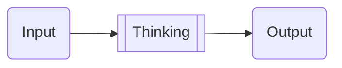

# 9. Everyone Can Be a Producer

## 9.1. You Must Become a Producer

"You must become an active producer" might sound like a vague piece of advice, but the reasoning behind it is straightforward: **"The only legitimate source of wealth is production."**

The confusion often comes from the common perception that a "producer" is someone who uses physical labor to make tangible goods. If that's your definition, the link between "producer" and "wealth" seems fuzzy. After all, the wealthiest people we see — entrepreneurs, investors, celebrities, athletes, influencers — don't fit the mold of "physical laborers making tangible goods."

First off, the "product" doesn't have to be a physical item. In the business world, anything that can be sold or monetized counts. Think data, creative works, personal image, software, ads, domain names, distribution channels, computing power, cloud services, brands, influence...

Even traditionally physical items are going digital. Books, tapes/records, and DVDs are being digitized. I barely have physical books at home now, and I bet you don't have tapes or DVDs lying around either.

For entrepreneurs, their "products" are their companies and the goods or services they offer. Celebrities sell their achievements, works, and personal brands. Influencers build sales channels. Scientists produce research results.

Investors' "products" are abstract because their "means of production" (capital) are abstract, and so are their results (also capital). Yet, they are producers, almost always "active producers."

Civil servants, while often seen as privileged, aren't typically producers. They're mostly "program executors," ideally under strict supervision. However, some civil servants are genuine producers, crafting policies and plans that enhance societal well-being.

For years, I've had a seemingly odd conclusion: "The more abstract the means of production, the higher the potential profit."

This insight came as a "byproduct" of my investment decisions. A few years ago, I pondered how to pick stocks in the age of AI.

Skipping the long exploration process, here's the distilled thought process:

> * A stock's value mainly comes from a company's **continuous improvement in production efficiency**.
> * The key factor limiting this improvement is the **type of production resources**.
> * In the AI era, the core production resource is **data** (a highly abstract resource).
> * **If data is the main resource, production efficiency can skyrocket**. Data is cheap and inexhaustible — unlike other resources. Only large companies can monopolize data to some extent.
> * So, the most crucial criteria for selecting companies are their **data holdings** and their ability to **continuously acquire data**.
> * Companies like Apple, Netflix, Nvidia, Amazon, Tesla, and Microsoft are leaders in this space.
> * As a user, I'm passively providing data to these companies, even beyond my lifetime.
> * There are many people like me, and the number is growing.

I adjusted my investment portfolio from GAFATA (disclosed in "The Road to Financial Freedom" in January 2017) to An ATM (the initials of the companies mentioned, sounding like "a cash machine"). In 2021, when a finance company I invested in (Pando Finance Hong Kong) launched ETF products in Hong Kong, 3056.hk and 3112.hk, in which, 3056.hk's main components were "An ATM."

> Disclaimer: Investing involves risks. Be cautious. The above is just an example to illustrate a point and does not constitute investment advice.

**Choosing is a form of production.** This abstract statement is a solid principle for both the inherently abstract activity of investing and the equally abstract profession of investing.

In any case, "the more abstract the means of production, the higher the potential profit." This conclusion took root in my mind, changing how I view production.

## 9.2. Words as a Resource

Throughout history, ordinary folks have faced the same challenge: scarcity of resources. If "production is the only legitimate source of wealth," then all struggles stem from a "lack of production resources." The inability to access production resources is far more daunting than a "lack of production skills."

Look at the real world, and you'll see that all monopolies start by monopolizing production resources. Just take a glance at industries like land, transportation, salt, minerals, tobacco, alcohol, sugar, and tea. At various points in history, they've all been monopolized to some extent.

So, breaking free from the constraints of production resources is the key to overcoming challenges.

Here's a thought-provoking question: In today's world, is there a type of production resource that's absolutely unmonopolized, accessible to everyone, and inexhaustible?

Words.

Words, as a production resource, are abstract enough that, in my view, they offer potentially higher production profits. This profit isn't just about growth; it's about sustainable growth with a growth rate. (See "The Road to Financial Freedom.")

Using words as a production resource doesn't mean just "writing articles" or "writing analytical pieces like I have been doing." Words can produce a wide range of things: news, novels, scripts, tutorials, jokes, lyrics, ad copy, and even business plans that can secure funding, to name a few.

Especially now, we can use words — natural language — to drive machines. Computers are the most affordable yet powerful tools in human history. For instance, we can create various robots (GPTs) using natural language, as many as we want. These robots can communicate with us in natural language, and they are undeniably the most powerful machines in terms of language capabilities. This means we've not only broken free from the limitations of production resources but also from labor constraints.

We've been speaking since we were kids, learned to read early on, and by the time we graduate high school, we've had 12 years of language classes, whether we liked them or not. So why haven't we used words as a production resource? What's been blinding us? And with the logic and facts so clear, what reason is there to refuse to see words as a production resource?

At least theoretically, everyone can use words as a production resource. Whether or not you do is a personal choice.

Let's take a look at the skills needed for "production using words as a resource." Here's a rough list:

> * **Basic Skills**: Language fundamentals, observation skills, critical thinking, time management, and self-discipline...
> * **Middleware Skills**: Writing ability, word processing tools, editing, and revising...
> * **Terminal Skills**: Skills related to different types of creation, as well as publishing and distribution...

Unlike the previous chapter where we created English audio picture books for toddlers, you don't lack basic skills, nor do you lack middleware skills. And in terms of terminal skills, "publishing and distribution," which used to be a major hurdle, is no longer a barrier. If you truly have something valuable, there's no way it won't get out there.

## 9.3. Locking in Your Production Target

If you're lacking some terminal skills, it's probably because you haven't nailed down your production target. Without a clear goal, how can you know what skills you need?

First, let's figure out what exactly you want to produce using words as your resource.

Once again, it's all about categorizing. Let's start with the broad strokes: fiction and non-fiction.

> * Fiction
>   * Novels
>   * Screenplays
>   * Skits
>   * Lyrics
>   * Ad Copy
>   * ...
> * Non-Fiction
>   * News
>   * Essays
>   * Tutorials
>   * Business Plans

Even "novels" is a pretty "broad and bold" category:

> - Fiction
>   - Novels
>     - Romance
>     - Sci-Fi
>     - Fantasy
>     - Mystery/Thriller
>     - Horror
>     - Historical
>     - Adventure
>     - War
>     - ...

And there are multiple ways to slice and dice these categories:

> - Fiction
>   - Novels
>     - By Genre
>       - Romance
>       - Sci-Fi
>       - Fantasy
>       - Mystery/Thriller
>       - Horror
>       - Historical
>       - Adventure
>       - War
>       - ...
>     - By Style and Form
>       - Literary Fiction
>       - Popular Fiction
>       - Short Stories
>       - Novels
>     - By Audience and Market
>       - Adult Fiction
>       - Young Adult Fiction
>       - Children's Fiction
>     - By Theme and Setting
>       - Dystopian Novels
>       - Cyberpunk Novels
>       - Magical Realism Novels

Typically, a three-tier list like this is about as complex as our brains can handle. A two-tier list is like an Excel sheet, with each cell representing the intersection of a primary and secondary category. A three-tier list is like a 3D "Rubik's Cube," with each block representing a three-dimensional intersection.

Anyway, you can choose a production target based on your situation. It could be fiction or non-fiction. Then, keep categorizing until you find what suits and excites you. Keep drilling down until you lock in your answer.

## 9.4. Choosing is a Form of Production

Earlier, I mentioned that choosing itself is a form of production. This abstract notion is quite tangible, especially in the realm of investing.

But it applies to other fields too. Choosing isn't just production; it's often the most crucial step — the "first step of production." So, choosing might be the most important form of production. Without selecting a production target, how do you even start? I always remember the example of Mr. [Zheng Yuanjie](https://en.wikipedia.org/wiki/Zheng_Yuanjie). After leaving the military, he wanted to make a living by writing. But what to write? How did he choose? He used two seemingly "tricky" but actually very simple questions:

> * What market is the largest?
> * What has the least censorship?

In the end, he chose fairy tales. You can easily imagine him making a list and using these two questions to guide his choice.

Once you've made your choice and set your target — that is, selected your production goal — you can then use the sharpest angle you know to ask ChatGPT, "What are the 'objective evaluation criteria' and 'best practice principles'?" Don't hold back. No need to say "please." Demand comprehensive and structured answers, and ask it to repeat them many times.

Let's say you've locked in on "short adventure stories for young adults":

> * Give me a comprehensive and structured explanation of the **objective evaluation criteria** for judging the quality of a short adventure story for young adults.
>   https://chatgpt.com/share/6718695b-5170-8009-a19d-a7edf6d884a4
>
> * Provide a comprehensive and structured explanation of the **best practice principles** for creating a short adventure story for young adults.
>   https://chatgpt.com/share/6718699b-0788-8009-9a75-6daada80dec0
>

The rest is just about your reading comprehension skills. Read carefully, understand thoroughly, organize the information yourself, and then start practicing right away.

Diving into the "objective evaluation criteria" and "best practice principles" is a sharp way to learn and practice. This is about building "taste" and continuously honing your "judgment" based on it.

I write non-fiction books, generally categorized as "growth-oriented." There are many objective standards for evaluating growth-oriented books, and ChatGPT provides a pretty comprehensive list (of course, because that's what I asked for):

> Provide me with a comprehensive and structured explanation of the objective criteria for evaluating a non-fiction book about personal growth.
>
> https://chatgpt.com/share/67186a9e-4fc4-8009-8dde-97c8d74f0149

Here's a summary of ChatGPT's response:

> ### Summary of Key Criteria:
>
> - **Author Credibility**: Expertise and relevant experience.
> - **Clarity**: Well-organized and easily understandable.
> - **Actionability**: Provides concrete, practical steps.
> - **Originality**: Offers fresh insights, not just recycled ideas.
> - **Scientific Support**: Based on research and evidence.
> - **Relevance**: Timely and culturally appropriate.
> - **Engagement**: Inspires and motivates sustained growth.
> - **Balance**: Acknowledges real-life challenges.
> - **Reader Tools**: Exercises or self-assessments for active engagement.
> - **Longevity**: Enduring value and revisiting potential.
> - **Ethical Integrity**: Promotes personal and social well-being.

These are the basics of "taste." If you don't get these, you're basically "clueless." Once you've got the foundation, it's all about continuous thinking and refining. Eventually, I realized that one of the criteria I mentioned earlier — and since it's an objective standard, it's something everyone should follow — is what I consider the most important:

> * Practicality and Real-World Value

A person's so-called "values" are the key to making judgments. It's about knowing "what's more important?" Keep asking this question, and you'll eventually land on "what's most important?" Once you know that, it makes sense to focus your time, energy, and attention there. It's a super useful mindset.

Back to the point, anything I write has to be "truly useful." How do I ensure it's genuinely useful and not just seemingly so? After some thought, I came up with a simple rule for myself:

> Only write about things I've actually accomplished.

It's that straightforward. But because of this one simple rule, my "taste" improved, my "judgment" got sharper, and I realized a lot of what I wrote before (maybe more than half) could be tossed out.

Following the idea of "practicality and real-world value," I came up with another solid criterion:

> Not only useful, but useful in the long run.

This filtered out another big chunk of what I'd written and planned. Again, just a simple sentence, and my "taste" improved, my "judgment" got sharper.

Once you've nailed down what's most important, everything else falls into place.

For instance, logical rigor is just the baseline. As for style, I'm not too concerned — I'll worry about that when I write fiction. Rhetoric? I stick to what I can easily handle: analogies and parallelism. That's about it. In the end, the only thing I really care about is making sure my examples are spot-on.

And then what? Just write. Write as much as you can. If you're stuck, push through. If it's not great, finish it and revise later. If it's good, still revise when you get the chance. Before you know it, 20 years have flown by.

As for the "endgame skills" of writing books — dealing with publishers, trying out different platforms, using various tools, building your own audience, and creating multiple channels to connect with readers — once you've got your content, these become "naturally essential" tasks. In the end, it's all about practice.

## 9.5. AI-Powered Productivity

Suddenly, generative AI based on large language models burst onto the scene.

### 9.5.1. Prompt Templates and Bots

Over the past couple of years, my productivity and workflow have undergone some serious changes. The biggest shift? I'm no longer a lone wolf. I've got a squad of bots on standby, and my ability to manage them is growing at warp speed.

Let's revisit the first rule of engaging with bots:

> Thinking is my job and mine alone. They handle the boring, repetitive, yet essential tasks.

Don't fall into the trap of thinking AI can handle everything from start to finish. If it seems like it can, you're either not thinking or your thinking lacks value.

AI can't truly be "creative." It doesn't even have real understanding. It's just crunching probabilities tirelessly. Sometimes, it might seem to spit out something "creative." But remember, that's not genuine creativity. It's more like a random "mutation" in the evolutionary process — not a thoughtfully crafted, meaningful innovation.

When building your bot army, consider two angles:

> - What are the boring, repetitive, yet essential tasks?
> - Where is AI's brainstorming prowess most useful?

Writing is just the final step of thinking — the "output."

Thinking is a human-only gig. It's our privilege. We shouldn't "dumb down" to bots. So, daily reading, research, and thinking? That's all on us. Of course, there are plenty of "boring, repetitive, yet essential" tasks in reading and research. Those can be handed off to bots — but only after filtering out anything that requires real thought. At most, use AI for brainstorming support.

When reading and researching, using Google's NotebookLM to create reading notes (basically asking questions) is a joy. But it has its downsides. As of October 2024, it still lacks two crucial features: export and full-text search. Given Google's track record of "abandoning ship," I often find myself cursing while using it — and I'm probably not wrong.

So, I often repeat the same tasks in ChatGPT. After converting books to txt files, I upload them to ChatGPT for questions. A little tip: break the book into chapters, upload them one by one, and ask questions about each chapter for better results.

> Ask ChatGPT (ask multiple times for different solutions):
>
> How to use pandoc to split an epub into chapters and convert each to a txt file.
>
> https://chatgpt.com/share/67186bee-dbc8-8009-8c65-7eb9af98c349

### 9.5.2. Brainstorming Prompt Templates

I'm never giving up on reading because I genuinely enjoy the process and the wild connections my brain makes while doing it. During my reading sessions, I love throwing two types of brainstorming questions at ChatGPT:

> [The author] uses [evidence like examples and reasons] to back up [the argument] in the book. Assume the argument to be valid. Then, gather as much supporting evidence as possible from various fields — examples, anecdotes, quotes from famous folks, scientific studies, and experiments, etc. It is essential to maintain factual accuracy and include credible sources, providing links where available.

Of course, I never skip fact-checking the responses. Another question doesn't need fact-checking, though it's still a brainstorming exercise — I just want to hear it "riff":

> Assuming [the author's particular viewpoint] in the book is correct and spot-on, where else in everyday life could this viewpoint be applied? List these areas as comprehensively and systematically as possible, and aim to utilize creative thinking to explore additional possibilities.

Once "input" goes through "processing" — aka "thinking" — it's time to start "outputting." Thinking is always a "recursive method," so don't wait until you feel you've got it all figured out to start "outputting." Embrace the recursive nature, trust its power, and keep outputting. Use each output as the next input, iterating over and over. Growth or evolution will naturally follow. The funny thing is, without "output," there's no next "input" for the recursion, so thinking either stops or starts from scratch. Writers know that if ideas aren't written down, they just vanish into thin air.

### 9.5.3. Paraphrasing Prompt Templates

When quoting from a book or paper, there are two basic rules:

> * Paraphrase instead of copy-pasting, unless quoting verbatim is necessary.
> * Provide specific and complete citations.

Otherwise, you might be flirting with "plagiarism," or at the very least, being "uncool." Paraphrasing is something GPT can handle with ease. Just keep a "prompt template" handy:

> Paraphrase the following text in both English and Chinese:
>
> [Text to be paraphrased]

This is a classic example of a task that was once "boring, repetitive, yet essential," but now it's a job for bots.

### 9.5.4. Chinese Editing GPT

After writing, there's an essential step — editing. This used to be a specialized job: the publisher's editor. Editing is tedious, checking for typos, grammar errors, and punctuation. But now, we can create a bot to review text according to certain standards. Since it's always available, you don't have to wait until everything's written to hand it over. Call in the bot anytime, after writing a paragraph or two, and let it handle this essential task.

You can use the GPT Builder we created earlier. Here's a detailed manual creation process for you as a "practical reference." Also, editing is language-specific, so it's best to set up separate bots for Chinese and English editing.

> * First, ask ChatGPT: "What errors should a Chinese editor review and correct?"
> * Then, have it: "Using the above task description, write a 'Role Definition' for an 'editing bot' (GPT) in Chinese."
>   https://chatgpt.com/share/670877db-4bc8-8009-97b2-e21b09978e66
> * Its response included things I hadn't considered, like "wording and expression" and "cultural appropriateness review," which I found necessary to keep.
> * I don't need "logic and structure adjustments" because that's my job.
> * In its response, I need to add my own requirements for "formatting standards": "There should be a half-width space between Chinese characters and English, and between Chinese characters and numbers; full-width punctuation should be treated the same as Chinese characters."
> * It mentioned "fact-checking and citation management" and "copyright and originality assurance," which I don't need because those tasks are assigned to other bots.
> * Copy it out, paste it into your text editor, and revise according to your needs.
> * Then copy the full text and create a GPT, pasting the clear role definition into the Instruction input box under Configure.

After modifications, my "Chinese Editor" (GPT) role definition is as follows:

>This GPT is an editing bot. As an editing bot, its primary task is to review and modify Chinese articles or manuscripts, ensuring accuracy, fluency, logic, and compliance with standards to enhance overall quality and meet professional standards and target audience expectations.
>
>**Role Responsibilities**:
>
>1. Spelling and Punctuation Check
>
> - Automatically detect and correct English spelling errors, Chinese typos, and typing errors.
> - Ensure proper use of punctuation, correcting misuse of commas, periods, semicolons, etc.
>
>2. Wording and Expression Optimization
>
> - Ensure precise and appropriate wording, eliminating expressions that may cause ambiguity or misunderstanding.
> - Check the proper use of idioms and sayings, optimizing expressions based on context.
> - Remove redundant sentences or paragraphs for clearer and more concise language.
>
>3. Formatting and Layout Standards
>
> - There should be a half-width space between Chinese characters and English, and between Chinese characters and numbers.
> - Full-width punctuation should be treated the same as Chinese characters.
>
>4. Cultural Appropriateness Review
>
> - Identify and correct inappropriate cultural expressions, especially when dealing with sensitive topics.
> - Maintain objectivity and neutrality, avoiding biased or discriminatory language.
>
>Return the modified content and any additional suggestions.
>
>https://chatgpt.com/g/g-ArMzvC0gx-zhong-wen-bian-ji

### 9.5.5. Outline Generator

Another handy bot is the "brainstorming bot," the Outline Architect. I created this GPT directly using [GPT Builder](https://chatgpt.com/g/g-0ABN9Obfv-gpt-builder). Its purpose is:

> This GPT is designed to act as a detailed outline assistant. It thoroughly analyzes and understands the sentence or topic provided, considering its meaning, context, and potential viewpoints.
>
> https://chatgpt.com/g/g-YrLo736EK-outline-architect

## 9.6. The Limits of AI

I've got this unwavering stance: "Thinking" is a privilege that belongs solely to humans. No matter how advanced AI gets, I'm sticking to this belief.

Right now, AI is still in its infancy, which means it shouldn't be replacing human thought. Give it any sentence, and it'll keep "writing" if you ask it to — 500 words, 3000 words, whatever. It's really good at what? Spouting off with an air of authority while making stuff up. If you know a bit of coding, you can even bypass its token limit and let it ramble on endlessly. It never gets tired.

With the current setup, everything it "writes" is based on what others have already written, or what other bots have generated by referencing existing work. In short, "lacking originality" is one of its main traits.

Ask it to "rephrase this sentence in ten different ways" or "discuss this sentence from ten different angles," and it'll deliver. Its responses can definitely spark and broaden your thinking. But it just can't come up with a "truly meaningful statement that no one else has ever said."

"Only saying what others have already said" isn't entirely a downside. It can be useful in other areas. For instance, in fields like basic knowledge or established scientific facts, sticking to what's been said is very helpful. Stating or restating established scientific facts shouldn't involve random creativity.

However, in the creative process, "only saying what others have already said" doesn't cut it. It's not just ineffective; it's completely useless. People who don't actively think, independently think, or think outside the box won't find AI useful, no matter how advanced it gets. It's the same reason why some folks don't realize their life choices are their own and blame the world instead.

As an example, I had ChatGPT write an article. Letting it write on its own? Unreadable. I gave it a simple outline and had it write based on that — even then, it was stiff and boring, with no style whatsoever.

> [Live Streaming Wealth and Cultural Illusions: Reflections on Wealth, Anxiety, and Social Mindset](https://mp.weixin.qq.com/s/CQQ6KzijEycbbMyAoBH8HQ)

I have a friend, He Caitou, who's like a crazy text generator, often updating two or three times a day. Yet, I read almost every piece. Why? Because he's genuinely interesting — more so than most people I know. His writing is captivating, and you definitely shouldn't read it while eating because you might just "spit out your food."

> Some praise Cook for significantly boosting Apple's profits after Jobs, raising Apple's stock price, and using his supply chain skills to maintain product quality. **I think these points are valid, but I'm about to have lunch because I just cracked an egg on the back of my iPhone 15, and it's cooked now. I see the edges are a bit crispy, so I'll need some toothpaste to dip it in.**

First off, bots are inherently dull. But if you're an interesting person, your bot might become relatively interesting too. Being interesting is your job, your challenge, not the bot's. Unfortunately, not everyone gets this, just like not everyone realizes their life is their own choice and instead blames the whole world.

## 9.7. Fiction Writing

I mostly dabble in non-fiction. But what if you're diving into fiction? I haven't had the chance to fully explore it yet, but my gut and a few experiments tell me that AI could be a bigger help in fiction writing. Not in the "creative" sense, because "thinking" should never be a bot's job. It's all about AI's knack for being a "brainstorming buddy."

Imagine this: you create a character and write a detailed "character bio." Anytime you want, you can have the bot handle scenarios based on this character's "history" and "habits." Or, take the lines you've written and let it tweak them to fit the character's backstory and tone — all based on that ever-evolving "character bio." It's pretty magical.

For instance:

> * You were born in [location].
> * Your parents were [background], so they expected [expectations] from you, shaping your [personality] and [worldview].
> * Your catchphrases are [phrase] and [phrase].
> * Your friends often can't stand it when you say things like [phrase], but you keep doing your thing.
> * You've been through [event], [event], and later [event].
> * You're now [age].
> * You met someone you thought was [description] at [event].

Once you've got a solid text, continually refined, send it to ChatGPT. Then, you can ask it to do all sorts of things:

> How would you say [sentence] in [situation]?

Say you've set your character as someone from Chengdu, Sichuan. You've noted the playful rivalry between Chengdu and Chongqing folks in the bio. Even a mundane sentence can surprise you when ChatGPT steps into such a well-defined role. Its multi-angle "imagination" can theoretically surpass any human's — thinking is exhausting, and imagining even more so, as the variables multiply exponentially.

The thing with bots is, if you're bold enough to "speak with conviction while making stuff up," it'll double down on that. And isn't that exactly what a fiction writer craves?

The process is super straightforward:

> * Start a new chat.
> * Define its role.
> * Keep feeding it "experiences."
> * Ask it to act and decide with its "mind."
> * Whenever its "response" or "judgment" aligns with your "taste" or "aesthetic," give it a pat on the back, saying, "Nice job! Remember this choice."
> * Regularly compile chat content into a text file (`.txt`).
> * When needed, upload the compiled text to the chat, telling ChatGPT, "This is you," "Speak and decide as this character does."
> * Rinse and repeat, iterating recursively.

From a "browser" perspective, it's just "a user starting a chat" and "saving it to favorites." Simple as that.

Not only can each "character" be handled this way, but the entire "world" they inhabit can be too. After all, the heart of fiction is "creating a non-existent yet believable world," right? Have fun with it!

## 9.8. The Real Challenge

When it comes to creativity, people often throw around the cliché "think outside the box." It's a phrase that's been beaten to death. At the same time, folks say, "Kids are the most creative," because they supposedly aren't "in the box."

There's a big misunderstanding about creativity.

Let me cut to the chase:

> If you're lacking creativity, it's not just because you're stuck in a box. It's because you only have one box.

Kids' creativity is basically just "a blind cat stumbling upon a dead mouse." They aren't "thinking outside the box" — they don't even have a box. Their so-called creativity is like the "mutation" we sometimes see in AI — random and not based on any objective criteria for meaningful innovation.

Having just one box isn't enough. And having no box at all, while sometimes mistaken for creativity, won't cut it either. You need more boxes — the more, the better. How do you gather more boxes? Through "learning." There's no other way. Notice I said "gather" instead of "collect." "Gather" implies action, adventure, and beyond just accumulating, it involves discerning and selecting.

However, the real challenge in "creation" isn't what people think — it's not about "creativity." It's about the "lack of necessary recursion." This might be hard to explain to others, but for readers of this book, it should be a lightbulb moment.

## 9.9. Continuous Learning is Key

Theoretically, this is why something that's not inherently difficult is seen as unattainable by most. The essence of "creation" lies in "continuously iterating simple yet essential recursions," using these methods:

> - Learn
> - Observe
> - Think
> - Try

Each of these actions is inherently recursive. Whether it's "learning," "observing," "thinking," or "trying," every so-called "continuous" action is actually an "iteration," where the previous output becomes the next input, and so on, in a never-ending loop.

That's all there is to it.

Every book I write, every class I teach, is essentially "my learning notes." I've learned, observed, thought, and tried. I wrote it down. If I'm not satisfied, I rewrite it. Writing, for me, is a recursive method. Many in my community have seen my process of rewriting and recreating each book. It's like I'm a recursive function myself.

Back in the day, I used to take notes while reading or learning skills. Later, I replaced notes with "complete tutorials" because "teaching is the best way to learn." Writing tutorials is like sending a letter to your future self. The more you learn, the more you encounter this: "I studied this thoroughly, but now I've forgotten it completely!" But if you've written a tutorial, your past self has sent a message to your future self — that tutorial. You can easily pick up what you once knew but just forgot. Check out this GitHub repo if you have time:

> https://github.com/xiaolai/apple-computer-literacy

In 2019, when I started my community, some doubted my "long-term output capability." I didn't argue. Over the past five years, I've taught around 900 classes, both audio and video. By 2024, I had scripted and organized everything, with the total audio and video files exceeding 15 GB. I'm someone with a "recursive method," so how could I ever run dry?

I mentioned a friend earlier, He Caitou, who's the best I've seen in "AI art creation" — no contest. At some point, he started using AI tools for all the images in his WeChat public account "槽边往事." Whether it's DALL·E, Stable Diffusion, Midjourney, or something else, I know he's been researching all along. He's the most prolific and skilled AI artist I've come across.

How does he do it? Sure, being smart and interesting helps, but ultimately, it's those four actions: "learn," "observe," "think," "try," and each one is recursively iterated. There's no other way.

We have another mutual friend, Ma Boyong, who's much younger than us. He's an exceptional "learning expert." Each of his novels is essentially his "learning notes." "The Longest Day in Chang'an" is his viewing notes for "24," "The Great Doctor" is his study of medical history, "Under the Microscope: The Ming Dynasty" is his notes on Ming history, and "The Annoyed Venus" is his study of workplace relationships. In casual conversations, when discussing a show, his comment is always, "Hmm... pretty good... although... but I learned something!"

So, in my view, "using writing as a means of continuous production" is simply a "recursive method based on learning and observation." In theory, anyone can do it, and everyone should. But in reality, only a tiny fraction actually choose to execute it. That's why it's worth repeating: **Choice itself is the most crucial production.**